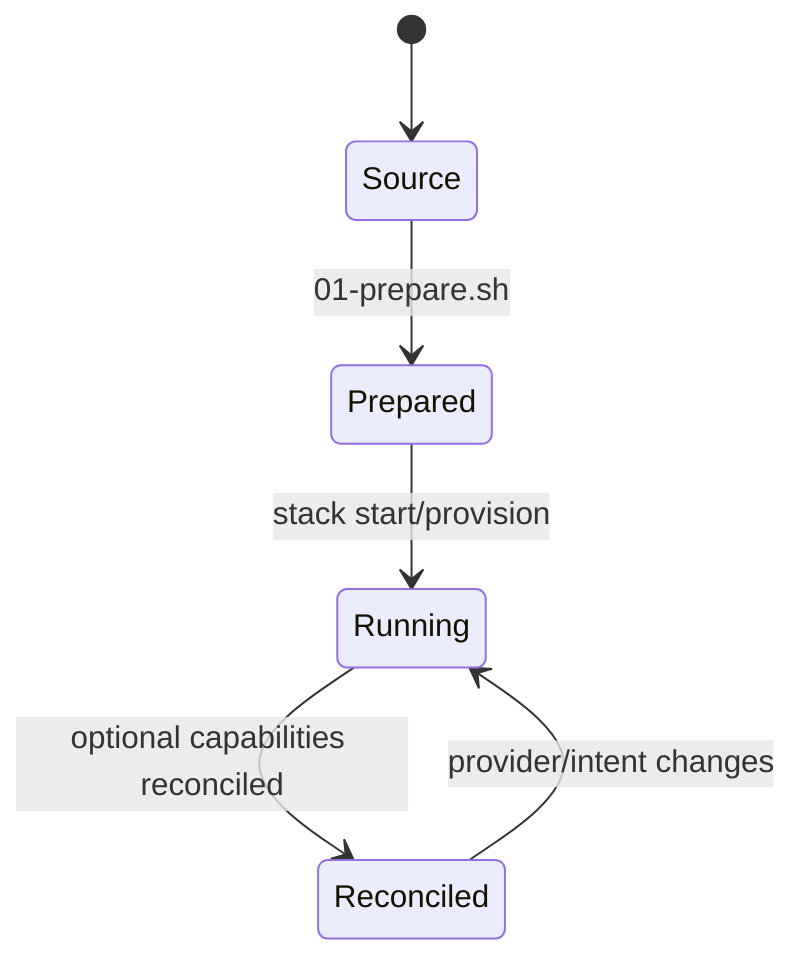
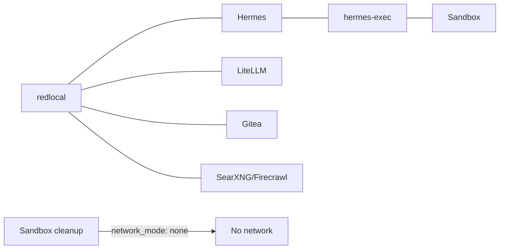

# Installation and lifecycle

This document describes the current deployment contract for `local_hybrid_ai`. The future common installer will consume the same manifest/dependency/capability model; until then these commands are the authoritative manual flow.

## 1. Permanent layout

```text
/opt/docker/
├── stacks/                  # one Git working tree
│   ├── .git/
│   ├── .env                 # operational, secret, ignored by Git
│   ├── .env.template        # tracked variable contract
│   └── stack0...stack6/
└── runtime/                 # persistent mutable state, never Git source
```

```dotenv
STACKS_ROOT=/opt/docker/stacks
BASE_PATH=/opt/docker/runtime
NETWORK_NAME=redlocal
```

Stack0 manages each application stack's `.env -> ../.env` compatibility link. The operational root `.env` must be `root:root 0600` on the reference deployment.

## 2. Dependency and capability model

```mermaid
flowchart TB
    S0[0 Platform] --> S1[1 HAProxy/Web]
    S0 --> S2[2 Search/Extract]
    S0 --> S3[3 LiteLLM]
    S0 --> S4[4 Gitea]
    S0 --> S5[5 Dockhand]
    S0 --> S6[6 Hermes]
    S3 -->|required AI capabilities| S6
    S2 -. optional web capabilities .-> S6
    S4 -. optional git.remote .-> S6
```

All application stacks require Stack0. Stack6 requires Stack3. Stack2 and Stack4 are optional for Stack6.

The manifest registry validates dependency cycles, ownership collisions and capability contracts. Useful commands:

```bash
python3 stack0_-_platform/manifests.py validate
python3 stack0_-_platform/manifests.py validate --target
python3 stack0_-_platform/manifests.py list
python3 stack0_-_platform/manifests.py plan 6
python3 stack0_-_platform/manifests.py plan all
```

`plan 6` resolves the minimum required order as Stack0 -> Stack3 -> Stack6.

## 3. Lifecycle states



`.lock` means **PREPARED only**. It does not mean deployed, running, healthy or reconciled.

PREPARE owns creation/validation of resources belonging to that stack. RECONCILE is a separate repeatable operation for optional capabilities and must not require deleting `.lock`.

## 4. Clean installation

Clone once and create the central environment:

```bash
sudo mkdir -p /opt/docker
cd /opt/docker
sudo git clone https://github.com/ea1het/local_hybrid_ai.git stacks
cd /opt/docker/stacks
sudo cp .env.template .env
sudo chown root:root .env
sudo chmod 0600 .env
sudo editor .env
```

Bootstrap Stack0 before any application stack:

```bash
sudo ./stack0_-_platform/install.sh
```

A full manual deployment may use 0,1,2,3,4,5,6 for operator convenience, but that order is **not** the dependency graph. Installing only Hermes requires 0,3,6. Installing Stack3 alone requires 0,3.

## 5. Stack deployment procedures

### Stack1 — HAProxy + static web

```bash
cd /opt/docker/stacks/stack1_-_haproxy_web
sudo ./01-prepare.sh
docker compose up -d
docker compose ps
```

Stack1 consumes Stack0 PKI read-only. Backends are optional from Stack1's dependency perspective; HAProxy can start while they are absent.

### Stack2 — SearXNG + Firecrawl

```bash
cd /opt/docker/stacks/stack2_-_searxng_firecrawl
sudo ./01-prepare.sh
docker compose up -d
docker compose ps
```

Stack2 provides `web.search` and `web.extract`. It owns SearXNG, Firecrawl API/Playwright, Redis, RabbitMQ and its own PostgreSQL persistence. It never creates `redlocal`.

### Stack3 — LiteLLM + dedicated PostgreSQL

```bash
cd /opt/docker/stacks/stack3_-_litellm
sudo ./01-prepare.sh
sudo ./02-postgres.sh
docker compose up -d litellm
docker compose ps
```

Stack3 provides `ai.gateway` and `ai.mcp-gateway`. It owns `litellm-postgres` and `${BASE_PATH}/service_-_litellm-postgres`.

**PGDATA safety:** on an existing deployment, PREPARE validates and preserves the existing PostgreSQL data directory. It does not change its owner, mode or inode. On a new empty runtime the official PostgreSQL container performs database initialization. Never recursively `chown` an existing cluster as a routine repair.

`LITELLM_SALT_KEY` and existing database identities must be preserved.

`90-migrate-postgres-from-stack2.sh` is a one-time legacy migration helper only. Do not run it on a clean installation and do not rerun it after migration has succeeded.

### Stack4 — Gitea + runner

```bash
cd /opt/docker/stacks/stack4_-_gitea
sudo ./01-prepare.sh
sudo ./02-run.sh
```

Stack4 provides `git.remote` and `git.runner`. It owns the Gitea/runner runtimes and the persistent runner registration secret. Existing Gitea data, runner `.runner` identity and registration token are preserved.

### Stack5 — Dockhand

```bash
cd /opt/docker/stacks/stack5_-_dockhand
sudo ./01-prepare.sh
docker compose up -d
docker compose ps
```

Stack5 owns the external Docker volume `dockhand_data`. PREPARE creates it only if absent and never removes/recreates an existing volume.

### Stack6 — Hermes

Minimum dependencies: Stack0 + Stack3.

```bash
cd /opt/docker/stacks/stack6_-_hermes
sudo ./01-prepare.sh
sudo ./04-gitmem.sh
sudo ./05-maintenance-sidecars.sh
docker compose config --quiet
docker compose up -d --build
sudo ./06-reconcile-capabilities.sh --restart
docker compose ps
```

`04-gitmem.sh` performs bounded Git-memory adoption/validation. `05-maintenance-sidecars.sh` prepares/validates maintenance prerequisites. `06-reconcile-capabilities.sh` is the repeatable capability reconciliation layer.

The temporary terminal-timeout workaround for the validated Hermes version remains:

```bash
sudo ./03-temporary-fix-issue-74116-terminal-timeout.sh
```

## 6. Incremental optional capabilities

### Add local web after Hermes is already running

Deploy Stack2 normally, verify it, then reconcile Stack6:

```bash
cd /opt/docker/stacks/stack6_-_hermes
sudo ./06-reconcile-capabilities.sh --restart
```

When both SearXNG and Firecrawl are running on `redlocal`, the managed Hermes configuration enables web tooling. If either provider is unavailable, web remains explicitly disabled. There is no external-provider fallback from this mechanism.

### Git-backed memory intent

Git memory is not enabled merely because Gitea exists. The operator must explicitly persist intent:

```bash
sudo ./06-reconcile-capabilities.sh --enable-git-memory
```

Disable it with:

```bash
sudo ./06-reconcile-capabilities.sh --disable-git-memory
```

Without either flag, the previous desired state is preserved. A new deployment defaults to disabled.

If Git memory is enabled but Gitea becomes unavailable, reconciliation stops only `hermes-memory-sync`; it preserves the memory worktree, SSH identity and desired state. When the provider returns, reconciliation can resume the sidecar after clean local/remote equality checks.

## 7. Network/security boundaries



The sandbox is not attached to `redlocal`, has no Docker socket and is not privileged. Hermes reaches it only over SSH on `hermes-exec`. The cleanup sidecar has no network.

## 8. Sandbox lifecycle and recovery

Generation identity is stored in both:

```text
${BASE_PATH}/service_-_hermes-sandbox/data/workspace/.sandbox-generation
${BASE_PATH}/service_-_hermes-sandbox/data/state/state.db
```

They must agree. Normal restarts preserve the generation. For corrupt/mismatched lifecycle state, use the bounded reset:

```bash
cd /opt/docker/stacks/stack6_-_hermes
docker compose stop hermes hermes-sandbox hermes-sandbox-cleanup
sudo ./02-cleanup.sh --reset-sandbox --yes
docker compose up -d hermes-sandbox hermes hermes-sandbox-cleanup
```

This resets only sandbox workspace/lifecycle state and preserves Hermes runtime, Git memory, sandbox home/authorized keys, host identity, managed configuration and memory-sync SSH identity.

## 9. Updating an existing deployment

Git updates must not overwrite deployment state:

```bash
cd /opt/docker/stacks
git status --short
git branch --show-current
git fetch origin main
git merge --ff-only origin/main
```

The root `.env`, stack `.env` symlinks, `.lock` files and `/opt/docker/runtime` are outside tracked source changes.

After an update, use the affected stack's documented lifecycle. Do not delete `.lock` merely to activate an optional capability; use reconciliation. A plain `docker restart` does not apply changed Compose environment/mounts.

## 10. Re-preparation

Removing a `.lock` and rerunning PREPARE is an explicit maintenance action, not a normal update primitive. Before doing so, understand what the stack's PREPARE manages and preserve persistent identities.

Validated atomic PREPARE behavior includes preserving bind-directory identity where required, persistent databases/volumes, generated secrets and existing runtime data. Stack3 specifically preserves existing PGDATA owner/mode/inode.

## 11. Secrets and persistent identities

Never commit or casually rotate:

- root operational `.env`;
- LiteLLM inference/MCP keys and `LITELLM_SALT_KEY`;
- provider API tokens;
- Telegram/Buzz credentials;
- TLS private keys;
- SSH private keys;
- database passwords;
- Gitea persistent secrets and runner identity/token;
- Hermes runtime databases/sessions/auth state;
- memory-sync SSH identity;
- sandbox lifecycle database/generation state.

The repository contains source configuration and `.env.template`, never production secret values.
