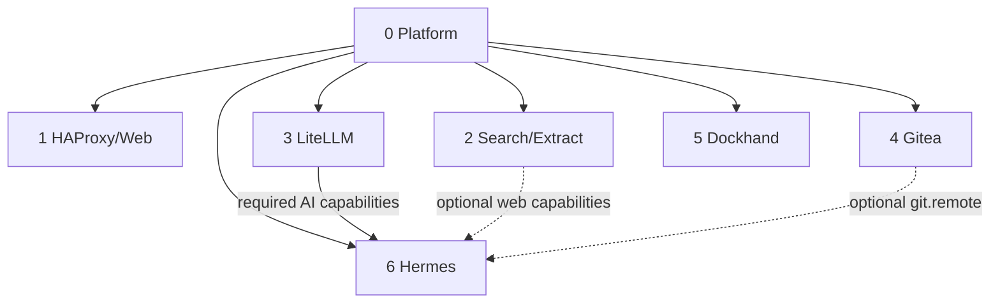
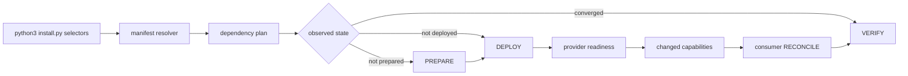
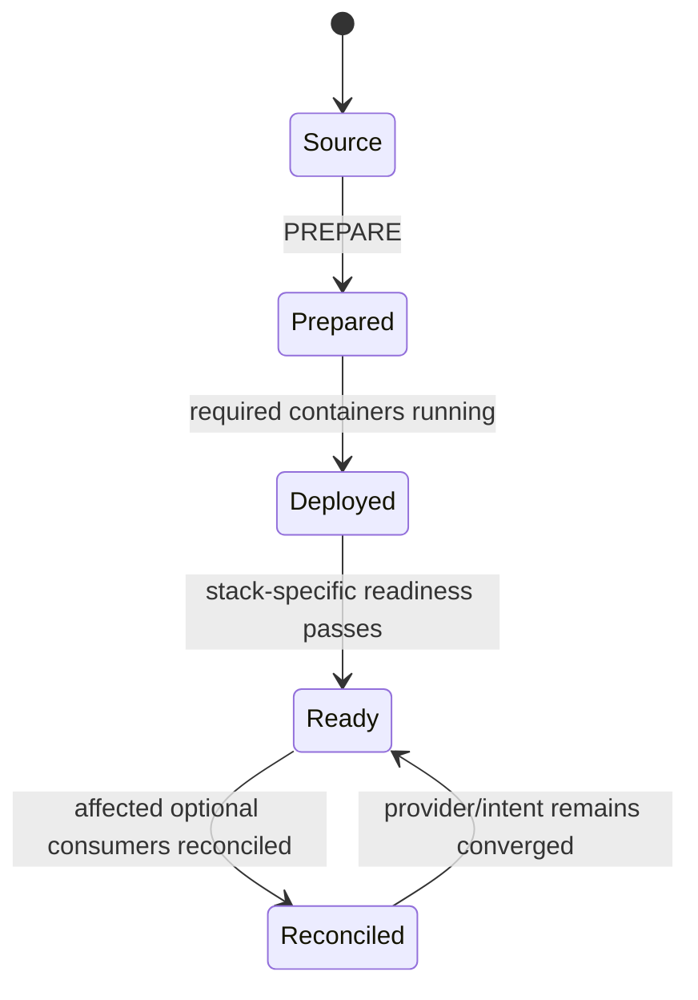
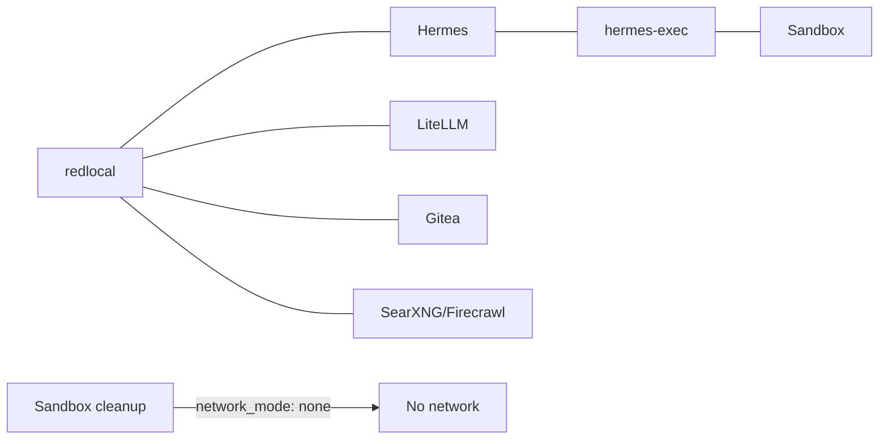

# Installation and lifecycle

This document describes the deployment contract for `local_hybrid_ai`. The root common installer consumes the same manifest/dependency/capability model as the stacks; manual stack commands remain useful for bounded maintenance and diagnosis.

## 1. Permanent layout

```text
/opt/docker/
├── stacks/                  # one Git working tree
│   ├── .git/
│   ├── .env                 # operational, secret, ignored by Git
│   ├── .env.template        # tracked variable contract
│   ├── install.py           # canonical common installer
│   ├── install.sh           # portable wrapper: invoke with bash unless executable
│   ├── installer/
│   │   ├── lifecycle.json   # stack-owned lifecycle command registry
│   │   └── test_installer.py
│   └── stack0...stack6/
└── runtime/                 # persistent mutable state, never Git source
```

```dotenv
STACKS_ROOT=/opt/docker/stacks
BASE_PATH=/opt/docker/runtime
NETWORK_NAME=redlocal
```

Stack0 manages each application stack's `.env -> ../.env` compatibility link. The operational root `.env` must be `root:root 0600` on the reference deployment.

The next planned architecture extension is an independent Open WebUI stack. It must be added through the same manifest/lifecycle/readiness model; do not pre-encode a stack number or dependency rule in the installer before its actual design is agreed.

## 2. Dependency and capability model



All application stacks require Stack0. Stack6 requires Stack3. Stack2 and Stack4 are optional for Stack6.

The manifest registry validates dependency cycles, ownership collisions and capability contracts. Useful commands:

```bash
python3 stack0_-_platform/manifests.py validate
python3 stack0_-_platform/manifests.py validate --target
python3 stack0_-_platform/manifests.py list
python3 stack0_-_platform/manifests.py plan 6
python3 stack0_-_platform/manifests.py plan all
```

`plan 6` resolves the minimum required order as Stack0 -> Stack3 -> Stack6.

## 3. Common installer v1

The root installer is deliberately thin. `manifests.py` decides **which stacks and dependency order** are required; `installer/lifecycle.json` maps each stack to its own lifecycle entry points. The installer does not duplicate stack implementation.



### Canonical invocation

`python3 install.py` is the canonical portable entry point:

```bash
python3 install.py 6 --plan
python3 install.py 6 --dry-run
python3 install.py 2 4 6 --dry-run
python3 install.py all --plan
```

The tracked `install.sh` is only a convenience wrapper. Some repository-content creation paths store it as mode `100644`, so the portable wrapper form is:

```bash
bash ./install.sh 6 --dry-run
```

Do not assume `./install.sh` is executable in every fresh checkout.

Real execution requires explicit acknowledgement:

```bash
sudo python3 install.py 6 --yes
sudo python3 install.py all --yes
```

Selectors are numeric IDs, `stackN`, exact stack directory names, or `all`.

`--plan` and `--dry-run` never execute lifecycle actions. `--dry-run` prints the exact actions that real execution would run. `--target` resolves `target_requires` instead of the current dependency graph. `--reconcile` is an explicit operator override for intentionally reconciling a stable requested consumer.

The installer observes `.lock` for PREPARED state and required containers for DEPLOYED state. It does not re-run PREPARE merely to converge an existing stack. Healthy providers do not cause spurious consumer reconciliation. A provider that will actually transition through PREPARE/DEPLOY contributes changed capabilities; prepared consumers whose optional capabilities intersect those changes are reconciled generically.

### Safety properties

The common installer:

- never rewrites the operational `.env`;
- never deletes `.lock` automatically;
- never runs Docker prune or `docker compose down -v`;
- never resets runtime state;
- never hard-codes Stack6 -> Stack3 dependency logic;
- does not perform the legacy Stack3 PostgreSQL migration;
- stops on the first failed lifecycle action and reports that action;
- keeps stack implementation inside the owning stack;
- validates required runtime containers after real execution.

The lifecycle registry is intentionally declarative but is **not** a second dependency graph. Dependencies, optional relationships, capabilities and ownership stay in `manifest.json`.

## 4. Lifecycle and readiness states



`.lock` means **PREPARED only**. It does not mean deployed, running, healthy, ready or reconciled.

**DEPLOYED is not READY.** Docker may report a container `running` before the application endpoint accepts traffic. A provider must complete its stack-owned readiness gate before dependent capability reconciliation can rely on it.

Stack2 is the current concrete implementation of this rule. Its lifecycle runs:

```text
docker compose up -d
    -> 02-wait-ready.sh
       -> searxng:8080 accepts TCP
       -> firecrawl-api:3002 accepts TCP
    -> reconcile affected prepared consumers
```

The installer also runs the Stack2 readiness gate during verification. This behavior was validated with a controlled SearXNG stop/recovery: the existing SearXNG container was reused, readiness completed before Stack6 reconciliation, Hermes retained its container identity, and a second installer run returned to verification-only convergence.

PREPARE owns creation/validation of resources belonging to that stack. RECONCILE is a separate repeatable operation for optional capabilities and must not require deleting `.lock`.

## 5. Clean installation

Clone once and create the central environment:

```bash
sudo mkdir -p /opt/docker
cd /opt/docker
sudo git clone https://github.com/ea1het/local_hybrid_ai.git stacks
cd /opt/docker/stacks
sudo cp .env.template .env
sudo chown root:root .env
sudo chmod 0600 .env
sudo editor .env
```

Then inspect and run the common installer. A complete installation is:

```bash
python3 install.py all --plan
sudo python3 install.py all --yes
```

A minimal Hermes installation is dependency-resolved automatically:

```bash
python3 install.py 6 --plan
sudo python3 install.py 6 --yes
```

The resolved required plan is Stack0 -> Stack3 -> Stack6. Numeric order `0,1,2,3,4,5,6` remains convenient for a full deployment but is not the dependency model.

## 6. Manual stack deployment procedures

These remain authoritative bounded operations when maintaining one stack directly.

### Stack1 — HAProxy + static web

```bash
cd /opt/docker/stacks/stack1_-_haproxy_web
sudo ./01-prepare.sh
docker compose up -d
docker compose ps
```

Stack1 consumes Stack0 PKI read-only. Backends are optional from Stack1's dependency perspective; HAProxy can start while they are absent.

### Stack2 — SearXNG + Firecrawl

```bash
cd /opt/docker/stacks/stack2_-_searxng_firecrawl
sudo ./01-prepare.sh
docker compose up -d
sudo bash ./02-wait-ready.sh
docker compose ps
```

Stack2 provides `web.search` and `web.extract`. It owns SearXNG, Firecrawl API/Playwright, Redis, RabbitMQ and its own PostgreSQL persistence. It never creates `redlocal`.

Do not reconcile a consumer merely because Compose returned successfully. `02-wait-ready.sh` is the provider readiness boundary for SearXNG and Firecrawl.

### Stack3 — LiteLLM + dedicated PostgreSQL

```bash
cd /opt/docker/stacks/stack3_-_litellm
sudo ./01-prepare.sh
sudo ./02-postgres.sh
docker compose up -d litellm
docker compose ps
```

Stack3 provides `ai.gateway` and `ai.mcp-gateway`. It owns `litellm-postgres` and `${BASE_PATH}/service_-_litellm-postgres`.

**PGDATA safety:** on an existing deployment, PREPARE validates and preserves the existing PostgreSQL data directory. It does not change its owner, mode or inode. On a new empty runtime the official PostgreSQL container performs database initialization. Never recursively `chown` an existing cluster as a routine repair.

`LITELLM_SALT_KEY` and existing database identities must be preserved.

`90-migrate-postgres-from-stack2.sh` is a one-time legacy migration helper only. Do not run it on a clean installation and do not rerun it after migration has succeeded. The common installer never invokes it.

### Stack4 — Gitea + runner

```bash
cd /opt/docker/stacks/stack4_-_gitea
sudo ./01-prepare.sh
sudo ./02-run.sh
```

Stack4 provides `git.remote` and `git.runner`. It owns the Gitea/runner runtimes and the persistent runner registration secret. Existing Gitea data, runner `.runner` identity and registration token are preserved.

### Stack5 — Dockhand

```bash
cd /opt/docker/stacks/stack5_-_dockhand
sudo ./01-prepare.sh
docker compose up -d
docker compose ps
```

Stack5 owns the external Docker volume `dockhand_data`. PREPARE creates it only if absent and never removes/recreates an existing volume.

### Stack6 — Hermes

Minimum dependencies: Stack0 + Stack3.

```bash
cd /opt/docker/stacks/stack6_-_hermes
sudo ./01-prepare.sh
sudo ./04-gitmem.sh
sudo ./05-maintenance-sidecars.sh
docker compose config --quiet
docker compose up -d --build
sudo ./06-reconcile-capabilities.sh --restart
docker compose ps
```

`04-gitmem.sh` is an explicit adoption/validation operation and is not run automatically by the common installer: adoption can require stopped Hermes and operator knowledge of local/remote memory state. `05-maintenance-sidecars.sh` prepares/validates maintenance prerequisites. `06-reconcile-capabilities.sh` is the repeatable capability reconciliation layer.

The temporary terminal-timeout workaround for the validated Hermes version remains:

```bash
sudo ./03-temporary-fix-issue-74116-terminal-timeout.sh
```

## 7. Incremental optional capabilities

### Add local web after Hermes is already running

With the common installer, deploy Stack2 directly:

```bash
sudo python3 install.py 2 --yes
```

If Stack2 is already healthy, the installer performs verification only and does not spuriously reconcile Stack6. If Stack2 actually transitions through deploy/recovery, the installer waits for Stack2 readiness, discovers the prepared Stack6 consumer through `optional_consumes`, and runs Stack6 reconciliation automatically.

Manual equivalent:

```bash
cd /opt/docker/stacks/stack2_-_searxng_firecrawl
docker compose up -d
sudo bash ./02-wait-ready.sh

cd /opt/docker/stacks/stack6_-_hermes
sudo ./06-reconcile-capabilities.sh --restart
```

When both local provider endpoints are ready, the managed Hermes configuration enables web tooling. If the provider is absent/incomplete, web remains explicitly disabled. There is no external-provider fallback from this mechanism.

### Git-backed memory intent

Git memory is not enabled merely because Gitea exists. The operator must explicitly persist intent:

```bash
cd /opt/docker/stacks/stack6_-_hermes
sudo ./06-reconcile-capabilities.sh --enable-git-memory
```

Disable it with:

```bash
sudo ./06-reconcile-capabilities.sh --disable-git-memory
```

Without either flag, the previous desired state is preserved. A new deployment defaults to disabled.

If Git memory is enabled but Gitea becomes unavailable, reconciliation stops only `hermes-memory-sync`; it preserves the memory worktree, SSH identity and desired state. When the provider returns, reconciliation can resume the sidecar after clean local/remote equality checks.

## 8. Network/security boundaries



The sandbox is not attached to `redlocal`, has no Docker socket and is not privileged. Hermes reaches it only over SSH on `hermes-exec`. The cleanup sidecar has no network.

## 9. Sandbox lifecycle and recovery

Generation identity is stored in both:

```text
${BASE_PATH}/service_-_hermes-sandbox/data/workspace/.sandbox-generation
${BASE_PATH}/service_-_hermes-sandbox/data/state/state.db
```

They must agree. Normal restarts preserve the generation. For corrupt/mismatched lifecycle state, use the bounded reset documented by Stack6. Never turn sandbox recovery into a whole-platform wipe.

## 10. Updating an existing deployment

Git updates must not overwrite deployment state:

```bash
cd /opt/docker/stacks
git status --short
git branch --show-current
git fetch origin main
git merge --ff-only origin/main
```

The root `.env`, stack `.env` symlinks, `.lock` files and `/opt/docker/runtime` are outside tracked source changes.

After an update, use the common installer for dependency-aware convergence or the affected stack's documented lifecycle for bounded maintenance. Do not delete `.lock` merely to activate an optional capability; use reconciliation. A plain `docker restart` does not apply changed Compose environment/mounts.

For a healthy full deployment, the intended final convergence check is:

```bash
python3 install.py all --dry-run
sudo python3 install.py all --yes
```

On a fully converged system this should contain verification/readiness actions only—no PREPARE, DEPLOY or RECONCILE transitions unless state actually changed or `--reconcile` was explicitly requested.

## 11. Re-preparation

Removing a `.lock` and rerunning PREPARE is an explicit maintenance action, not a normal update primitive. Before doing so, understand what the stack's PREPARE manages and preserve persistent identities.

Validated atomic PREPARE behavior includes preserving bind-directory identity where required, persistent databases/volumes, generated secrets and existing runtime data. Stack3 specifically preserves existing PGDATA owner/mode/inode.

## 12. Tests and validated installer behavior

Planner regression tests:

```bash
python3 -m unittest -v installer.test_installer
```

The reference deployment has validated:

- healthy Stack6 execution performs verification only and preserves container IDs;
- healthy Stack2/Stack4 providers do not trigger unnecessary Stack6 reconciliation;
- explicit `--reconcile` does trigger consumer reconciliation intentionally;
- stopping only SearXNG makes Stack2 `PREPARED + NOT-DEPLOYED`;
- the installer restores the existing SearXNG container without deleting data;
- Stack2 readiness completes before Stack6 reconciliation;
- Hermes-to-SearXNG and Hermes-to-Firecrawl connectivity works after recovery;
- `.env` and all `.lock` files remain unchanged during recovery;
- a second run after recovery has no state transitions.

These tests establish the core v1 state model:

```text
not prepared             -> PREPARE + DEPLOY
prepared / not deployed  -> DEPLOY
provider deploy           -> WAIT READY -> consumer RECONCILE
prepared / deployed       -> VERIFY (plus stack readiness verification where declared)
explicit --reconcile      -> intentional RECONCILE
```

## 13. Adding the next stack: Open WebUI

Open WebUI is planned as a new stack, not an ad-hoc container inside an existing stack. Before implementation, decide and document:

1. stack ID and directory name;
2. persistent runtime ownership;
3. required and optional dependencies;
4. consumed/provided capabilities;
5. required containers;
6. readiness gate(s), especially the user-facing HTTP endpoint;
7. ingress relationship with Stack1/HAProxy;
8. authentication/secrets and whether any are persistent identities;
9. lifecycle commands for `prepare`, `deploy`, optional `reconcile`, and `verify`;
10. manifest validation and installer planner tests.

Do not add `if open-webui` logic to `install.py`. Add a manifest and lifecycle registry entry so the generic resolver handles it.

## 14. Secrets and persistent identities

Never commit or casually rotate:

- root operational `.env`;
- LiteLLM inference/MCP keys and `LITELLM_SALT_KEY`;
- provider API tokens;
- Telegram/Buzz credentials;
- TLS private keys;
- SSH private keys;
- database passwords;
- Gitea persistent secrets and runner identity/token;
- Hermes runtime databases/sessions/auth state;
- memory-sync SSH identity;
- sandbox lifecycle database/generation state.

The repository contains source configuration and `.env.template`, never production secret values.
