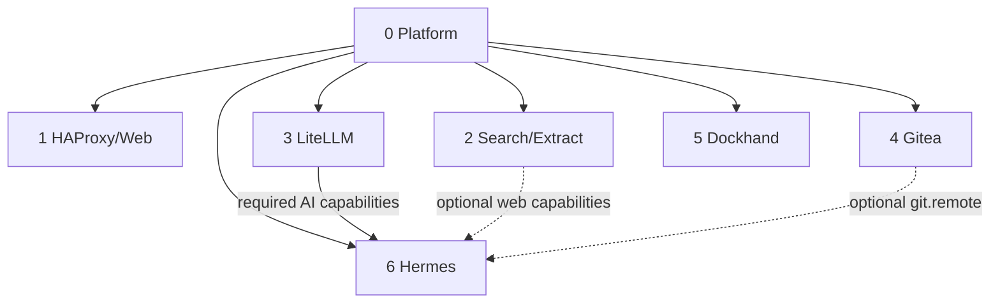

# Installation and lifecycle

This document defines the current clean-install and maintenance contract for `local_hybrid_ai`. The tracked repository represents the converged platform only; completed one-time migration helpers are deliberately removed.

## 1. Permanent layout

```text
/opt/docker/
├── stacks/                  # Git worktree / source
│   ├── .git/
│   ├── .env                 # operational values, ignored by Git
│   ├── .env.template        # tracked variable contract
│   ├── .env.secretsexplained.md
│   ├── install.py
│   ├── installer/
│   └── stack0 ... stack6/
└── runtime/                 # persistent mutable state
```

Reference values:

```dotenv
STACKS_ROOT=/opt/docker/stacks
BASE_PATH=/opt/docker/runtime
NETWORK_NAME=redlocal
```

The operational `.env` is `root:root 0600` on the reference deployment. Stack0 manages application-stack `.env -> ../.env` compatibility links.

## 2. Dependency and capability model



All application stacks require Stack0. Stack6 additionally requires Stack3. Stack2 and Stack4 are optional providers for Stack6.

Useful manifest commands:

```bash
python3 stack0_-_platform/manifests.py validate
python3 stack0_-_platform/manifests.py validate --target
python3 stack0_-_platform/manifests.py list
python3 stack0_-_platform/manifests.py plan 6
python3 stack0_-_platform/manifests.py plan all
```

## 3. Common installer

The root installer resolves the dependency plan from manifests and invokes stack-owned lifecycle commands from `installer/lifecycle.json`.

```text
observe state
  -> PREPARE when not prepared
  -> DEPLOY when required containers are absent/stopped
  -> provider readiness when declared
  -> reconcile affected prepared consumers
  -> VERIFY
```

Canonical inspection:

```bash
python3 install.py 6 --plan
python3 install.py 6 --dry-run
python3 install.py 2 4 6 --dry-run
python3 install.py all --plan
```

Real execution requires acknowledgement:

```bash
sudo python3 install.py 6 --yes
sudo python3 install.py all --yes
```

`--plan` and `--dry-run` never execute lifecycle actions. `--reconcile` is the explicit operator override for deliberately reconciling a stable consumer.

The installer never rewrites `.env`, removes `.lock`, prunes Docker, resets runtime, recreates persistent databases as cleanup, or executes historical migration scripts.

## 4. Lifecycle states

```text
SOURCE
PREPARED    -> .lock exists
DEPLOYED    -> required containers running
READY       -> stack-specific readiness passed
RECONCILED  -> optional consumer configuration matches provider capabilities
```

`.lock` means PREPARED only. A running container is not automatically READY.

Stack2 readiness is explicit:

```text
searxng:8080
firecrawl-api:3002
```

The installer waits for that gate before reconciling Stack6 web capability.

## 5. Clean installation

```bash
sudo mkdir -p /opt/docker
cd /opt/docker
sudo git clone https://github.com/ea1het/local_hybrid_ai.git stacks
cd /opt/docker/stacks
sudo cp .env.template .env
sudo chown root:root .env
sudo chmod 0600 .env
sudo editor .env
```

Before deployment, read `.env.secretsexplained.md` and replace all required placeholders according to their provenance. Do not invent random strings for credentials that must be issued by another service.

Then:

```bash
python3 install.py all --plan
sudo python3 install.py all --yes
```

Minimal Hermes deployment:

```bash
python3 install.py 6 --plan
sudo python3 install.py 6 --yes
```

The resolver derives Stack0 -> Stack3 -> Stack6 automatically.

## 6. Database security standard

For application-owned PostgreSQL instances, `postgres` is the administrative/bootstrap role and the application receives a dedicated non-admin role.

### Stack2 / Firecrawl

```text
firecrawl-postgres
└── database postgres
    ├── postgres   admin/bootstrap, SUPERUSER, owner, pg_cron
    └── firecrawl  normal application role
```

Admin password:

```text
${BASE_PATH}/service_-_firecrawl-postgres/secret/postgres_admin_password
```

Application credential:

```dotenv
FIRECRAWL_DB_NAME=postgres
FIRECRAWL_DB_USER=firecrawl
FIRECRAWL_DB_PASSWORD=<persistent secret>
```

The PostgreSQL service exposes no host port. Firecrawl connects over `redlocal` to `firecrawl-postgres:5432`.

Fresh initialization uses `POSTGRES_PASSWORD_FILE` for the admin password. After the upstream NuQ initialization script creates the schema, Stack2's `config/postgres/020-firecrawl-app-role.sh` creates/reconciles the `firecrawl` role and grants required NuQ privileges.

### Stack3 / LiteLLM

```text
litellm-postgres
├── postgres              admin/bootstrap
└── ${LITELLM_DB_USER}    LiteLLM application role
```

Admin password:

```text
${BASE_PATH}/service_-_litellm-postgres/secret/postgres_admin_password
```

Application credential:

```dotenv
LITELLM_DB_NAME=litellm
LITELLM_DB_USER=litellm
LITELLM_DB_PASSWORD=<persistent secret>
```

Neither application should use `postgres` during normal operation.

## 7. PGDATA safety

Existing PostgreSQL data directories are persistent operational state. PREPARE may validate them but must not recursively change owner/mode, replace the directory, or reset the cluster.

This maintenance rule is separate from disaster-recovery policy. Stack2 is intentionally reconstructable for full DR; Stack3 is recovered from a logical LiteLLM database dump rather than a physical PGDATA copy.

After PostgreSQL maintenance, validate real operations rather than container state alone. Examples:

```bash
docker exec litellm-postgres psql -U postgres -d postgres -Atc 'SELECT 1;'
docker exec litellm-postgres psql -U postgres -d postgres -v ON_ERROR_STOP=1 -c 'CHECKPOINT;'
```

For Firecrawl, also verify that application sessions connect as `firecrawl` while `pg_cron` remains owned/executed by `postgres`.

## 8. Manual stack lifecycle

### Stack1

```bash
cd /opt/docker/stacks/stack1_-_haproxy_web
sudo ./01-prepare.sh
docker compose up -d
docker compose ps
```

### Stack2

```bash
cd /opt/docker/stacks/stack2_-_searxng_firecrawl
sudo ./01-prepare.sh
docker compose up -d
sudo bash ./02-wait-ready.sh
docker compose ps
```

### Stack3

```bash
cd /opt/docker/stacks/stack3_-_litellm
sudo ./01-prepare.sh
sudo ./02-postgres.sh
docker compose up -d litellm
docker compose ps
```

### Stack4

```bash
cd /opt/docker/stacks/stack4_-_gitea
sudo ./01-prepare.sh
sudo ./02-run.sh
```

### Stack5

```bash
cd /opt/docker/stacks/stack5_-_dockhand
sudo ./01-prepare.sh
docker compose up -d
docker compose ps
```

### Stack6

```bash
cd /opt/docker/stacks/stack6_-_hermes
sudo ./01-prepare.sh
sudo ./04-gitmem.sh
sudo ./05-maintenance-sidecars.sh
docker compose config --quiet
docker compose up -d --build
sudo ./06-reconcile-capabilities.sh --restart
docker compose ps
```

`04-gitmem.sh` remains an explicit operator-aware adoption/validation operation rather than an automatic common-installer step.

## 9. Incremental optional capabilities

Deploying Stack2 after Hermes:

```bash
cd /opt/docker/stacks
sudo python3 install.py 2 --yes
```

When Stack2 actually transitions, the installer waits for provider readiness and reconciles prepared consumers whose `optional_consumes` intersect changed capabilities. If Stack2 is already healthy, it verifies only.

Git-backed memory intent remains separate from Gitea availability:

```bash
cd /opt/docker/stacks/stack6_-_hermes
sudo ./06-reconcile-capabilities.sh --enable-git-memory
```

## 10. Updates

Safe source update pattern:

```bash
cd /opt/docker/stacks
git status --short
git branch --show-current
git fetch origin main
git merge --ff-only origin/main
```

A Git update must not overwrite `.env`, `.lock` or `/opt/docker/runtime`.

After updating, validate source and convergence:

```bash
python3 stack0_-_platform/manifests.py validate
python3 stack0_-_platform/manifests.py validate --target
python3 -m unittest -v installer.test_installer
python3 install.py all --dry-run
```

A fully converged deployment should show verification/readiness actions only unless state actually changed.

## 11. Re-preparation

Removing a `.lock` is an explicit maintenance decision. Do not delete locks as a generic update mechanism. Before re-running PREPARE, identify every persistent identity the stack owns and verify it remains unchanged afterwards.

## 12. Cleanup policy

The repository should contain only:

- clean-install source;
- current lifecycle scripts;
- current readiness/reconciliation logic;
- current documentation and tests.

Completed one-time migration helpers and instructions are removed after the platform has converged. Historical context belongs in Git history, not in the active installation path.

This cleanup rule does **not** mean deleting runtime data or rollback material casually. Runtime deletion is a separate operator decision and must be bounded to a proven obsolete artifact.

## 13. Security boundaries

- secrets outside Git;
- application DB role distinct from PostgreSQL admin;
- no database host ports unless explicitly designed;
- agent has no Docker socket;
- sandbox isolated from `redlocal`;
- optional local providers fail closed;
- provider policy centralized at LiteLLM;
- persistent data/identities preserved across source updates;
- no broad prune/reset operations as maintenance shortcuts.

## 14. Disaster recovery contract

Disaster recovery is defined separately from normal runtime persistence. See [`dr-howto.md`](dr-howto.md) for the complete stack-by-stack policy, examples and future engine requirements. [`recovery.schema.json`](recovery.schema.json) is the normative JSON Schema for the manifest `recovery` object.

Every future manifest recovery declaration has:

```text
recovery
├── contract     REQUIRED
└── resources    OPTIONAL
```

The mandatory contract uses `schema_version: 1` and one of:

```text
reconstructable
managed
mixed
```

The current intended DR set is:

```text
Git source at a known commit/tag
+ protected operational .env
+ Stack0 platform PKI archive
+ Stack3 LiteLLM logical PostgreSQL dump
+ Stack4 Gitea application-native dump
```

Stack1, Stack2, Stack5 and Stack6 are intentionally reconstructable. Stack6 durable knowledge must be externalized to Git/Gitea; runtime caches, sessions, packages, SQLite operational state and sandbox state are not recovery targets.

The backup/restore engine is not implemented yet. Do not interpret the schema as an available operational command until the engine and its tests are added.

## 15. Next stack: Open WebUI

Open WebUI must be introduced as a new atomic stack. Before implementation define its stack ID, owned runtime, required/optional dependencies, consumed/provided capabilities, database/storage model, secret provenance, readiness gate, Stack1 ingress contract **and recovery contract**. The generic resolver and future recovery engine should discover it without stack-specific conditionals.
