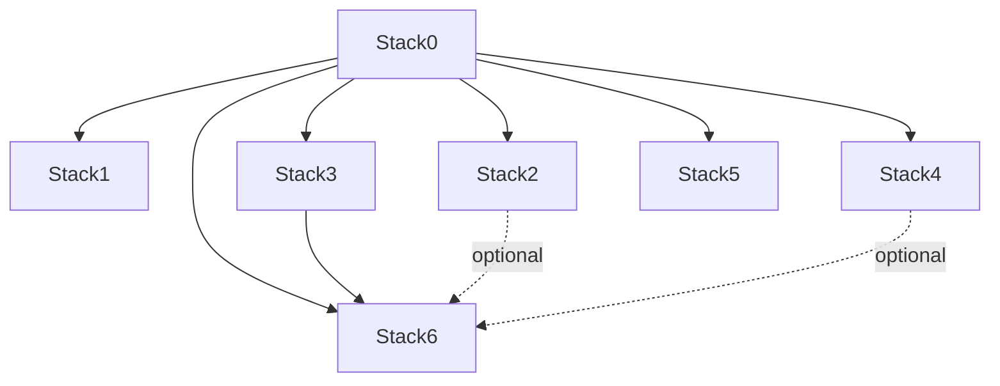

# Installation and Operations

[Home](README.md) · [AI maintainer guide](a2aknowledge.md) · [Pending work](pending.md) · [Backup/DR](bkp-dr/README.md)

## Filesystem contract

```text
/opt/docker/stacks   Git checkout and operational root .env
/opt/docker/runtime  persistent mutable stack-owned state
```

Reference values are `STACKS_ROOT=/opt/docker/stacks`, `BASE_PATH=/opt/docker/runtime`, `NETWORK_NAME=redlocal`. Stack preparation must preserve the operational `.env` and existing persistent identities/data.

## Dependency graph



Use manifests and [`installer/lifecycle.json`](installer/lifecycle.json) as executable truth. Stack6 requires Stack0 + Stack3. Stack2/Stack4 are optional providers.

## Common installer

Inspect first:

```bash
python3 install.py 6 --plan
python3 install.py 6 --dry-run
python3 install.py all --plan
python3 install.py all --dry-run
```

Execute deliberately with the privileges required by the host:

```bash
sudo python3 install.py 6 --yes
sudo python3 install.py all --yes
```

`.lock` is PREPARED only. The installer observes required containers for DEPLOYED and uses declared readiness/reconciliation where available. It does not rewrite `.env`, prune Docker, reset databases or run historical migration helpers.

## Validation

Core source checks include:

```bash
python3 stack0_-_platform/manifests.py validate
python3 stack0_-_platform/manifests.py validate --target
python3 -m unittest -v installer.test_installer
python3 install.py all --dry-run
```

DR tests are now under `bkp-dr/tests`; use the DR documentation for the current supported invocation and do not assume generic real `backup all` is enabled.

## Updates

Synchronize source with fast-forward-only Git operations, validate source, then let the common installer converge only the intended lifecycle actions. Do not use runtime deletion as an update mechanism. Configuration/version drift detection is a known pending design item; see [`pending.md`](pending.md).

## Backup/recovery

Backup/DR is deliberately separate from installation. Start at [`bkp-dr/README.md`](bkp-dr/README.md), then [`bkp-dr/STATUS.md`](bkp-dr/STATUS.md) and [`bkp-dr/dr-howto.md`](bkp-dr/dr-howto.md). Verified recovery evidence exists for Stack0 PKI, Stack3 LiteLLM DB and Stack4 Gitea. Do not delete verified backup sets as generic cleanup.

## Stack navigation

See the stack table and architecture in [`README.md`](README.md). Each stack README defines ownership, dependencies, capabilities, persistence and DR classification.
