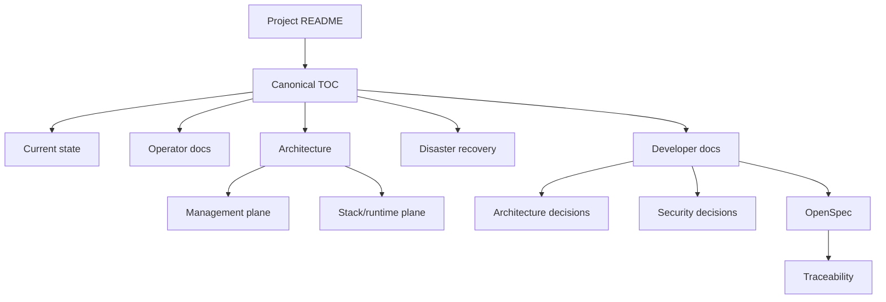

<!--
This Source Code Form is subject to the terms of the Mozilla Public
License, v. 2.0. If a copy of the MPL was not distributed with this
file, You can obtain one at https://mozilla.org/MPL/2.0/.
-->

# Local Hybrid AI documentation

[← Project README](../README.md) · [Canonical documentation map](TOC.md)

This directory contains operator guidance, architecture and decision records, disaster-recovery material, behavioural contracts and development guidance. [`TOC.md`](TOC.md) is the canonical navigation entry and opens with a diagram showing how the documentation layers relate. Folder `README.md` files are local indexes and link back toward that map.

## Reader paths

| Reader need | Entry point |
|---|---|
| Current deployed design and retired surfaces | [Current implementation state](current-state.md) |
| Management/control architecture | [Management-plane architecture](architecture/management-plane.md) |
| Runtime topology and stack relationships | [Stack architecture](stacks/README.md) |
| Installation and reconciliation | [Installation](installation.md) |
| Normal operation | [User documentation](user-docs/README.md) |
| Secrets and configuration | [Configuration](configuration/README.md) |
| Backup or recovery | [Disaster recovery](dr/README.md) |
| Upgrade compatibility | [Upgrade policy](upgrade-policy.md) |
| Architectural rationale | [ADRs](devel-docs/adr/README.md) |
| Security rationale | [SDRs](devel-docs/sdr/README.md) |
| Observable behavioural contracts | [OpenSpec](devel-docs/openspec/README.md) |
| Contract-to-evidence mapping | [OpenSpec traceability](devel-docs/openspec/traceability.md) |
| Test strategy | [Testing](devel-docs/testing.md) |
| Active unfinished work | [Pending work](pending.md) |
| AI-assisted maintenance context | [Agent-oriented continuity reference](a2aknowledge.md) |

## Documentation model

Folder READMEs are indexes, not competing sources of truth. Machine-readable ownership, component topology, dependency, capability and recovery facts remain authoritative in stack manifests. Architectural rationale belongs in ADRs, security rationale in SDRs, observable behaviour in OpenSpec/Gherkin, and implementation verification in tests.

## Language and audience policy

Canonical project documentation is maintained in English. Human-facing prose is written in third-person, role-oriented language so operator and maintainer responsibilities remain explicit. Literal commands, code, configuration, machine output and Gherkin retain the syntax required by their interfaces.

The documentation is human-first. Material intended primarily to help AI agents continue maintenance work is explicitly marked as agent-oriented and does not replace operator, architecture or specification documentation.

Historical implementation names remain only where they explain an accepted decision, a compatibility contract, or recovery of an older recorded source revision. They are not presented as current operator interfaces or current repository layout. The retained architecture research PDF is background material rather than a live source of truth.
