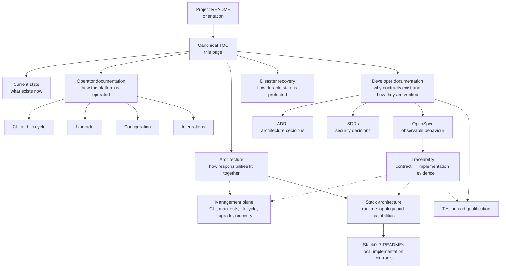

<!--
This Source Code Form is subject to the terms of the Mozilla Public
License, v. 2.0. If a copy of the MPL was not distributed with this
file, You can obtain one at https://mozilla.org/MPL/2.0/.
-->

# Documentation map

This is the canonical table of contents for Local Hybrid AI. The documentation is primarily written for human operators, contributors and maintainers. Agent-oriented material is explicitly identified as such. Folder `README.md` files act as local indexes rather than independent documentation islands.

[← Project README](../README.md)

## How the documentation is organized

A reader looking for the deployed system begins with **Current state**. An operator follows **Operator documentation** and **Disaster recovery**. A maintainer follows **Architecture** and **Developer documentation**. ADRs and SDRs preserve decision history; OpenSpec describes current observable behaviour and links that behaviour to implementation and evidence.

## Start here

- [Project overview](../README.md) — purpose, local-first philosophy, stack relationships and management boundary.
- [Current implementation state](current-state.md) — concise current-state contract plus explicitly retired legacy surfaces.
- [Management-plane architecture](architecture/management-plane.md) — how `local-ai`, manifests, lifecycle, upgrade and recovery divide responsibilities behind the public interface.
- [Installation and lifecycle](installation.md) — PREPARE → DEPLOY → READY → RECONCILE → VERIFY.
- [Operator CLI](user-docs/cli.md) — supported `./local-ai` commands and machine contracts.
- [Shell completion](user-docs/completion.md) — Bash/Zsh generation, automatic persistent installation and status.
- [Upgrade workflow](user-docs/upgrade.md) — installed/available/selectable workflow, explicit selection and guarded apply.
- [Selectable overrides](user-docs/selectable-overrides.md) — administrator override of a component's default selectable classification.
- [Component version authority](user-docs/version-authority.md) — installation-owned version intent and migration from older deployments.
- [Configuration and secrets](configuration/README.md) — protected `.env`, generated secrets and ownership rules.
- [Disaster recovery](dr/README.md) — backup/restore model, operating procedure and qualification status.
- [Upgrade compatibility policy](upgrade-policy.md) — compatibility boundaries independent from executor selectability.

## Architecture

- [Architecture index](architecture/README.md)
- [Management-plane architecture](architecture/management-plane.md) — command boundary, manifest compilation, lifecycle, upgrade and recovery responsibilities.
- [Stack architecture](stacks/README.md) — responsibilities, hard dependencies, optional capabilities and cross-stack flows.
- [Stack0 README](../stack0_-_platform/README.md)
- [Stack1 README](../stack1_-_haproxy_web/README.md)
- [Stack2 README](../stack2_-_searxng_firecrawl/README.md)
- [Stack3 README](../stack3_-_litellm/README.md)
- [Stack4 README](../stack4_-_gitea/README.md)
- [Stack5 README](../stack5_-_dockhand/README.md)
- [Stack6 README](../stack6_-_hermes/README.md)
- [Stack7 README](../stack7_-_open-webui/README.md)
- [Architecture Decision Records](devel-docs/adr/README.md) — durable architectural choices and consequences.
- [Security Decision Records](devel-docs/sdr/README.md) — security boundaries and least privilege.
- [Behavioural specifications](devel-docs/openspec/README.md) — Gherkin/OpenSpec contracts linked to implementation and tests.
- [Traceability](devel-docs/openspec/traceability.md) — contract → implementation → test/qualification mapping.
- [Hybrid AI architecture research reference](architecture/arquitectura_hibrida_de_ia.pdf) — retained background material; not a source of truth for the live implementation.

## Operations

- [User documentation](user-docs/README.md)
- [CLI reference](user-docs/cli.md)
- [Shell completion](user-docs/completion.md)
- [Upgrade workflow](user-docs/upgrade.md)
- [Selectable overrides](user-docs/selectable-overrides.md)
- [Component version authority](user-docs/version-authority.md)
- [Integrations](user-docs/integrations/README.md)
- [Configuration](configuration/README.md)
- [Disaster recovery](dr/README.md)
- [Active backlog](pending.md)

## Development

- [Developer documentation](devel-docs/README.md)
- [Documentation maintenance standard](devel-docs/documentation.md)
- [Testing and qualification](devel-docs/testing.md)
- [Upgrade executor qualification](devel-docs/upgrade-qualification.md)
- [ADR index](devel-docs/adr/README.md)
- [SDR index](devel-docs/sdr/README.md)
- [OpenSpec index](devel-docs/openspec/README.md)
- [Feature contracts](devel-docs/openspec/features/README.md)
- [Per-stack contracts](devel-docs/openspec/stacks/README.md)
- [AI-assisted continuity contract](a2aknowledge.md) — agent-oriented maintenance context, not an operator guide.

## Documentation rules

1. Root `README.md` explains the system to a new reader; it is not a file inventory.
2. `docs/TOC.md` is the canonical navigation map.
3. Folder READMEs index the documents they own and link back toward canonical navigation.
4. Stack implementation READMEs explain local stack contracts; `docs/stacks/README.md` explains relationships across stacks.
5. Human-facing prose uses third-person, role-oriented language. Commands, code, Gherkin and literal interface text remain exact.
6. ADRs explain architectural decisions; SDRs explain security decisions; Gherkin/OpenSpec describes observable behaviour. They cross-link instead of duplicating one another.
7. Current operator documentation describes the current public CLI. Historical names or layouts appear only where required to explain migration, compatibility or an accepted decision.
8. Wide tables are avoided. Compact tables are followed by prose where detail is required.
9. Mermaid diagrams use GitHub-supported syntax and model one concern per diagram.
10. Historical documents are retained only when they contain knowledge not represented by current canonical documentation. The architecture research PDF is intentionally retained as non-authoritative background material.
11. Python modules and tests start with module-level documentation explaining responsibility, behavioural scope and important negative boundaries.

The complete maintenance rules are defined in [the documentation standard](devel-docs/documentation.md).
