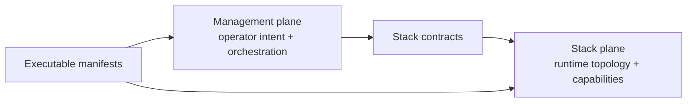

<!--
This Source Code Form is subject to the terms of the Mozilla Public
License, v. 2.0. If a copy of the MPL was not distributed with this
file, You can obtain one at https://mozilla.org/MPL/2.0/.
-->

# Architecture

[← Documentation map](../TOC.md)

The live architecture is defined by executable manifests and current repository documentation. A reader interested in the control plane starts with the [management-plane architecture](management-plane.md); a reader interested in runtime topology starts with the [cross-stack architecture map](../stacks/README.md). The relevant ADR, SDR and behavioural contract then provide decision rationale and observable guarantees.

## Canonical architecture sources

- [Management-plane architecture](management-plane.md) — `local-ai`, manifest compilation, lifecycle, upgrade and recovery responsibility boundaries.
- [Stack architecture](../stacks/README.md) — topology, hard dependencies and optional capabilities.
- [Architecture Decision Records](../devel-docs/adr/README.md) — why durable architectural choices were made.
- [Security Decision Records](../devel-docs/sdr/README.md) — security boundaries and least-privilege choices.
- [OpenSpec](../devel-docs/openspec/README.md) — observable behaviour and traceability to tests.
- Stack `manifest.json` files — authoritative machine-readable ownership, dependency, capability and recovery declarations.

## Two complementary views

The management-plane documentation explains how declared state is interpreted and safely changed. The stack-plane documentation explains what runs and how stacks depend on or optionally consume one another. Neither view replaces the executable manifests.

## Research reference

[`arquitectura_hibrida_de_ia.pdf`](arquitectura_hibrida_de_ia.pdf) is intentionally retained as a research/reference document. It provides background and exploratory context, but it is **not** the source of truth for the deployed platform. If it disagrees with manifests, ADRs/SDRs or current documentation, the current executable contracts win.

Architecture documentation does not act as a second configuration system: concrete container ownership and dependency facts belong in manifests and are summarized only where they make the system understandable.
