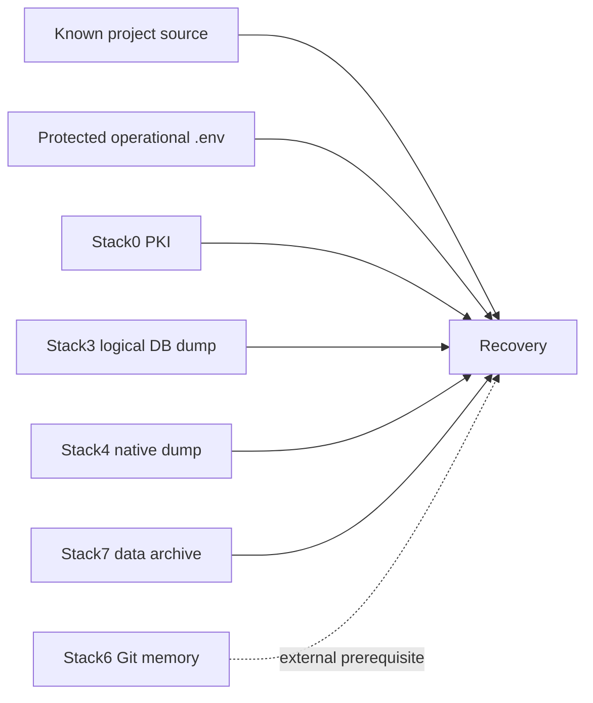
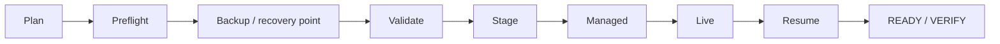

<!--
This Source Code Form is subject to the terms of the Mozilla Public
License, v. 2.0. If a copy of the MPL was not distributed with this
file, You can obtain one at https://mozilla.org/MPL/2.0/.
-->

# Disaster recovery

[← DR index](README.md) · [Documentation map](../TOC.md) · [Management plane](../architecture/management-plane.md)

The DR rule preserves only state whose loss would prevent a correct rebuild. A Docker volume or bind mount is not a backup target unless a manifest declares it.

`./local-ai` is the supported operator and integration boundary. DR implementation is privately owned by the independent `src/local_ai_cli/backup/` and `src/local_ai_cli/restore/` packages; external automation does not couple to their direct Python contracts.



## Recovery policy

| Stack | Policy | Durable input |
|---|---|---|
| 0 Platform | mixed | PKI archive |
| 1 HAProxy/Web | reconstruct | none |
| 2 SearXNG/Firecrawl | reconstruct | none |
| 3 LiteLLM | mixed | logical PostgreSQL dump + original salt |
| 4 Gitea | managed | native Gitea dump |
| 5 Dockhand | reconstruct | none |
| 6 Hermes | reconstruct + external | Git-backed `MEMORY.md` + `USER.md` |
| 7 Open WebUI | mixed | `/app/backend/data` archive + secret key |

Schemas are implementation-owned: [`recovery.schema.json`](../../src/local_ai_cli/restore/recovery.schema.json) belongs to Restore and [`backup-set.schema.json`](../../src/local_ai_cli/common/backup-set.schema.json) is a shared Backup/Restore primitive.

## Recovery phases



Planning and preflight are read-only. Preflight validates the destination and required runtime sources before backup execution; equal, descendant and ancestor overlap with protected source/runtime roots is rejected. Backup publication and restore application are explicit mutating phases. Staging and managed/live restore remain separate because they carry different safety and resumability properties.

## Backup

The supported operator entry point is:

```bash
./local-ai backup
```

A machine consumer uses the JSON contract where supported:

```bash
./local-ai --json backup
```

A real backup preflights source/runtime prerequisites, stages sensitive data privately, performs integrity checks, writes `backup.json` and `checksums.sha256`, then atomically publishes one immutable `backup-*` directory. The operational `.env` is a sensitive global artifact; its contents never belong in logs or metadata. [ADR-0001](../devel-docs/adr/0001-backup-operational-env.md) and [SDR-0001](../devel-docs/sdr/0001-protected-operational-config-in-backups.md) define the rationale.

## Restore

Supported management forms are exposed through `./local-ai restore ...`; the underlying `src/local_ai_cli/restore/` implementation remains private. A restore validates the recorded recovery point before materializing source/configuration, stages artifacts before live mutation, restores managed state in its declared phase, converges runtime and finally re-establishes READY/VERIFY and external prerequisites.

Historical recovery compatibility may recognize source commits that still contain `installer/install.py` or the older root `install.py`. That is a restore-compatibility rule only; it does not make those historical paths supported management interfaces.

The generic restore path has passed destructive clean-target qualification for stacks 0–6. Stack7 has separately passed an isolated archive restore from a global recovery point without modifying the active runtime. These statements describe qualified capabilities, not installation-specific recovery points. Detailed evidence and current qualification scope are summarized in [status.md](status.md).

## Qualified recovery coverage

- Stacks 0–6: destructive clean-target recovery has been qualified.
- Stack7: application-data recovery has been qualified using an isolated restore from a complete recovery point.
- Backup-set integrity, destination-overlap rejection and atomic publication are part of the qualified recovery contract.

Concrete backup-set names, timestamps, host paths and deployment-specific inventory belong in operational records or Git history, not in canonical project documentation.

## Deliberately excluded

Raw PostgreSQL PGDATA, containers, images, logs, queues, caches, `.lock`, migration markers, Firecrawl transient DB/queue state, SearXNG cache, Dockhand state, Gitea runner registration, Hermes SQLite/session/cache state and sandbox contents are not DR artifacts merely because they exist.

## Remaining hardening

Encryption-at-rest, retention generations, off-host replication, external Stack6 SSH prerequisite packaging, malformed type/schema validation hardening and bounded/resumable-recovery improvements remain active work. Destination-overlap protection is already implemented and qualified rather than pending. [Pending work](../pending.md) contains the remaining active items.
