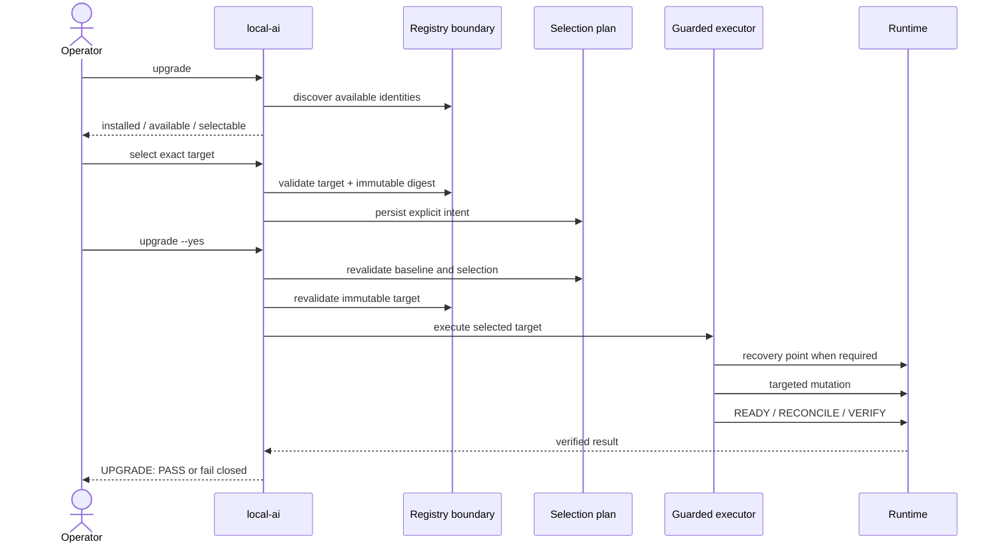

<!--
This Source Code Form is subject to the terms of the Mozilla Public
License, v. 2.0. If a copy of the MPL was not distributed with this
file, You can obtain one at https://mozilla.org/MPL/2.0/.
-->

# Upgrading Local Hybrid AI components

[← User documentation](README.md) · [CLI reference](cli.md) · [Upgrade policy](../upgrade-policy.md) · [Management plane](../architecture/management-plane.md)

The normal upgrade workflow deliberately separates **observation**, **explicit selection** and **mutation**. Registry discovery never becomes consent.



The operator begins with:

```bash
./local-ai upgrade
```

This is the primary human version view. `./local-ai upgrade check` remains a compatibility alias. Stack selectors in the public CLI are always numeric: `7` is valid; the internal manifest identity `stack7` and manifest directory names are not public selectors. Selective lifecycle commands use the same numeric convention.

| Field | Meaning |
|---|---|
| `INSTALLED` | The concrete version installed/running now. |
| `AVAILABLE` | The newest version discovered from the same registry/package. Discovery is information, not consent. |
| `POLICY` | The compatibility boundary enforced for an explicit target. |
| `SELECTABLE` | Whether the project has qualified an automated upgrade procedure for that component. |
| `SELECTED` | The exact target explicitly chosen by the operator. |
| `VALID` | Whether an existing selection still passes its applicable policy/baseline gates. |

Component topology and upgrade semantics are declared by each owning stack's `manifest.json` and compiled by the management plane. Internal machine data may retain identities such as `stack7`; that representation is not an alternate operator selector. There is no separate central component catalog to synchronize when a stack changes.

## SELECTABLE

`SELECTABLE=yes` means more than the existence of a newer image. It means Local Hybrid AI has a defined and qualified procedure for changing that component through the supported `./local-ai` management boundary.

A typical flow is:

```bash
./local-ai upgrade
./local-ai upgrade 2 redis select 8.10.1-alpine3.23
./local-ai upgrade
sudo ./local-ai upgrade --yes
```

`select VERSION` validates and records an exact target as explicit operator intent. It does not modify the running service. The target must exist in the configured registry, satisfy the effective compatibility policy and resolve to an immutable digest; where versions are comparable, downgrade protection also applies. If the selected tag later moves to another digest, apply fails instead of following it silently.

`clear` removes the previously selected target without changing runtime:

```bash
./local-ai upgrade 2 redis clear
```

`sudo ./local-ai upgrade --yes` applies exactly the targets already selected. It never means “upgrade everything”, and discovery never creates a selection automatically.

Before mutation, the management plane revalidates the runtime baseline, policy, target existence, immutable digest and executor eligibility. The component-specific procedure may then create a recovery point when required, update installation-owned version authority, perform a targeted deployment, wait for READY, reconcile when required, verify the selected version, and re-verify affected prepared consumers.

### `UPGRADE: PASS`

`UPGRADE: PASS` is the success boundary for the supported operation. It does not merely mean that Docker started a container. It means the guarded procedure completed without a failing condition and finished the post-change checks required by the executor, including target-version verification and any required READY, reconciliation and consumer verification.

After `UPGRADE: PASS`, upgrade history records the successful operation and the successful selection is cleared.

### Failure without `UPGRADE: PASS`

If `UPGRADE: PASS` is absent, the operator does not treat the operation as successful merely because a container is running. The stable error code and any reported recovery point identify the next diagnostic boundary. The installation can then be inspected with:

```bash
./local-ai status
./local-ai upgrade
```

The guarded executor does **not** append a successful history event or clear the selection when execution fails. A recovery point is attached to the reported failure when one was created before mutation. Local Hybrid AI deliberately does not perform destructive automatic rollback. Depending on the failure, the operator may correct the cause and retry, restore from the reported recovery point, or investigate a component-specific readiness/migration failure. The current executor therefore preserves the failed selection and explicit error/recovery context rather than claiming a separate persistent failure-history journal.

Compatibility policy is inspected or overridden independently:

```bash
./local-ai upgrade policy
./local-ai upgrade policy 2 redis
./local-ai upgrade policy 2 redis set minor-series
./local-ai upgrade policy 2 redis clear
```

With no action after the component, `policy` shows the effective policy. `set` creates or replaces the installation-local override. `policy ... clear` removes only that override and returns the effective policy to the manifest default; it does not clear an upgrade selection. There is no public `show` action. Changing policy never makes an unqualified component selectable.

## NO SELECTABLE

`SELECTABLE=no` does not mean the software cannot be upgraded. Today it applies to exactly three components: `platform-foundation` (not a versioned package), Stack4 `runner` and Stack6 `sandbox` (both built locally rather than sourced from a registry). Every other component is selectable by manifest default.

| Blocker | Meaning |
|---|---|
| `non-versioned-component` | A versioned package upgrade does not meaningfully apply to this component. Currently `platform-foundation`. |
| `local-build` | The component is produced locally rather than upgraded from a normal registry version stream. Currently Stack6 `sandbox`. |
| `local-managed` | The component lifecycle is managed locally and does not expose an independent registry-version upgrade path. Currently Stack4 `runner`. |
| `migration-policy-required` | Reserved for a component whose migration/compatibility/recovery semantics are not yet resolved. Not currently used by any manifest. |
| `executor-not-qualified` | Reserved for a component with no qualified guarded-mutation procedure. Not currently used by any manifest. |

A `NO SELECTABLE` component may still show a newer `AVAILABLE` version. Knowing that an update exists and being offered for selection are separate facts.

An administrator can override the classification in either direction with a persistent, auditable override, independent from the Git-tracked manifest:

```bash
./local-ai upgrade selectable 4 runner enable --yes
./local-ai upgrade 4 runner select <version>
./local-ai upgrade --yes
```

Enabling an override changes only whether the component is offered for selection; it does not bypass policy, target existence, immutable digest, stale-plan protection, recovery requirements, READY, VERIFY or dependency-impact checks, and it still requires the component to have a manifest-declared mutation recipe (the executor otherwise refuses apply with `UPGRADE_COMPONENT_NOT_EXECUTABLE`). [Selectable overrides](selectable-overrides.md) contains the complete boundary.

### Qualification for SELECTABLE

Most components are selectable by manifest default; the three named exceptions above are deliberate, not a qualification backlog. The gates below describe the engineering bar a component's guarded execution path is expected to meet, and are what the project checks before adding a new component's upgrade recipe or promoting a component out of the three exceptions:

1. Reliable installed-version and target identity.
2. Explicit compatibility policy.
3. Defined version-authority mutation.
4. Known deployment scope.
5. Defined migration ordering and compatibility constraints where applicable.
6. Defined failure modes and safe recovery strategy.
7. Meaningful READY semantics.
8. Post-upgrade VERIFY proving the selected version and service usability.
9. Known provider/consumer impact and required re-verification.
10. Automated selection, stale-plan, immutable-target, failure and success tests.
11. Representative real-runtime qualification.

Only after those gates are satisfied does the owning manifest declare `execution.mode=guarded` and expose `SELECTABLE=yes`. [Upgrade executor qualification](../devel-docs/upgrade-qualification.md) is the engineering contract.

## Existing installations and `upgrade adopt`

`upgrade adopt` is a migration utility for installations created before explicit installation-owned version authority existed. It is not part of normal day-to-day upgrade operation.

```bash
./local-ai upgrade adopt
sudo ./local-ai upgrade adopt --yes
```

The read-only form shows what exact running identities would be recorded. Unprepared stacks are skipped; a PREPARED component whose runtime identity cannot be observed fails closed. The `--yes` form writes only missing non-secret authority keys and does not pull images, run Compose, select an upgrade or restart services. Fresh installations already have exact source baselines and do not require routine adoption.
