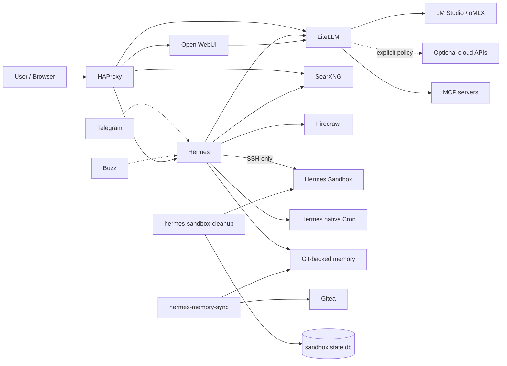

# Local Hybrid AI

**A local-first, hybrid AI reference implementation focused on data sovereignty, controlled routing, isolated agent execution and deliberately scoped automation.**

> **Local first. Cloud when necessary. The decision should belong to you.**

## Current architecture

The platform combines:

- **LM Studio / oMLX** — local OpenAI-compatible inference runtimes;
- **LiteLLM** — single model-routing, policy and MCP gateway boundary;
- **Hermes Agent** — interactive/autonomous agent runtime and native deferred-work scheduler;
- **Hermes sandbox** — isolated execution over SSH, never Docker socket access;
- **Hermes memory sync sidecar** — deterministic Git synchronization of long-term memory;
- **Hermes sandbox cleanup sidecar** — SQLite/inotify lifecycle management for disposable workspace data;
- **SearXNG + Firecrawl** — private/local search and extraction;
- **HAProxy** — internal TLS/reverse proxy;
- **Gitea** — private/local Git;
- **Dockhand** — container-management tooling;
- **Telegram / Buzz** — optional Hermes messaging interfaces;
- **Open WebUI** — optional human chat/model interface.

There is no separate scheduling stack. Deferred intelligent work uses **Hermes native Cron**; deterministic maintenance stays in small purpose-built Stack6 sidecars.

## Architecture



## Model and MCP boundary

Applications and agents target LiteLLM rather than provider-specific endpoints:

```text
Application / Hermes -> LiteLLM -> selected model
Hermes -> LiteLLM MCP Gateway -> upstream MCP servers
```

Cloud use, if configured, belongs at the LiteLLM policy layer. Hermes is intentionally configured without silent provider fallback outside LiteLLM.

## Agent isolation

Hermes terminal execution is:

```text
Hermes -> SSH -> hermes-sandbox
```

The sandbox has no Docker socket, no privileged mode, no host networking and no arbitrary host filesystem mounts.

The sandbox is explicitly **ephemeral scratch space, not durable storage**. Hermes' managed system prompt instructs the agent to persist any artifact needed by future work outside the sandbox.

## Deferred work

Hermes native Cron is the sole agentic scheduling mechanism.

The managed policy distinguishes current failures from real future dependencies. Future cron prompts must be self-contained because scheduled runs use fresh agent sessions.

## Git-backed Hermes memory

Long-term memory is a dedicated Git working tree:

```text
/opt/docker/runtime/service_-_hermes-memory/data/
├── .git/
├── MEMORY.md
└── USER.md
```

`hermes-memory-sync` runs every 15 minutes by default and performs conservative fetch / fast-forward / commit / push operations. It refuses ambiguous divergence and never force-pushes.

Its SSH identity is separate from Hermes and lives under:

```text
/opt/docker/runtime/service_-_hermes-memory-sync/ssh/
```

## Sandbox lifecycle

The sandbox owns its lifecycle database:

```text
/opt/docker/runtime/service_-_hermes-sandbox/data/state/state.db
```

Before accepting SSH work, the sandbox initializes or validates the SQLite generation state.

`hermes-sandbox-cleanup`:

- watches `/workspace` using inotify;
- reconciles missed activity during daily sweeps;
- protects the initial generation baseline;
- tracks post-baseline top-level objects as disposable units;
- quarantines objects inactive for 7 days by default;
- deletes them after a 1-day grace period;
- retains deleted DB records for 90 days by default;
- has no network access.

Fast recovery from a corrupt lifecycle DB is:

```bash
sudo ./02-cleanup.sh --reset-sandbox
```

This destroys only the sandbox workspace generation and its lifecycle DB. Hermes state, Git-backed memory, sandbox home/SSH identity and managed configuration remain intact.

## Network model

`redlocal` is the shared infrastructure network for HAProxy, Hermes, LiteLLM, SearXNG, Firecrawl, Gitea and `hermes-memory-sync`.

Hermes and the sandbox additionally share the private `hermes-exec` bridge. The sandbox is not attached to `redlocal`.

`hermes-sandbox-cleanup` uses `network_mode: none`.

## Deployment layout

```text
/opt/docker/
├── stacks/
│   ├── stack1_-_haproxy_web/
│   ├── stack2_-_searxng_firecrawl/
│   ├── stack3_-_litellm/
│   ├── stack4_-_gitea/
│   ├── stack5_-_dockhand/
│   └── stack6_-_hermes/
└── runtime/
    ├── service_-_haproxy/
    ├── service_-_web/
    ├── service_-_searxng/
    ├── service_-_firecrawl-*/
    ├── service_-_litellm/
    ├── service_-_gitea/
    ├── service_-_gitea-runner/
    ├── service_-_hermes/
    ├── service_-_hermes-memory/
    ├── service_-_hermes-memory-sync/
    └── service_-_hermes-sandbox/
```

Platform contract:

```dotenv
STACKS_ROOT=/opt/docker/stacks
BASE_PATH=/opt/docker/runtime
```

## Stack map

| Stack | Purpose |
|---|---|
| `stack1_-_haproxy_web` | HAProxy / web ingress and TLS routing |
| `stack2_-_searxng_firecrawl` | Local/private search and extraction |
| `stack3_-_litellm` | Model policy and MCP gateway |
| `stack4_-_gitea` | Local Git service and runner |
| `stack5_-_dockhand` | Container-management tooling |
| `stack6_-_hermes` | Hermes, native Cron, isolated sandbox, memory and maintenance sidecars |

## Hermes version policy

```dotenv
HERMES_IMAGE=nousresearch/hermes-agent
HERMES_VERSION=v2026.8.31
```

The repository retains the temporary `TERMINAL_TIMEOUT` workaround until the corresponding upstream issue is resolved for the deployed version.

## Stack6 deployment sequence

```bash
cd /opt/docker/stacks/stack6_-_hermes
sudo ./01-prepare.sh
sudo ./04-gitmem.sh
sudo ./05-maintenance-sidecars.sh

docker compose config --quiet
docker compose up -d --build
docker compose ps
```

## Security and secrets

This repository is public. Never commit real `.env` files, provider/MCP keys, messaging credentials, TLS/SSH private keys, Hermes runtime databases/auth/session state, the memory-sync SSH identity or sandbox lifecycle databases.

## Validation strategy

Validate each boundary independently:

```text
1. Local inference runtime works.
2. LiteLLM can call it.
3. Hermes can call LiteLLM.
4. Hermes can reach the isolated sandbox over SSH.
5. SearXNG / Firecrawl work.
6. Messaging works where enabled.
7. LiteLLM MCP discovery/tool execution works.
8. Hermes native Cron executes a real future task.
9. hermes-memory-sync performs a real Gitea synchronization.
10. sandbox state.db initializes and survives a normal restart.
11. sandbox cleanup watcher/sweep/quarantine operate as designed.
12. --reset-sandbox creates a fresh sandbox generation.
```

> **Treat effective runtime configuration as something that must be tested, not assumed.**
