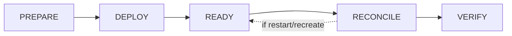
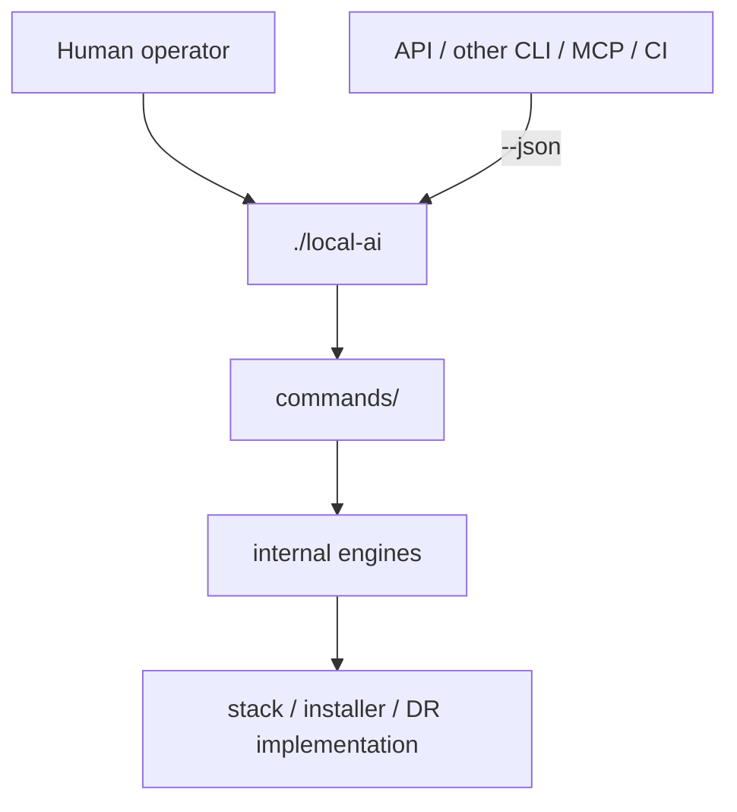

# Local Hybrid AI

Local-first AI platform built as independent Docker stacks. Git contains project source and declarative configuration; each installation owns its mutable runtime and local management state outside the checkout.

```mermaid
flowchart LR
    S0[Stack0 Platform] --> S1[Stack1 HAProxy]
    S0 --> S2[Stack2 Web]
    S0 --> S3[Stack3 LiteLLM]
    S0 --> S4[Stack4 Gitea]
    S0 --> S5[Stack5 Dockhand]
    S0 --> S6[Stack6 Hermes]
    S0 --> S7[Stack7 Open WebUI]
    S3 --> S6
    S3 --> S7
    S2 -. optional web.search / web.extract .-> S6
    S2 -. optional web.search / web.extract .-> S7
    S1 -. ingress .-> S7
```

## Repository contract

```text
/opt/docker/stacks    project source
/opt/docker/runtime   persistent installation runtime and management state
```

`.lock` means **PREPARED only**. It never means deployed, ready or healthy. Stack preparation must not silently rewrite the protected root `.env`.



## Management boundary

`./local-ai` is the **only supported management interface** for operators and external integrations. It is the project's anticorruption boundary: APIs, other CLIs, CI jobs, agents and UIs must not couple to internal Python files, shell scripts, Compose files or implementation paths.

Human output is the default. Machine consumers use the same CLI with `--json` where a stable JSON contract is available.



## Structure

```text
local-ai                sole supported management CLI
commands/               CLI command implementations; internal API
internal/               private catalogs and implementation support
README.md / LICENSE     repository entry points
docs/                   long-form documentation and evidence
adr/                    architecture decision records
sdr/                    security decision records
openspec/               lightweight Gherkin behaviour contracts
tests/                  all automated tests
installer/              shared lifecycle registry; internal
bkp-dr/                 DR implementation and schemas; internal
stack0_-_* ... stack7_-_*  atomic stack implementations; internal
```

## Operator entry points

```bash
./local-ai install --plan all
./local-ai install 0 1 2 3 4 5 6 7 --yes
./local-ai backup
./local-ai upgrade check
./local-ai --json upgrade check
```

Upgrade selection is installation-local. For a stack with one selectable component:

```bash
./local-ai upgrade stack7 select v0.12.0
```

For a stack with several components:

```bash
./local-ai upgrade stack3 litellm select 1.100.0
```

`Selected` is persisted under the installation runtime area. Availability does not imply consent: `--yes` must never auto-select unselected upgrades.

Internal scripts remain implementation details and may change without preserving their direct invocation contracts.

## Development validation

Tests may address internal modules directly; operator-contract tests exercise `./local-ai`.

```bash
python3 -m unittest discover -s tests -p 'test_*.py'
```

## Documentation

Start with [docs/README.md](docs/README.md). Installation is documented in [docs/installation.md](docs/installation.md), DR in [docs/dr/howto.md](docs/dr/howto.md), architectural decisions in [adr/](adr/), security decisions in [sdr/](sdr/), behavioural specifications in [openspec/](openspec/) and active work in [docs/pending.md](docs/pending.md).
