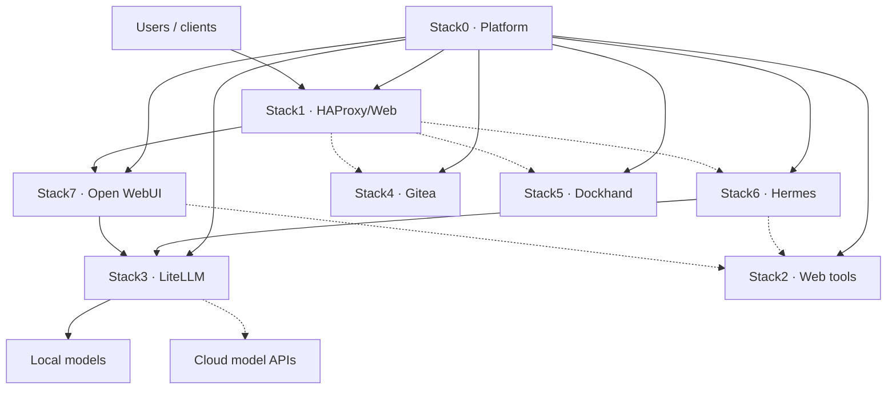
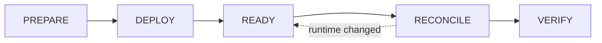
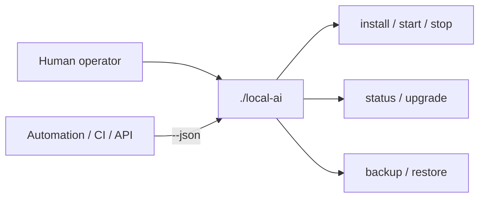

<!--
This Source Code Form is subject to the terms of the Mozilla Public
License, v. 2.0. If a copy of the MPL was not distributed with this
file, You can obtain one at https://mozilla.org/MPL/2.0/.
-->

# Local Hybrid AI

A **local-first, hybrid AI platform** assembled from independent Docker stacks. Local services are the default execution path; cloud services can be used deliberately when a workload or policy requires them. The repository is designed so that infrastructure ownership, security boundaries, persistence, recovery and upgrades remain explicit rather than hidden inside one monolithic Compose project.

A new reader begins with this page and then follows the [documentation map](docs/TOC.md), whose opening diagram routes operators, maintainers and contributors to the appropriate documentation layer.

## What problem this project solves

Local AI systems tend to become tightly coupled: one Compose file owns everything, application state leaks into the source checkout, agents gain excessive privileges, and upgrades become “pull the newest image and hope”. Local Hybrid AI takes the opposite approach:

- **local first** — inference, web tooling and agent execution can remain on the local platform;
- **hybrid by policy** — remote model providers are reached through the AI gateway, not directly by every consumer;
- **atomic stacks** — each stack declares what it requires, provides, consumes and owns;
- **one management boundary** — operators and automation use `./local-ai`, not private scripts as public APIs;
- **explicit mutable state** — Git source and installation runtime are separate;
- **fail closed** — missing required dependencies, unsafe lifecycle operations and indeterminate registry state do not become implicit success;
- **recoverable by design** — stateful resources declare recovery contracts; reconstructable resources are rebuilt from source;
- **version-aware upgrades** — a human version and an immutable image digest are different pieces of evidence.

## How the platform fits together



Stack0 is the shared foundation. Stack3 is a **required** AI dependency for Hermes and Open WebUI. Stack2 provides **optional** `web.search` and `web.extract` capabilities. Stack1 publishes services but does not own their application state. The detailed dependency/capability model is in the [stack architecture](docs/stacks/README.md).

## The eight stacks

| Stack | Purpose |
|---|---|
| **0 · Platform** | Shared Docker network, PKI and platform foundation |
| **1 · HAProxy/Web** | HTTPS ingress and static landing page |
| **2 · SearXNG/Firecrawl** | Local web search and extraction |
| **3 · LiteLLM** | OpenAI-compatible model/MCP gateway and policy boundary |
| **4 · Gitea** | Local Git service and Actions runner |
| **5 · Dockhand** | Container-management UI |
| **6 · Hermes** | Agent runtime, isolated sandbox and Git-backed durable memory |
| **7 · Open WebUI** | Curated chat UI over LiteLLM with optional local web tools |

## Source is not runtime

The repository is declarative project source. Mutable installation state lives outside the checkout:

```text
/opt/docker/stacks    Git checkout: source, manifests, Compose and documentation
/opt/docker/runtime   installation-owned runtime, secrets and management state
```

This separation is a core invariant. Stack preparation does not silently regenerate the protected root `.env`, and a stack `.lock` means **PREPARED only** — never “deployed”, “ready” or “healthy”. [Configuration](docs/configuration/README.md) and [ADR-0001](docs/devel-docs/adr/0001-backup-operational-env.md) describe the corresponding contracts.

## Lifecycle

Every managed stack follows the same conceptual lifecycle:



Preparation establishes prerequisites and declarative/runtime structure. Deployment starts or updates runtime. READY proves required runtime health. Reconciliation applies capability-dependent policy. VERIFY checks the resulting contract. [Installation](docs/installation.md) describes the operator workflow.

## One supported management interface

`./local-ai` is the project’s **sole supported management and automation boundary**. Python modules under `src/local_ai_cli/`, stack shell scripts and Compose files are implementation details.



Common entry points are:

```bash
./local-ai install --plan all
./local-ai install 0 1 2 3 4 5 6 7 --yes
./local-ai status
./local-ai start 5
./local-ai stop 5
./local-ai upgrade
./local-ai backup --yes
./local-ai restore list-backup-sets
./local-ai restore plan <backup-set>
```

Interactive backup asks for confirmation; unattended or JSON execution requires `--yes`. Restore planning is read-only and does not expose the recovery engine's private `--dry-run` implementation flag.

Selective lifecycle is conservative: `stop` refuses to stop a provider while required consumers are running, and `start` refuses to invent or auto-start missing required providers. The complete [CLI reference](docs/user-docs/cli.md), [management-plane architecture](docs/architecture/management-plane.md) and [ADR-0002](docs/devel-docs/adr/0002-single-management-cli.md) describe the boundary at different levels.

## Security boundaries

Security decisions are recorded explicitly rather than buried in Compose files. Important examples include: Hermes runs without the Docker socket; AI consumers use least-privilege LiteLLM credentials; service networking stays internal unless intentionally published; and Open WebUI model access is explicit. The [SDR index](docs/devel-docs/sdr/README.md) records the rationale.

## Upgrades and recovery

The normal upgrade workflow is **installed → available → selectable → selected → verified PASS**. Registry availability is discovery, not consent, and a component is selectable only after its executor has been qualified. The [upgrade guide](docs/user-docs/upgrade.md) is the operator entry point; compatibility rules are documented separately in [upgrade policy](docs/upgrade-policy.md).

Disaster recovery is manifest-driven. Stateful resources are backed up according to their recovery strategy; reconstructable resources are rebuilt. Backup publication and restore validation fail closed. The [DR guide](docs/dr/README.md) is the recovery entry point.

## Repository map

```text
local-ai                        supported operator/automation CLI
src/local_ai_cli/                private management implementation package
src/local_ai_cli/backup/         backup engine
src/local_ai_cli/restore/        restore engine
src/local_ai_cli/common/         shared primitives (manifests, DR archive/filesystem/postgres, render)
stack0_-_* … stack7_-_*         atomic stack implementations
docs/                           documentation and decision records
tests/                          automated verification, mirroring src/local_ai_cli/
```

The complete documentation structure is in [`docs/TOC.md`](docs/TOC.md). Behavioural traceability from requirements to implementation and tests is in [OpenSpec traceability](docs/devel-docs/openspec/traceability.md).

## Development gate

The repository validation gate is:

```bash
PYTHONDONTWRITEBYTECODE=1 python3 -m unittest discover -s tests -p 'test_*.py' -t .
```

Testing conventions and qualification evidence are documented in [testing strategy](docs/devel-docs/testing.md).