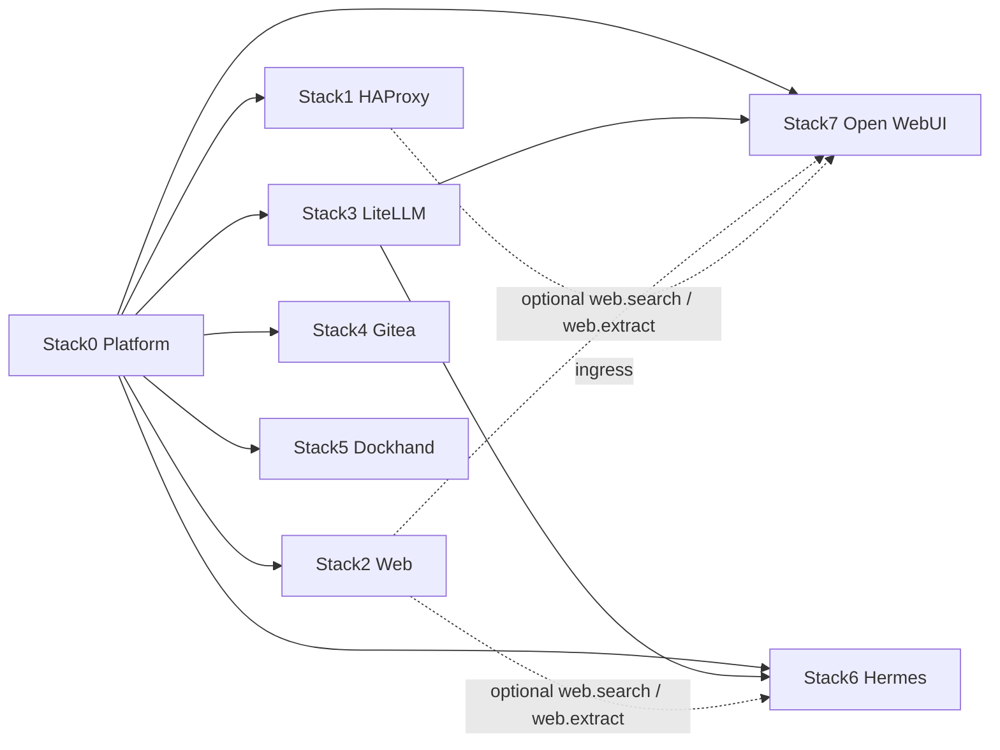
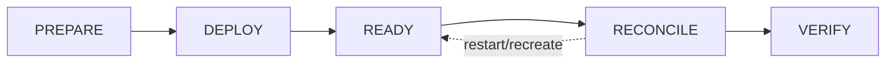
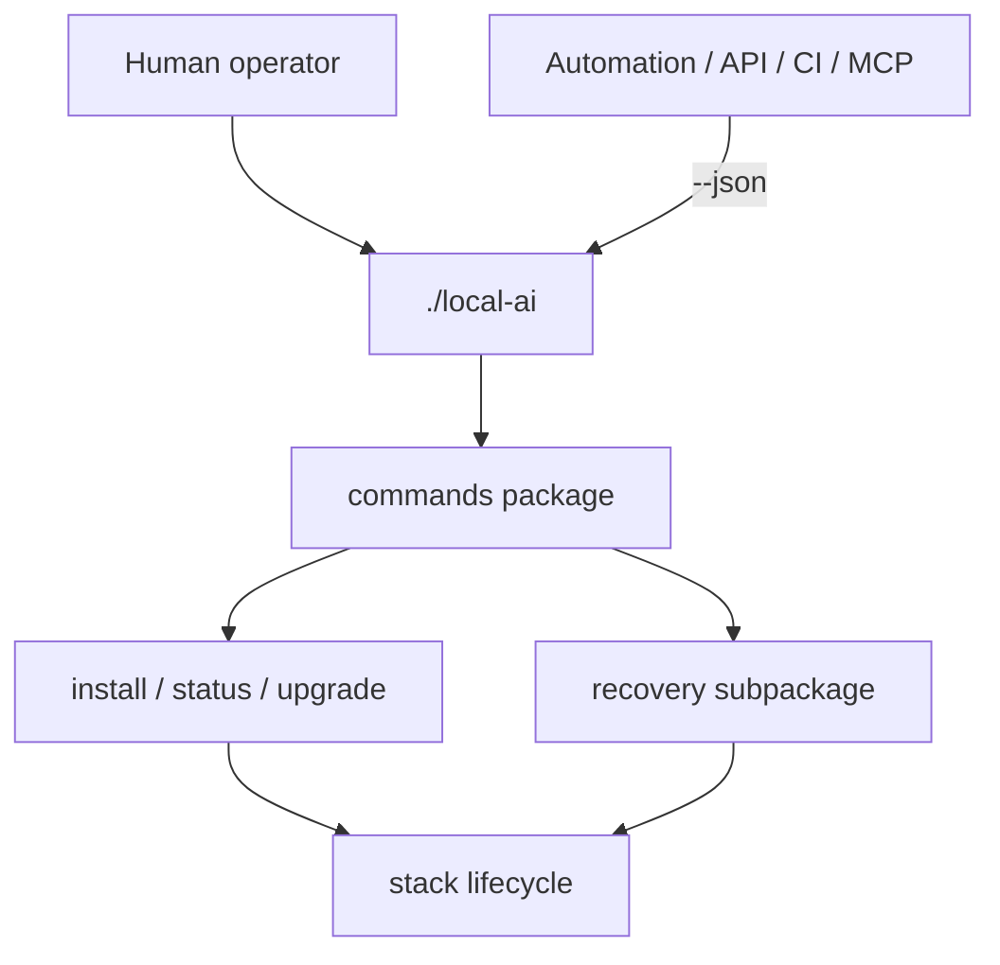

# Local Hybrid AI

Local-first AI platform built as independent Docker stacks. Git contains project source and declarative configuration; each installation owns its mutable runtime and local management state outside the checkout.



## Repository contract

```text
/opt/docker/stacks    project source
/opt/docker/runtime   persistent installation runtime and management state
```

`.lock` means **PREPARED only**. It never means deployed, ready or healthy. Stack preparation must not silently rewrite the protected root `.env`.



## Management boundary

`./local-ai` is the **only supported management interface** for operators and external integrations. It is the project's anticorruption boundary: APIs, other CLIs, CI jobs, agents and UIs must not couple to implementation modules, stack scripts or Compose files.

Human output is the default. Machine consumers use the same CLI with `--json` where a stable JSON contract is available.



## Structure

```text
local-ai                       sole supported management CLI
commands/                      private implementation package behind local-ai
commands/install.py            manifest-driven install/reconcile engine
commands/install-lifecycle.json lifecycle registry
commands/status.py             installation state view
commands/upgrade*.py           upgrade discovery, policy, guard and executor
commands/upgrade-components.json component upgrade metadata
commands/recovery/             backup/restore engines, adapters and schemas
docs/                          operator and developer documentation
docs/devel-docs/adr/           architecture decision records
docs/devel-docs/sdr/           security decision records
docs/devel-docs/openspec/      executable behavioural contracts
tests/                         all automated tests
stack0_-_* ... stack7_-_*      atomic stack implementations
```

There are deliberately no separate `internal/`, `installer/` or `bkp-dr/` implementation roots. Those concerns are all behind the same CLI and are organized under `commands/`; recovery remains a subpackage because it has enough engines, adapters and schemas to warrant its own namespace.

## Operator entry points

```bash
./local-ai install --plan all
./local-ai install 0 1 2 3 4 5 6 7 --yes
./local-ai backup
./local-ai restore plan <backup-set>
./local-ai upgrade check
./local-ai upgrade policy
./local-ai --json upgrade check
./local-ai status
```

`status` describes installation/runtime state as **Desired / Deployed / Actual / Drift**. `upgrade check` describes update decision state as **Actual / Available / Policy / Selectable / Selected / Valid**. `Actual` is the shared observation between both views; an upgrade selection never becomes desired state until it is explicitly applied.

Registry availability and upgrade compatibility are separate. Each component has a project default policy and each installation may override it locally with one of exactly three modes: `minor-series`, `major-series` or `manual`.

```bash
./local-ai upgrade policy stack7
./local-ai upgrade policy stack7 set major-series
./local-ai upgrade policy stack7 clear
```

`clear` removes only the installation override and returns to the project default.

Upgrade selection is installation-local. The selected version must be a real target published by the configured container registry and must pass both the effective compatibility policy and the independent `selectable` gate. A successful selection records the exact registry digest as immutable target identity; apply rejects the plan if the selected tag later resolves to a different digest.

```bash
./local-ai upgrade stack6 select <published-version>
./local-ai upgrade stack7 select <published-version>
./local-ai upgrade --yes
```

Availability does not imply compatibility or consent: `--yes` applies only explicitly selected upgrades and never means "upgrade everything".

Implementation files under `commands/` remain private and may change without preserving direct invocation contracts. Historical DR compatibility may recognize older source layouts when restoring an existing recovery point; that compatibility does not make historical paths public APIs.

## Development validation

Tests may address private modules directly; operator-contract tests exercise `./local-ai`.

```bash
PYTHONDONTWRITEBYTECODE=1 python3 -m unittest discover -s tests -p 'test_*.py'
```

## Documentation

Start with [docs/README.md](docs/README.md). Installation is documented in [docs/installation.md](docs/installation.md), upgrade compatibility policy in [docs/upgrade-policy.md](docs/upgrade-policy.md), DR in [docs/dr/howto.md](docs/dr/howto.md), architectural decisions in [docs/devel-docs/adr/](docs/devel-docs/adr/), security decisions in [docs/devel-docs/sdr/](docs/devel-docs/sdr/), behavioural specifications in [docs/devel-docs/openspec/](docs/devel-docs/openspec/) and active work in [docs/pending.md](docs/pending.md).
