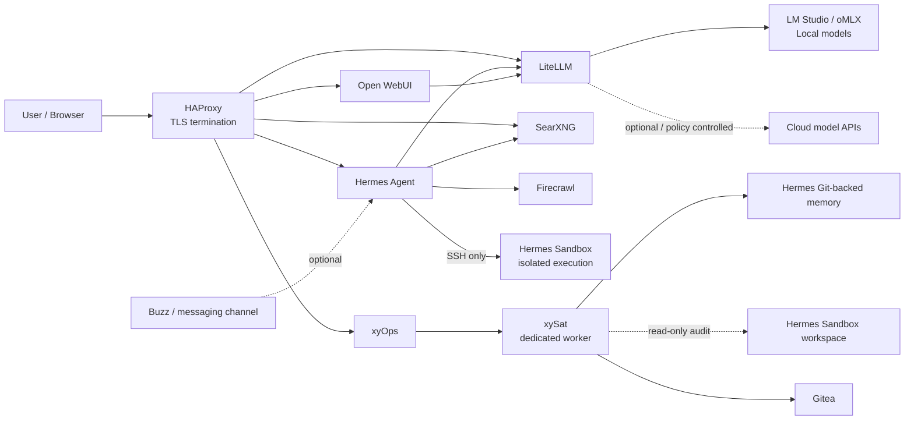
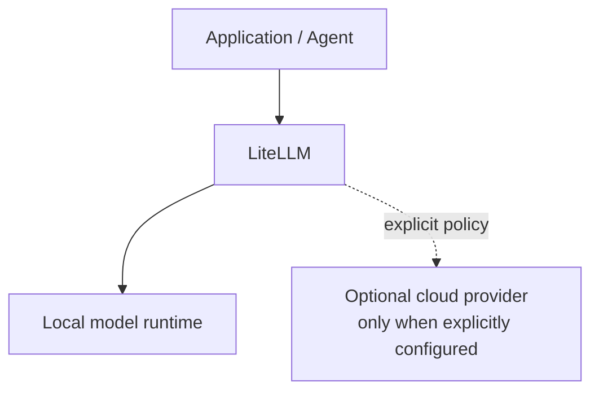
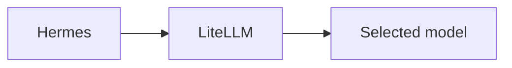
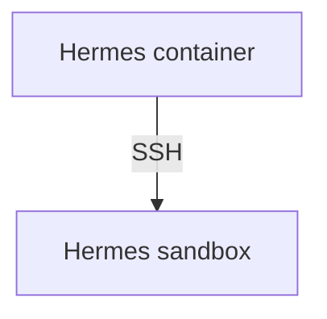
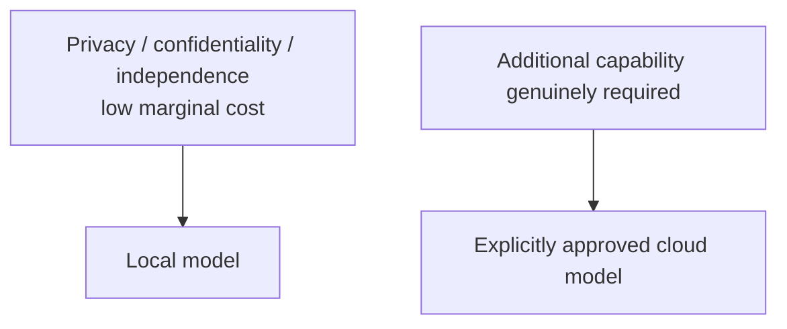

# Local Hybrid AI

**A local-first, hybrid AI reference implementation focused on data sovereignty, controlled routing, isolated agent execution and deliberately scoped automation.**

This repository is the practical companion to the article **Local hybrid AI: be sovereign with your data**.

The core idea is simple:

> **Local first. Cloud when necessary. The decision should belong to you.**

If every prompt, document, source-code fragment, log, internal conversation and business process has to leave infrastructure you control before AI can help, then the architecture depends on someone else's infrastructure, policies, pricing, availability and jurisdiction.

This project explores a different approach: keep the AI control plane, as much inference as practical, agent execution, search, extraction and operational automation inside infrastructure you operate, while retaining the ability to use external models deliberately when their additional capability justifies it.

This is not an argument that every workload must be offline. It is an argument that the boundary between local and cloud should be **explicit, technically enforceable and controlled by the operator**.

---

## What this repository contains

The repository contains Docker stacks, configuration patterns, deployment scripts and operational lessons from a real local/hybrid AI lab.

The current architecture combines:

- **LM Studio / oMLX** as local OpenAI-compatible inference runtimes.
- **LiteLLM** as the single model-routing and policy boundary.
- **Hermes Agent** as the autonomous / interactive agent runtime.
- **An isolated Hermes execution sandbox**, reached over SSH rather than Docker socket access.
- **Open WebUI** for general chat / model interaction where used.
- **SearXNG** for local/private metasearch.
- **Firecrawl** for web extraction and content acquisition.
- **HAProxy** as the TLS-terminating reverse proxy for internal services.
- **Gitea** as local/private Git infrastructure.
- **Dockhand** as container-management tooling.
- **xyOps + xySat** as the dedicated scheduling and controlled operational-automation layer.
- **Buzz** as an optional messaging interface to Hermes.

The `stackXX_*` directories are deployment units. The numeric prefix reflects the organisation of this lab; it is not intended as a universal dependency model.

---

## Architecture



### Model boundary

Applications and agents do **not** need direct credentials for every model provider.

The intended model path is:



For Hermes specifically:



Hermes is deliberately configured without provider-level fallback outside LiteLLM. Any cloud use belongs at the LiteLLM policy layer rather than silently inside the agent runtime.

---

## Why LiteLLM is central

LiteLLM is more than an API-compatibility layer. It is the **model policy boundary**.

It lets the rest of the environment target one OpenAI-compatible endpoint while the operator decides which model actually handles a request.

This makes it possible to:

- keep normal workloads local;
- expose stable model aliases to clients;
- swap or upgrade local runtimes without reconfiguring every application;
- issue per-application virtual keys;
- constrain which models a client may use;
- centralise logging, budgets, routing and provider policy;
- add cloud providers later without giving every application direct provider credentials.

A useful consequence is that an agent can be prevented from deciding on its own to fall back to an external provider.

---

## Local inference

The local inference layer is designed around OpenAI-compatible runtimes such as **LM Studio** and **oMLX**.

The architecture does not depend conceptually on one local runtime. The important contract is that the inference layer sits behind LiteLLM.

The objective is not to maximise benchmark scores at any cost. It is to find the point where **capability, privacy, latency, cost, power consumption, noise and independence** are acceptable together.

---

## Agent isolation

Giving an AI agent shell access is useful. Giving it unrestricted access to the Docker host is not.

Hermes therefore uses a separate execution container:



The sandbox is intended for activities such as:

- shell commands;
- Python and virtual environments;
- Node.js / npm;
- Git;
- compiling and testing code;
- document generation and conversion;
- PDF processing;
- spreadsheets;
- Word-compatible documents;
- PowerPoint-compatible presentations;
- LibreOffice / Pandoc workflows.

### Explicit Hermes boundaries

Hermes and its sandbox are intentionally designed without:

- `/var/run/docker.sock`;
- Docker-in-Docker;
- privileged mode;
- host networking;
- arbitrary host filesystem mounts.

The sandbox does not receive Hermes provider credentials, LiteLLM keys, messaging secrets or the Docker host filesystem.

Hermes reaches the sandbox through a dedicated private Docker bridge and SSH key pair.

---

## Operational automation boundary

Stack7 adds scheduling without turning the scheduler into a privileged host-management service.

The design principle is:

> **A scheduler is not the Docker host, and a scheduler is not the Docker daemon.**

The xyOps conductor coordinates schedules and job history. A dedicated xySat worker executes only explicitly approved jobs.

The Stack7 worker is intentionally deployed without:

- `/var/run/docker.sock`;
- `privileged: true`;
- host networking;
- an unrestricted `/opt/docker` mount;
- the host root filesystem.

Access is granted path-by-path and only to the degree required by a job.

### Validated jobs

Two jobs are currently integrated:

1. **Hermes Memory Sync**
   - runs every 10 minutes;
   - commits and pushes controlled changes to the Git-backed Hermes memory repository;
   - refuses automatic merge/rebase when history is divergent or when the remote is ahead while unsaved local memory exists;
   - never force-pushes.

2. **Hermes Sandbox Audit**
   - runs daily at 03:30 `Europe/Madrid`;
   - mounts the sandbox workspace read-only;
   - reports size, filesystem use, symlinks, file age and unclassified top-level objects;
   - performs no automatic deletion.

---

## Network model

The deployment uses distinct Docker-network roles.

### `redlocal`

`redlocal` is the shared external Docker bridge for infrastructure services that need to communicate internally, including examples such as:

```text
HAProxy
Hermes
LiteLLM
SearXNG
Firecrawl
Gitea
xyOps
xySat
```

Internal application ports generally do not need to be published directly on the Docker host. HAProxy and other internal clients can reach services by Docker DNS.

### `hermes-exec`

Hermes and its sandbox additionally share a private execution network:

```text
Hermes <-> hermes-sandbox
```

The sandbox is intentionally **not** attached to `redlocal`.

This limits its visibility of the broader application environment while preserving the controlled Hermes-to-sandbox SSH path.

---

## Reverse proxy and TLS

HAProxy is the ingress point for web-facing services.

Typical internal routing looks conceptually like:

```text
https://chat.example.lan      -> open-webui:8080
https://ai-gateway.example    -> litellm:4000
https://search.example        -> searxng:8080
https://agent.example         -> hermes:9119
https://xyops.example         -> xyops:5522
```

TLS terminates at HAProxy. Backend application ports can remain private to the Docker network.

For the deployed scheduler:

```text
Human/browser path:
https://xyops.casa.lan -> HAProxy -> xyops:5522

xySat internal path:
xysat -> redlocal -> xyops:5522
```

The worker does not need to use the LAN-facing hostname for conductor communication.

---

## Deployment layout v2

Source configuration and persistent runtime state are deliberately separated.

```text
/opt/docker/
├── stacks/
│   ├── stack1_-_haproxy_web/
│   ├── stack2_-_searxng_firecrawl/
│   ├── stack3_-_litellm/
│   ├── stack4_-_gitea/
│   ├── stack5_-_dockhand/
│   ├── stack6_-_hermes/
│   └── stack7_-_xyops/
└── runtime/
    ├── service_-_haproxy/
    ├── service_-_web/
    ├── service_-_searxng/
    ├── service_-_firecrawl-*/
    ├── service_-_litellm/
    ├── service_-_gitea/
    ├── service_-_gitea-runner/
    ├── service_-_hermes/
    ├── service_-_hermes-sandbox/
    ├── service_-_hermes-memory/
    ├── service_-_xyops/
    └── service_-_xysat/
```

The platform-wide contract is:

```dotenv
STACKS_ROOT=/opt/docker/stacks
BASE_PATH=/opt/docker/runtime
```

`STACKS_ROOT` contains source / Git-controlled stack definitions.

`BASE_PATH` contains deployed and persistent runtime state.

### Source of truth

The stack directory is the source definition.

The `service_-_*` runtime directory is not an independent source of truth. Managed configuration should be changed in the stack and deployed through the stack's preparation process.

### `.env`

`.env` contains deployment-specific values and secrets.

Preparation scripts may **read and validate** `.env`, but should not silently generate, append to or rewrite operational values.

### `.lock`

Preparation scripts use `.lock` to make state-changing preparation explicit.

A lock is created only after preparation and audit complete successfully.

---

## Stack map

| Stack | Purpose |
|---|---|
| `stack1_-_haproxy_web` | HAProxy / web ingress and internal TLS routing |
| `stack2_-_searxng_firecrawl` | Local/private search and extraction |
| `stack3_-_litellm` | Model gateway and policy boundary |
| `stack4_-_gitea` | Local Git service and runner |
| `stack5_-_dockhand` | Container-management tooling |
| `stack6_-_hermes` | Hermes agent, isolated sandbox and Git-backed memory |
| `stack7_-_xyops` | xyOps conductor and dedicated xySat scheduler worker |

---

## An important lesson: declared configuration is not always effective configuration

A container can be recreated correctly while **persistent runtime state continues to override the configuration you think you deployed**.

Examples encountered during Hermes integration include:

- runtime-generated `.env` values overriding container environment;
- session state retaining old model/provider choices;
- built-in presets referencing external providers;
- different code paths resolving configuration values differently;
- runtime shadow configuration surviving normal container recreation.

The resulting principle is:

> **Treat effective runtime configuration as something that must be tested, not assumed.**

This is why preparation, cleanup, runtime-state auditing and explicit end-to-end validation are separate concerns.

---

## Another important lesson: restart is not recreate

When an environment variable changes:

```bash
docker restart <container>
```

does not rebuild the container environment.

A Compose-managed service normally needs recreation:

```bash
docker compose up -d --force-recreate <service>
```

Even recreation may not be sufficient when an application reloads conflicting values from persistent state.

---

## Hermes model policy

Hermes uses a custom provider pointing to LiteLLM.

The intended policy is:

- no direct OpenAI/Codex provider from Hermes;
- no automatic OpenRouter fallback;
- no external provider fallback inside Hermes;
- auxiliary model calls follow the same LiteLLM-controlled boundary.

Failure should be visible. Fallback should be explicit.

---

## Git-backed Hermes memory

Hermes memory is maintained as a dedicated Git working tree under:

```text
/opt/docker/runtime/service_-_hermes-memory/data
```

The repository contains at least:

```text
MEMORY.md
USER.md
```

The remote is:

```text
ssh://git@gitea/ea1het/hermes-memory.git
```

Periodic synchronization is delegated to Stack7 rather than hidden inside Stack6 preparation.

The scheduler performs controlled fetch / fast-forward / commit / push operations and refuses to automatically resolve ambiguous divergence.

---

## Security and secrets

This repository is public. Real deployments must keep credentials outside Git.

Never commit real values for:

- `.env` files;
- LiteLLM master or virtual keys;
- LM Studio / local-runtime API tokens;
- cloud-provider API keys;
- Buzz private keys / auth tags;
- TLS private keys;
- SSH private keys;
- database passwords;
- xySat `config.json`;
- xySat auth tokens;
- xyOps bootstrap tokens;
- xyOps runtime secret keys;
- runtime databases containing credentials or session information.

Stack-specific `.gitignore` rules exclude operational files such as `.env` and `.lock`.

---

## Validation strategy

Debugging this system is easier when each boundary is tested independently.

A representative sequence is:

```text
1. Local inference runtime works.
2. LiteLLM can call the local inference runtime.
3. A request using an application-specific LiteLLM virtual key succeeds.
4. Hermes can call LiteLLM.
5. Hermes can reach the isolated sandbox over SSH.
6. Search and extraction paths work.
7. Optional messaging channels are validated.
8. xyOps conductor is healthy behind HAProxy.
9. xySat reaches xyops:5522 over redlocal.
10. Scheduler jobs are validated manually before their automatic triggers are enabled.
```

Validated Stack7 paths include:

```text
xyOps -> xySat -> hermes-memory-sync.sh -> Gitea
xyOps -> xySat -> hermes-sandbox-audit.sh
```

---

## What "hybrid" means here

Hybrid does **not** mean sending every request to both local and cloud models.

It means maintaining an architecture in which the operator can make an explicit decision:



Cloud capability can be useful. Dependency should not be invisible.

---

## Project status

This repository represents a **real, evolving lab implementation** rather than a finished commercial distribution.

Stacks are cleaned, documented and published progressively. Some conventions will continue to improve as operational edge cases are discovered.

The objective is reproducibility and transparency: show not only which containers run, but also the security boundaries, deployment discipline, routing decisions, scheduler boundaries and failure modes required to make a local/hybrid AI environment reliable.

---

## Contributing

Issues, corrections, architectural alternatives and pull requests are welcome.

Particularly useful contributions include:

- stronger isolation patterns;
- reproducible local-model routing;
- provider-independent model gateways;
- safer secret handling;
- controlled operational automation;
- better deployment validation;
- local-first agent tooling;
- improvements that reduce unnecessary cloud dependency without pretending cloud services have no value.

---

## License

This repository is licensed under the Mozilla Public License 2.0 (MPL-2.0).

---

## Core principle

> **Local first. Cloud when necessary. The decision should belong to you.**

