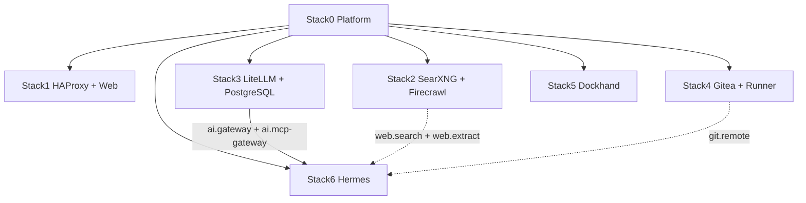
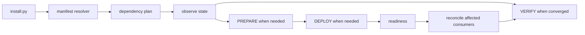
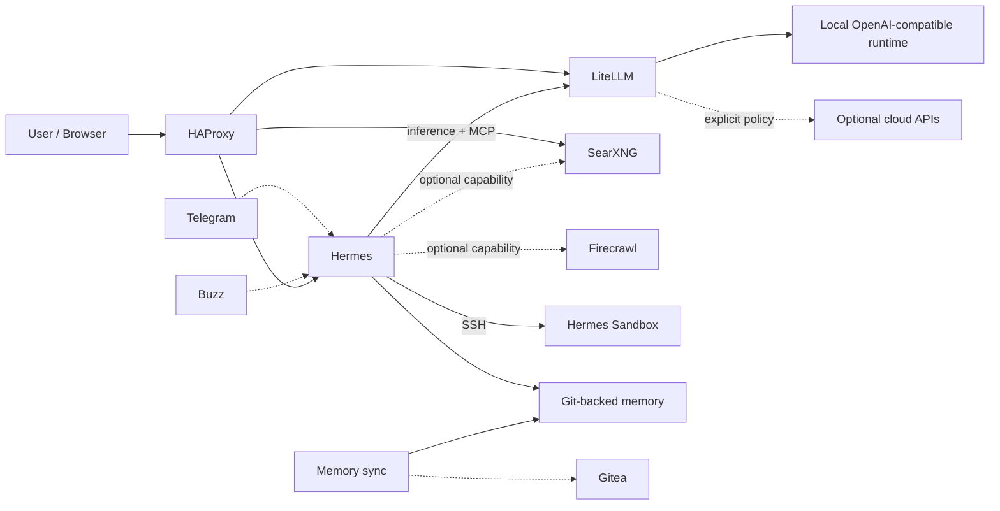
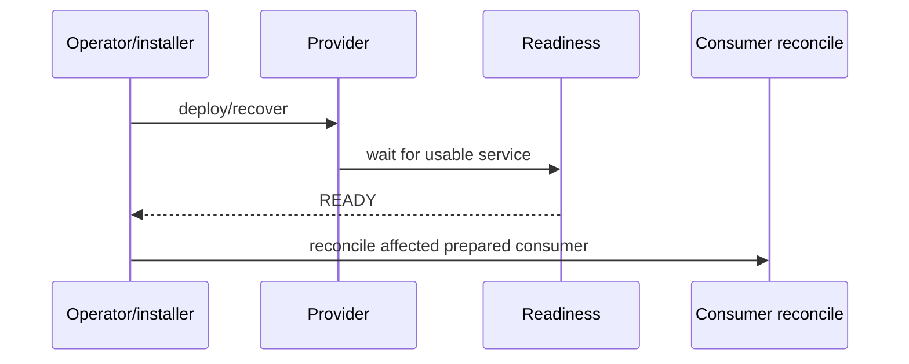

# Local Hybrid AI

**Local-first hybrid AI platform with explicit dependency, capability, readiness, persistence and security boundaries.**

> Local first. Cloud when necessary. The operator decides.

This repository contains the deployable Docker stacks and lifecycle controls for the platform. Git contains source and installation logic; mutable state, databases and operational secrets live outside the checkout.

## Architecture



| Stack | Purpose | Required dependencies | Main capabilities |
|---|---|---|---|
| 0 | platform foundation | none | environment, shared network, PKI |
| 1 | ingress + static web | 0 | `ingress.https`, `web.static` |
| 2 | local web search/extraction | 0 | `web.search`, `web.extract` |
| 3 | model-policy + MCP gateway | 0 | `ai.gateway`, `ai.mcp-gateway` |
| 4 | Git + Actions runner | 0 | `git.remote`, `git.runner` |
| 5 | container management | 0 | `containers.management` |
| 6 | AI agent + sandbox + memory | 0, 3 | `ai.agent`, `ai.sandbox`, `ai.memory` |

Every current application stack requires Stack0. Stack6 additionally requires Stack3. Stack2 and Stack4 are optional capability providers for Stack6. Dependencies and capabilities are declared in manifests rather than duplicated in installer conditionals.

The next planned extension is an independent Open WebUI stack. Its ID, ownership, persistence, dependencies, capabilities, readiness and ingress contract must be designed explicitly before implementation.

## Permanent filesystem contract

```text
/opt/docker/
├── stacks/                         # Git checkout / source
│   ├── .git/
│   ├── .env                        # operational values, ignored by Git
│   ├── .env.template               # tracked variable contract
│   ├── .env.secretsexplained.md    # secret provenance/lifecycle guide
│   ├── install.py                  # common installer
│   ├── installer/
│   └── stack0 ... stack6/
└── runtime/                        # persistent mutable state
```

Reference shared values:

```dotenv
STACKS_ROOT=/opt/docker/stacks
BASE_PATH=/opt/docker/runtime
NETWORK_NAME=redlocal
```

`/opt/docker/stacks` is source. `/opt/docker/runtime` is state. Never repair source by deleting runtime, and never put mutable production state in the Git worktree.

## Lifecycle model

```text
SOURCE
  -> PREPARED        stack-owned preparation completed; .lock exists
  -> DEPLOYED        required containers are running
  -> READY           stack-specific readiness passes
  -> RECONCILED      affected optional consumers match available capabilities
```

`.lock` means PREPARED only. It is not a health signal.

**DEPLOYED is not READY.** Stack2 demonstrates this explicitly: `02-wait-ready.sh` waits for `searxng:8080` and `firecrawl-api:3002` before optional consumers are reconciled.

PREPARE and RECONCILE are separate responsibilities. PREPARE creates or validates resources owned by the stack. RECONCILE adapts a prepared consumer to optional capabilities without rewriting `.env`, deleting `.lock`, or making the provider mutate consumer state.

## Common installer

`install.py` resolves dependency closure from manifests and invokes stack-owned lifecycle commands.



Inspect before execution:

```bash
python3 install.py 6 --plan
python3 install.py 6 --dry-run
python3 install.py all --plan
```

Execute deliberately:

```bash
sudo python3 install.py 6 --yes
sudo python3 install.py all --yes
```

The installer never rewrites the operational `.env`, deletes `.lock`, prunes Docker state, resets databases or executes historical migration helpers. Migration helpers are not part of the converged repository: the tracked source represents the current clean-install architecture only.

## Database security standard

Application stacks that own PostgreSQL follow the same principle:

```text
postgres        -> administrative/bootstrap identity
application role -> normal application connectivity
```

The administrative role is not used by the application during routine operation. Its password is stack-owned runtime secret state outside `.env`; the application password remains a dedicated application credential.

### Stack2 / Firecrawl

```text
firecrawl-postgres / database postgres
├── postgres     SUPERUSER, owner/bootstrap, pg_cron
│   secret: ${BASE_PATH}/service_-_firecrawl-postgres/secret/postgres_admin_password
└── firecrawl    non-admin application role
    secret: FIRECRAWL_DB_PASSWORD
```

The database remains named `postgres` because the pinned NuQ image configures `pg_cron` for that database. Firecrawl itself connects as `firecrawl`, not `postgres`. PostgreSQL does not publish 5432 to the host.

### Stack3 / LiteLLM

```text
litellm-postgres
├── postgres             administrative/bootstrap role
│   secret: ${BASE_PATH}/service_-_litellm-postgres/secret/postgres_admin_password
└── ${LITELLM_DB_USER}   LiteLLM application role
    secret: LITELLM_DB_PASSWORD
```

Both stacks treat PGDATA and database credentials as persistent identity. Existing PGDATA owner/mode/inode are preserved; recursive `chown`, cluster recreation or password regeneration are not routine repair mechanisms.

## Runtime flow



LiteLLM is the inference/provider policy boundary. Hermes does not silently bypass it. When Stack2 is not ready, Hermes web tooling remains explicitly disabled rather than falling through to an external provider.

## Security and ownership contracts

- Stack0 owns platform-shared resources: environment links, `redlocal`, platform runtime, PKI and manifest validation.
- Every application stack owns its own containers and persistent state.
- PostgreSQL administrative identities are separate from application roles.
- No real secret belongs in Git.
- Stack-owned secrets that need not be shared prefer restricted runtime files rather than the central `.env`.
- Hermes receives no Docker socket and executes through an isolated SSH sandbox.
- The sandbox is not attached to `redlocal`.
- Optional providers do not become hidden required dependencies.
- Absence of local optional capability must fail closed, not silently escalate to cloud.
- Historical migration helpers are removed after convergence; normal installation must not depend on them.

## Capabilities and incremental composition

Stack6 demonstrates optional capability consumption. Stack2 provides `web.search` and `web.extract`; Stack4 provides `git.remote`. A provider transition is followed by provider readiness and then consumer-owned reconciliation.



A provider that is already healthy and ready is verification-only and should not cause spurious consumer recreation.

## Secrets and credential provenance

`.env.template` defines the variable contract. [`.env.secretsexplained.md`](.env.secretsexplained.md) documents where each secret comes from, who generates or issues it, where it is stored, what consumes it and what rotation means.

Important distinctions include:

- operator-generated secrets;
- application-generated secrets;
- service-issued credentials such as LiteLLM client keys;
- external-provider credentials;
- runtime-generated stack identities;
- operator-provisioned runtime identities;
- derived secrets such as password hashes.

Do not confuse a random string with a service-issued credential, and do not regenerate a persistent identity just because a generator exists.

## Operations

See [`INSTALLATION.md`](INSTALLATION.md) for clean installation, lifecycle, updates, verification and maintenance. Each stack README defines stack-specific ownership and safety boundaries. AI/coding agents should read [`a2aknowledge.md`](a2aknowledge.md) before modifying the platform.

The desired end state after any maintenance is:

```text
Git source on intended commit
+ clean worktree
+ operational .env preserved
+ runtime identities preserved
+ required containers running
+ readiness passing
+ installer dry-run showing verification-only convergence
```
