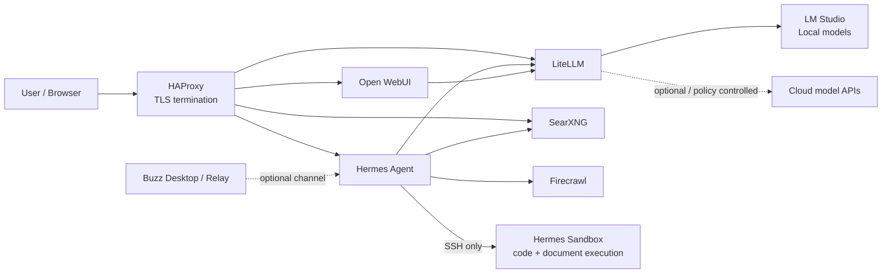
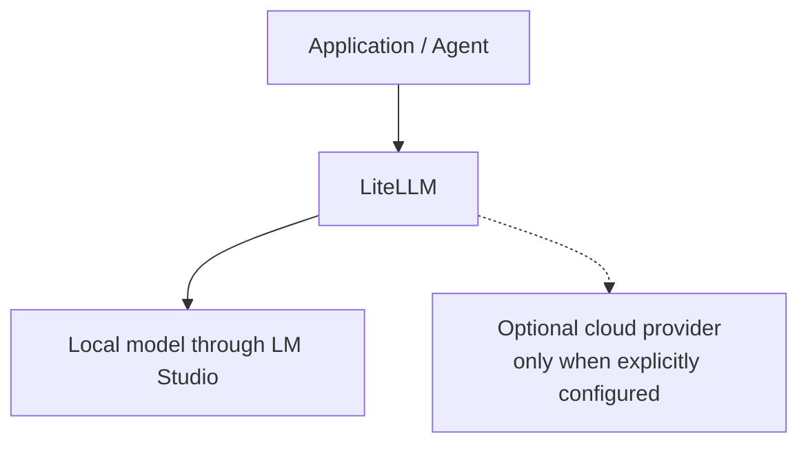
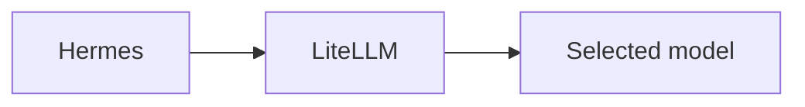
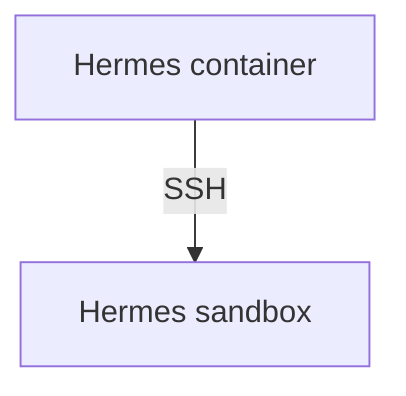
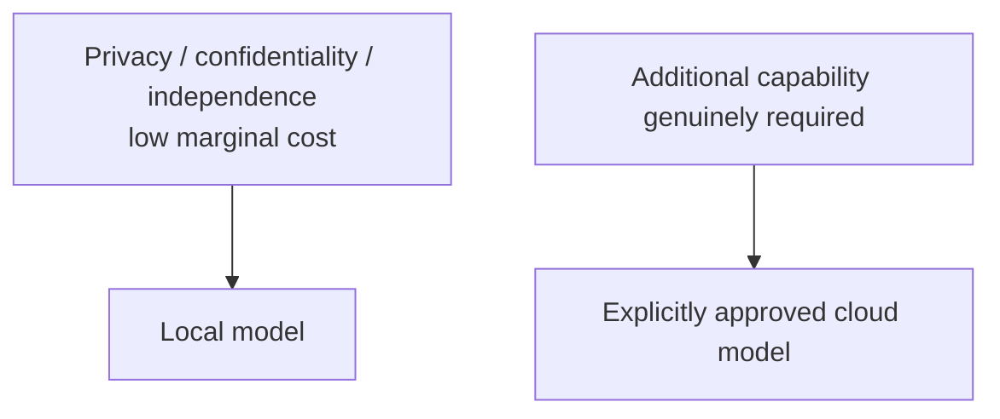

# Local Hybrid AI

**A local-first, hybrid AI reference implementation focused on data sovereignty, controlled routing and isolated agent execution.**

This repository is the practical companion to my LinkedIn article **[Local hybrid AI: be sovereign with your data](https://www.linkedin.com/pulse/local-hybrid-ai-sovereign-your-data-jonathan-gonz%25C3%25A1lez-msc-ea1het--zhmoe)**.

The core idea is simple:

> **Local first. Cloud when necessary. The decision should belong to you.**

If every prompt, document, source-code fragment, log, internal conversation and business process has to leave your infrastructure before AI can help you, then your AI architecture is dependent on someone else's infrastructure, policies, pricing, availability and jurisdiction.

This project explores a different approach: keep the AI control plane and as much inference and tooling as practical inside infrastructure you operate, while retaining the ability to use external models deliberately when their additional capability justifies it.

This is not an argument that every workload must be offline. It is an argument that **the boundary between local and cloud should be explicit, technically enforceable and controlled by the operator**.


## What this repository contains

The repository contains the Docker stacks, configuration patterns, deployment scripts and operational lessons from a real local/hybrid AI lab.

The architecture currently combines:

- **LM Studio** as a local OpenAI-compatible inference endpoint.
- **LiteLLM AI gateway** as the single model-routing and policy boundary.
- **Hermes Agent** as an autonomous/interactive agent runtime.
- **An isolated Hermes execution sandbox** reached over SSH rather than Docker socket access.
- **Open WebUI** for general chat/model interaction.
- **SearXNG** for local/private metasearch.
- **Firecrawl** for web extraction and content acquisition.
- **HAProxy** as the TLS-terminating reverse proxy for internal services.
- **Buzz** as an optional messaging interface to Hermes.
- Supporting services such as internal Git hosting and management tooling where useful to the environment.

The `stackXX_*` directories are intended to be published progressively. The numeric prefix reflects the deployment organisation of this lab; it should not be interpreted as a universal dependency model.


## Architecture



### The important boundary

Applications and agents do **not** need direct credentials for every model provider.

The intended model path is:



For Hermes specifically, the goal is stricter:



Hermes is deliberately configured without external fallback providers. Any cloud access should be introduced at the LiteLLM policy layer rather than silently from the agent runtime.


## Why LiteLLM is central

LiteLLM is used as more than an API compatibility layer. It is the **model policy boundary**.

It allows the rest of the environment to target one OpenAI-compatible endpoint while the operator decides which model actually handles the request.

That makes it possible to:

- keep normal workloads local;
- expose stable model aliases to clients;
- swap or upgrade local models without reconfiguring every application;
- issue per-application virtual keys;
- constrain which models a client can use;
- centralise logging, budgets, routing and provider policy;
- add a cloud provider later without giving every application direct cloud credentials.

A useful consequence is that an agent can be prevented from deciding on its own to fall back to a third-party provider.


## Local inference

The current local inference layer uses **LM Studio** with its OpenAI-compatible server.

The design does not depend conceptually on LM Studio; another compatible local inference server could sit behind LiteLLM. LM Studio is simply the implementation currently used in this environment.

The local-model strategy favours models that are capable enough for general work, coding, reasoning, document processing and agent tasks while remaining practical on efficient local hardware.

The broader objective is not to maximise benchmark scores at any cost. It is to find the point where **capability, privacy, latency, cost, power consumption, noise and independence** are acceptable together.


## Agent isolation

Giving an AI agent shell access is useful. Giving it unrestricted access to the Docker host is not.

Hermes therefore uses a separate execution container.



The sandbox is intended for activities such as:

- shell commands;
- Python and virtual environments;
- Node.js/npm;
- Git;
- compiling and testing code;
- document generation and conversion;
- PDF processing;
- spreadsheets;
- Word-compatible documents;
- PowerPoint-compatible presentations;
- LibreOffice / Pandoc workflows.

### Explicit security boundaries

Hermes and its sandbox are intentionally designed **without**:

- `/var/run/docker.sock`;
- Docker-in-Docker;
- privileged mode;
- host networking;
- arbitrary host filesystem mounts.

The sandbox does not receive Hermes provider credentials, LiteLLM keys, messaging secrets, or the Docker host filesystem.

Hermes reaches the sandbox through a dedicated private Docker bridge and SSH key pair.


## Network model

The deployment uses two distinct network concepts.

### Shared service network

`redlocal` is an external Docker bridge used by services that need to communicate inside the application environment, for example:

```text
HAProxy
Hermes
LiteLLM
SearXNG
Firecrawl
Open WebUI
```

Internal services generally do not need their application ports published directly on the Docker host. HAProxy can reach them by container DNS over the shared network.

### Private execution network

Hermes and its sandbox additionally share a private execution network.

The sandbox is intentionally **not** attached to `redlocal`.

This limits its visibility of the rest of the application environment while still allowing normal outbound Docker NAT connectivity when required.


## Reverse proxy and TLS

HAProxy is the ingress point for web-facing services. It acts as as anticorruption layer as well. 

Typical internal routing looks conceptually like:

```text
https://chat.example.lan     -> open-webui:8080
https://ai-gateway.example   -> litellm:4000
https://search.example       -> searxng:8080
https://agent.example        -> hermes:9119
```

TLS terminates at HAProxy. Backend application ports can therefore remain private to the Docker network instead of being exposed directly on the host.

Using a second layer of TLS is up to you. It was definitely not needed for this lab. 

## Deployment philosophy

The stacks use a deliberate separation between **source configuration** and **persistent service state**.

Conceptually:

```text
/opt/docker/stackXX_-_<service>/
    .env
    .lock
    01-prepare.sh
    02-cleanup.sh        # where applicable
    docker-compose.yml
    config/

/opt/docker/service_-_<service>/
    config/
    data/
    logs/
```

### Source of truth

The `stackXX_*` directory is the source definition.

The `service_-_*` directory is the deployed/persistent runtime location.

Configuration should therefore be changed in the stack and deployed through the preparation process rather than edited independently in both locations.

### `.env`

`.env` contains deployment-specific values and secrets.

`01-prepare.sh` may **read and validate it, but must not generate, append to, or silently modify it**.

### `.lock`

Preparation scripts use a `.lock` file to make destructive or state-changing preparation explicit.

The lock is checked before other preparation work and is created only after preparation and audit complete successfully.

### `01-prepare.sh`

The preparation phase is responsible for tasks such as:

- validating prerequisites;
- validating the external Docker network;
- creating the expected service tree;
- deploying managed configuration;
- generating infrastructure keys where appropriate;
- setting ownership and permissions;
- checking dependent containers;
- running `docker compose config --quiet`;
- auditing the final filesystem state;
- creating `.lock` only after success.

### `02-cleanup.sh`

Some applications create runtime configuration or state that survives container recreation. A controlled cleanup phase is therefore being added for stacks where stale state can shadow the declared configuration.

Cleanup is intentionally separate from preparation and should only run while the relevant containers are stopped and the deployment lock has been deliberately removed.


## An important lesson: declared configuration is not always effective configuration

One of the most useful lessons from building this environment is that a container can be recreated correctly while **persistent runtime state continues to override the configuration you think you deployed**.

Examples encountered during the Hermes/Buzz integration included:

- a runtime-generated `/opt/data/.env` containing old credentials overriding Docker-provided environment variables;
- session state retaining old model/provider choices;
- built-in Mixture-of-Agents presets referencing external providers even when the main model was local;
- different code paths resolving configuration values differently;
- environment-variable substitution working in the CLI while a gateway path passed the literal `${VARIABLE}` string downstream.

The resulting design principle is:

> **Treat effective runtime configuration as something that must be tested, not assumed.**

For values that a component does not resolve consistently at runtime, the preferred pattern is to render the final managed configuration during the controlled preparation phase rather than hardcoding values or relying on an undocumented secondary `.env`.


## Another important lesson: restart is not recreate

When an environment variable changes:

```bash
docker restart <container>
```

does not rebuild the container environment.

A Compose-managed service normally needs to be recreated:

```bash
docker compose up -d --force-recreate <service>
```

Even that is not sufficient when an application reloads conflicting values from a persistent volume. That distinction is one of the reasons the cleanup/audit workflow exists in this repository.


## Hermes model policy

Hermes is configured with a **custom provider pointing to LiteLLM**.

The intended policy is:

- no direct OpenAI/Codex provider;
- no automatic OpenRouter fallback;
- no external fallback providers;
- Mixture-of-Agents presets constrained to the same `custom`/LiteLLM route;
- auxiliary tasks use the main provider rather than an implicit external provider.

This is important because a local-first architecture is not local-first if an agent framework can silently select a remote model when something fails.

Failure should be visible. Fallback should be explicit.


## Buzz integration

Buzz is an optional messaging front end for Hermes.

In this architecture Hermes runs remotely in Docker, so the intended integration is the **Hermes native messaging gateway**, not a second local Hermes process launched through Buzz ACP on the desktop.

The gateway integration uses a Buzz/Nostr agent identity and, depending on how that identity was created, requires values such as:

```text
BUZZ_RELAY_URL
BUZZ_PRIVATE_KEY
BUZZ_AUTH_TAG
BUZZ_CLI_PATH
```

These are secrets/runtime values and **must never be committed to a git repository**, not even this one.

A useful operational detail: the private key associated with the Buzz **agent pubkey** must be used, not the owner's identity key. The owner-signed authentication tag and the agent private key form separate parts of the authentication relationship.


## Security and secrets

This repository is public. Real deployments must treat the checked-in configuration as code and keep credentials outside Git.

Ensure you never commit real values for:

- `.env` files;
- LiteLLM master keys;
- LiteLLM virtual keys;
- LM Studio API tokens;
- cloud-provider API keys;
- Buzz `nsec` private keys;
- `BUZZ_AUTH_TAG` values;
- TLS private keys;
- SSH private keys;
- database passwords;
- generated `auth.json` files;
- runtime state databases containing credentials or session information.

The `.gitignore` on this repository already ignores `.env`; stack-specific exclusions may be added as the repository evolves. I forced the addition manually for educational purposed. Be careful yourself. 


## Validation strategy

Debugging this type of system is much easier when each boundary is tested independently.

A typical validation sequence is:

```text
1. Local inference server works.
2. LiteLLM can call the local inference server.
3. A request using the application's LiteLLM virtual key succeeds.
4. The application/agent can call LiteLLM directly.
5. The application web interface works.
6. Optional external channels such as Buzz are added last.
```

For example, when diagnosing an agent path, a direct request from the Hermes container to LiteLLM can prove that networking, authentication, model aliases, LiteLLM and LM Studio are healthy before debugging the Hermes gateway itself.

This repository intentionally documents those operational lessons instead of presenting only the final happy-path configuration.


## What "hybrid" means here

Hybrid does **not** mean sending every request to both local and cloud models.

It means maintaining an architecture in which the operator can make an explicit decision:



Cloud capability can be useful. Dependency should not be invisible.


## Project status

This repository represents a **real, evolving lab implementation** rather than a finished commercial distribution.

Stacks are being cleaned, documented and published progressively. Some scripts and conventions will continue to improve as operational edge cases are discovered.

The objective is reproducibility and transparency: show not only which containers run, but also the security boundaries, deployment discipline, routing decisions and failure modes required to make a local/hybrid AI environment reliable.


## Contributing

Issues, corrections, architectural alternatives and pull requests are welcome.

Particularly useful contributions include:

- stronger isolation patterns;
- reproducible local-model routing;
- provider-independent model gateways;
- safer secret handling;
- better deployment validation;
- local-first agent tooling;
- improvements that reduce unnecessary cloud dependency without pretending cloud services have no value.


## License

This repository is licensed under the **Mozilla Public License 2.0 (MPL-2.0)**. See [LICENSE](LICENSE).


## Related article

**Local hybrid AI: be sovereign with your data**  
Jonathan González (EA1HET) 
https://www.linkedin.com/pulse/local-hybrid-ai-sovereign-your-data-jonathan-gonz%25C3%25A1lez-msc-ea1het--zhmoe
