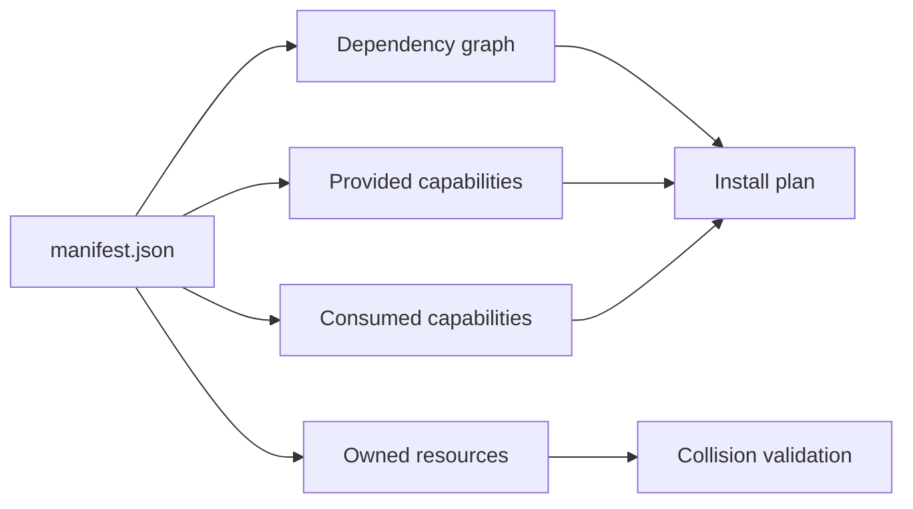
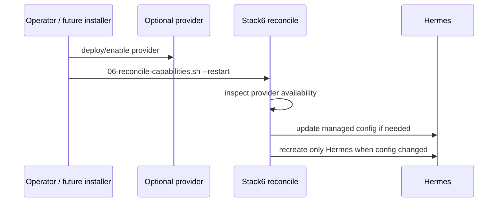
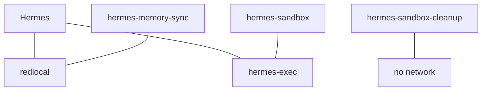

# Local Hybrid AI

**Local-first hybrid AI platform with explicit dependency, capability and security boundaries.**

> Local first. Cloud when necessary. The decision should belong to the operator.

This repository contains the deployable Docker stacks and operational controls for a small local/hybrid AI platform. Source lives in Git; mutable runtime state and secrets do not.

## Architecture at a glance

```mermaid
flowchart TB
    S0[Stack0 Platform] --> S1[Stack1 HAProxy + Web]
    S0 --> S2[Stack2 SearXNG + Firecrawl]
    S0 --> S3[Stack3 LiteLLM + PostgreSQL]
    S0 --> S4[Stack4 Gitea + Runner]
    S0 --> S5[Stack5 Dockhand]
    S0 --> S6[Stack6 Hermes]
    S3 -->|ai.gateway + ai.mcp-gateway| S6
    S2 -. web.search + web.extract .-> S6
    S4 -. git.remote .-> S6
```

Every application stack requires Stack0. Stack6 additionally requires Stack3. Stack2 and Stack4 are optional capability providers for Stack6.

| Stack | Role | Required dependencies | Main capabilities |
|---|---|---|---|
| 0 | platform foundation | none | platform environment, network, PKI |
| 1 | ingress + static web | 0 | `ingress.https`, `web.static` |
| 2 | local web search/extraction | 0 | `web.search`, `web.extract` |
| 3 | AI/model/MCP gateway | 0 | `ai.gateway`, `ai.mcp-gateway` |
| 4 | Git + Actions runner | 0 | `git.remote`, `git.runner` |
| 5 | container management | 0 | `containers.management` |
| 6 | agent + sandbox + memory | 0, 3 | `ai.agent`, `ai.sandbox`, `ai.memory` |

All seven stacks are atomic in the current manifest graph. `target_requires` remains supported by the resolver for architecture evolution, but the current and target dependency sets of Stacks 0, 2, 3 and 6 are already aligned.

## Runtime flow

```mermaid
flowchart LR
    U[User / Browser] --> HP[HAProxy]
    TG[Telegram] -. optional .-> H[Hermes]
    BZ[Buzz] -. optional .-> H
    HP --> H
    HP --> LL[LiteLLM]
    HP --> SX[SearXNG]
    H -->|inference + MCP| LL
    LL --> LOCAL[Local OpenAI-compatible runtime]
    LL -. explicit policy .-> CLOUD[Optional cloud APIs]
    H -. when capability available .-> SX
    H -. when capability available .-> FC[Firecrawl]
    H -->|SSH| SB[Hermes Sandbox]
    H --> MEM[Git-backed memory]
    MS[Memory sync] -. optional git.remote .-> G[Gitea]
    MS --> MEM
    CLEAN[Sandbox cleanup] --> SB
```

LiteLLM is the model-policy and MCP boundary. Hermes does not silently bypass it for provider inference. Web tooling is explicitly disabled when Stack2 is unavailable; it is enabled by Stack6 reconciliation only when both local providers are available. Git-memory synchronization is separately controlled by persistent operator intent and requires Stack4/Gitea.

## Design contracts

- **Stack0 is mandatory.** It owns the central environment links, shared network, platform runtime, PKI and manifest validation.
- **Atomic ownership.** Each application stack owns its own containers and persistent state.
- **Dependency-driven composition.** `manifest.json` declares `requires`, `optional`, `provides`, `consumes`, `optional_consumes` and `owns`.
- **PREPARE is not DEPLOY.** `.lock` means only that `01-prepare.sh` completed successfully.
- **PREPARE and RECONCILE are separate.** Preparation creates/validates stack-owned resources. Reconciliation adapts a prepared consumer to optional capabilities without changing `.lock`.
- **Source/runtime separation.** `/opt/docker/stacks` is Git-managed source; `/opt/docker/runtime` is persistent mutable state.
- **No secrets in Git.** Operational `.env`, database credentials, TLS/SSH private material and runtime databases remain outside source control.
- **No Docker socket for Hermes.** Agent execution goes through an isolated SSH sandbox.
- **No implicit web fallback.** Absence of Stack2 leaves Hermes web tools disabled rather than falling through to an external provider.
- **Deterministic maintenance stays deterministic.** Hermes native Cron handles agentic deferred work; small sidecars handle Git-memory sync and sandbox cleanup.

## Manifest model

Stack0 discovers `stackN_-_*` directories and validates their manifests. The resolver checks IDs/directories, graph dependencies, cycles, ownership collisions and capability contracts.



Examples:

```bash
python3 stack0_-_platform/manifests.py validate
python3 stack0_-_platform/manifests.py validate --target
python3 stack0_-_platform/manifests.py plan 3
python3 stack0_-_platform/manifests.py plan 6
python3 stack0_-_platform/manifests.py plan all
```

For Stack6 the minimum plan is Stack0 -> Stack3 -> Stack6. Stack2 and Stack4 are not mandatory dependencies.

## Capability reconciliation

Stack6 demonstrates the intended incremental lifecycle:



`06-reconcile-capabilities.sh` does not create provider resources and does not alter `.env` or `.lock`.

- Stack2 present: local `web.search` + `web.extract` become available and Hermes web tooling can be enabled.
- Stack2 absent/incomplete: web remains explicitly disabled.
- Stack4 present + Git-memory desired/enabled + safe Git preconditions: `hermes-memory-sync` can run.
- Stack4 unavailable: the sidecar stops while local memory and desired state are preserved.

## Filesystem contract

```text
/opt/docker/
├── stacks/                         # Git checkout / source
│   ├── .env                        # operational, ignored by Git
│   ├── .env.template               # tracked variable contract
│   ├── stack0_-_platform/
│   ├── stack1_-_haproxy_web/
│   ├── stack2_-_searxng_firecrawl/
│   ├── stack3_-_litellm/
│   ├── stack4_-_gitea/
│   ├── stack5_-_dockhand/
│   └── stack6_-_hermes/
└── runtime/                        # persistent mutable state
    ├── service_-_platform/
    ├── service_-_haproxy/
    ├── service_-_web/
    ├── service_-_searxng/
    ├── service_-_firecrawl-*/
    ├── service_-_litellm/
    ├── service_-_litellm-postgres/
    ├── service_-_gitea/
    ├── service_-_gitea-runner/
    ├── service_-_hermes/
    ├── service_-_hermes-memory/
    ├── service_-_hermes-memory-sync/
    └── service_-_hermes-sandbox/
```

Shared deployment context:

```dotenv
STACKS_ROOT=/opt/docker/stacks
BASE_PATH=/opt/docker/runtime
NETWORK_NAME=redlocal
```

Stack5 is the exception to directory-backed persistence: it owns the external Docker volume `dockhand_data`.

## Network and execution boundaries



The sandbox has no Docker socket, is not privileged, is not attached to `redlocal`, and receives no arbitrary host filesystem mounts. Its workspace is scratch space. Durable artifacts must be persisted explicitly.

## Stack3 PostgreSQL safety

Stack3 owns a dedicated PostgreSQL 17.10 service and runtime. Existing PGDATA ownership, permissions and inode identity are preserved by PREPARE. PREPARE must never force an existing PGDATA to `root:root`; PostgreSQL owns that directory inside the bind-mounted runtime.

`LITELLM_SALT_KEY`, LiteLLM database state and the Stack3 PostgreSQL administrative secret are persistent identities and must not be rotated casually.

The legacy `90-migrate-postgres-from-stack2.sh` is only for deployments created before Stack3 became atomic. It is not part of a clean install and must not be rerun after a successful migration.

## Hermes memory and sandbox

Git-backed memory lives under `service_-_hermes-memory/data`. `04-gitmem.sh` performs adoption/validation; routine reconciliation never clones, pulls, merges, rebases, commits or pushes. The optional memory-sync sidecar performs conservative synchronization and refuses divergence rather than auto-merging.

Sandbox generation integrity is represented by both `.sandbox-generation` and `state/state.db`; they must agree. `hermes-sandbox-cleanup` has no network and applies retention/quarantine policy. `02-cleanup.sh --reset-sandbox --yes` is the bounded recovery path for a corrupt generation and deliberately preserves Hermes state, Git memory, SSH identities and managed configuration.

## Interfaces and optional integrations

Open WebUI, Telegram and Buzz are optional interfaces. Telegram and Buzz credentials may be empty; empty means disabled. They are not required for the core Hermes -> LiteLLM -> inference path.

The validated Hermes pin is:

```dotenv
HERMES_IMAGE=nousresearch/hermes-agent
HERMES_VERSION=v2026.8.31
```

## Installation and operations

See [`INSTALLATION.md`](INSTALLATION.md) for the complete deployment and update flow. Each stack README documents its ownership, preparation, startup and recovery boundaries.

Bootstrap always starts with Stack0:

```bash
cd /opt/docker/stacks
sudo ./stack0_-_platform/install.sh
```

## Security

Never commit real operational `.env` values, provider/inference/MCP credentials, Telegram/Buzz secrets, TLS or SSH private keys, database passwords, Hermes runtime databases/sessions, Git-memory SSH material or sandbox lifecycle state.

Treat effective runtime configuration as something to validate, not assume.
