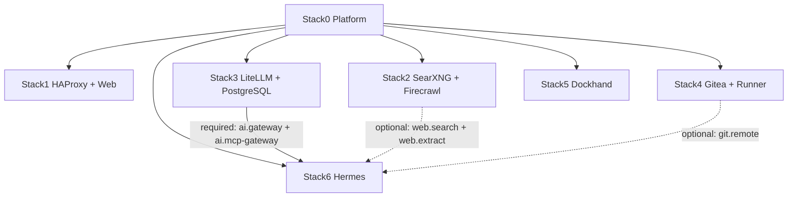
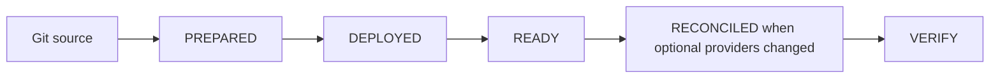
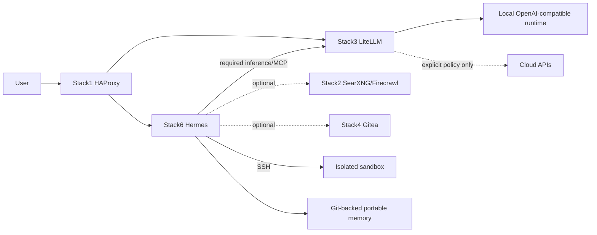
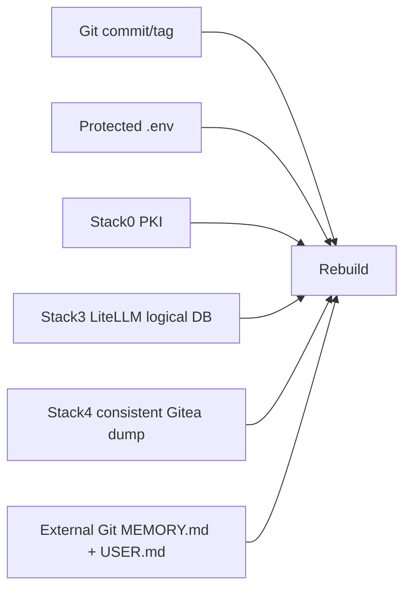

# Local Hybrid AI

Local-first hybrid AI platform composed of atomic Docker stacks with explicit ownership, dependency, capability, readiness, persistence, security and disaster-recovery contracts.

> Local first. Cloud when necessary. The operator decides.

## Architecture

| Stack | Directory | Function | Requires | Provides |
|---|---|---|---|---|
| 0 | [`stack0_-_platform`](stack0_-_platform/README.md) | shared environment/network/PKI/manifest foundation | — | platform foundation |
| 1 | [`stack1_-_haproxy_web`](stack1_-_haproxy_web/README.md) | HAProxy ingress + static web | 0 | `ingress.https`, `web.static` |
| 2 | [`stack2_-_searxng_firecrawl`](stack2_-_searxng_firecrawl/README.md) | local search/extraction | 0 | `web.search`, `web.extract` |
| 3 | [`stack3_-_litellm`](stack3_-_litellm/README.md) | model-policy + MCP gateway | 0 | `ai.gateway`, `ai.mcp-gateway` |
| 4 | [`stack4_-_gitea`](stack4_-_gitea/README.md) | Git service + Actions runner | 0 | `git.remote`, `git.runner` |
| 5 | [`stack5_-_dockhand`](stack5_-_dockhand/README.md) | container management UI | 0 | `containers.management` |
| 6 | [`stack6_-_hermes`](stack6_-_hermes/README.md) | replaceable agent + sandbox + portable Git-backed memory | 0, 3 | `ai.agent`, `ai.sandbox`, `ai.memory` |

Stack2 and Stack4 are optional providers for Stack6. Optional capabilities must never become hidden required dependencies or silent cloud fallbacks.

## Runtime and lifecycle

`.lock` means PREPARED only. `/opt/docker/stacks` is Git source; `/opt/docker/runtime` is persistent mutable state. The operational root `.env` is ignored by Git and must not be rewritten by stack preparation.

The common [`install.py`](install.py) resolves dependencies and lifecycle from manifests. See [`INSTALLATION.md`](INSTALLATION.md) and [`installer/README.md`](installer/README.md).

## Runtime flow

## Database/security model

Stack-local PostgreSQL uses `postgres` only as administrative/bootstrap identity and a dedicated non-admin application role for routine connectivity. Stack2 uses `firecrawl`; Stack3 uses the configured LiteLLM application role. PostgreSQL admin passwords are restricted runtime secrets outside `.env`; application credentials remain protected operational configuration. Existing PGDATA must never be recursively replaced/chowned/reset as routine maintenance.

See [`.env.secretsexplained.md`](.env.secretsexplained.md) for secret provenance.

## Backup and disaster recovery

All DR implementation, schemas, tests and detailed documentation live under [`bkp-dr/`](bkp-dr/README.md).

Stack0 PKI, Stack3 LiteLLM DB and Stack4 Gitea have real backup + isolated restore evidence. Stack1, Stack2 and Stack5 are reconstructable. Stack6/Hermes is also reconstructable as a whole: its runtime, `SOUL.md`, SQLite databases, caches, logs and complete sandbox are disposable. The only durable Stack6 exception is user-owned portable memory (`MEMORY.md` + `USER.md`) externalized to Git and verified independently. Read [`bkp-dr/STATUS.md`](bkp-dr/STATUS.md) before continuing DR work.

## Maintainer navigation

- [`a2aknowledge.md`](a2aknowledge.md) — architecture and AI-agent handoff rules.
- [`pending.md`](pending.md) — explicitly deferred/uncompleted work.
- [`INSTALLATION.md`](INSTALLATION.md) — installation/update/verification.
- [`bkp-dr/README.md`](bkp-dr/README.md) — backup/DR entry point.
- [`bkp-dr/STATUS.md`](bkp-dr/STATUS.md) — current DR evidence and exact continuation point.
- [`.env.secretsexplained.md`](.env.secretsexplained.md) — secrets and credential lifecycle.

The next planned independent stack is Open WebUI; its contract must be designed before implementation and is tracked in [`pending.md`](pending.md).
