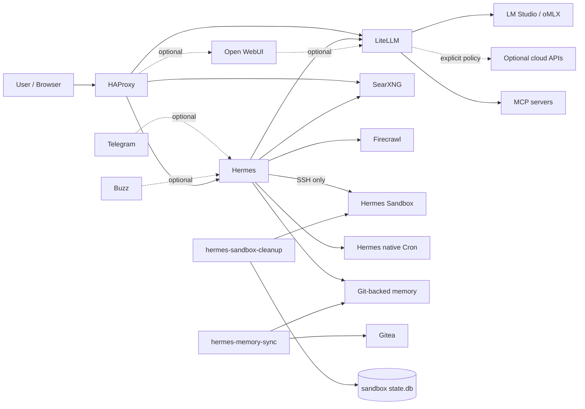

# Local Hybrid AI

**A local-first, hybrid AI reference implementation focused on data sovereignty, explicit routing, isolated agent execution and deliberately scoped automation.**

> **Local first. Cloud when necessary. The decision should belong to you.**

This repository contains the Docker stacks, configuration patterns and operational controls used to run a small local/hybrid AI platform without making a cloud provider, an agent framework or the Docker daemon the implicit trust boundary.

The objective is not to force every workload offline. The objective is to make the boundary between local and cloud **visible, enforceable and operator-controlled**.

## Design principles

- **Local inference first.** Applications target a local OpenAI-compatible runtime whenever possible.
- **One model-policy boundary.** LiteLLM owns model routing and optional cloud escalation.
- **One MCP boundary.** Hermes reaches upstream MCP servers through the LiteLLM MCP gateway.
- **One platform bootstrap.** Stack0 owns shared environment links, network bootstrap, PKI lifecycle and dependency-manifest validation.
- **Atomic application ownership.** A stack owns its application-specific persistent state instead of provisioning inside another stack.
- **No Docker socket for the agent.** Hermes executes through a dedicated SSH sandbox.
- **Scratch is not storage.** Sandbox artifacts are disposable unless explicitly persisted elsewhere.
- **Native agent scheduling for agentic work.** Future intelligent work uses Hermes native Cron.
- **Deterministic maintenance stays deterministic.** Git memory sync and sandbox housekeeping are small purpose-built sidecars.
- **Source and runtime are separated.** Git-managed stack definitions live under `/opt/docker/stacks`; persistent state lives under `/opt/docker/runtime`.
- **Secrets never belong in Git.** Operational `.env`, SSH/TLS private material and runtime databases stay outside the repository.

## Current architecture

The current source tree contains one mandatory platform/bootstrap stack and six application stacks:

| Stack | Responsibility |
|---|---|
| `stack0_-_platform` | Platform bootstrap, manifest/dependency registry, shared network, central `.env` links and PKI lifecycle |
| `stack1_-_haproxy_web` | HAProxy ingress, TLS routing and static web service |
| `stack2_-_searxng_firecrawl` | Local/private search and web extraction, including Firecrawl-owned PostgreSQL |
| `stack3_-_litellm` | Model policy/routing and MCP gateway, with dedicated LiteLLM PostgreSQL |
| `stack4_-_gitea` | Local Git service and runner |
| `stack5_-_dockhand` | Container-management tooling |
| `stack6_-_hermes` | Hermes, native Cron, isolated sandbox, Git-backed memory and maintenance sidecars |

Stack0 does not run an application container. It is the mandatory platform foundation for application-stack preparation and for future dependency-driven installation.

There is **no standalone scheduling stack**. Deferred agentic work is handled by Hermes native Cron. Mechanical maintenance is handled inside Stack6 by `hermes-memory-sync` and `hermes-sandbox-cleanup`.

### Dependency model

Each stack contains a machine-readable `manifest.json`. Stack0 discovers those manifests and validates the dependency graph instead of maintaining a hard-coded stack table.

Stack3 is now atomic and requires only Stack0. Stack6 is still in transition: its current graph includes Stack2 because the current prepare script hard-checks the local web services, while the target minimum is Stack0 + Stack3. Stack2 and Stack4 are intended to remain optional capability providers for Hermes.

### Logical data flow



Open WebUI, Telegram and Buzz are optional interfaces; they are not required for the core Hermes -> LiteLLM -> inference path.

## Model and MCP policy boundary

Applications and agents target LiteLLM instead of embedding provider-specific routing:

```text
Application / Hermes -> LiteLLM -> selected model
Hermes -> LiteLLM MCP Gateway -> upstream MCP servers
```

Cloud inference, when configured, belongs behind LiteLLM policy. Hermes is intentionally not configured with silent provider fallback outside that boundary.

LiteLLM now owns a dedicated PostgreSQL service inside Stack3. Firecrawl keeps its own PostgreSQL inside Stack2; no application database is shared across those stack boundaries.

## Agent execution boundary

Hermes terminal execution is deliberately indirect:

```text
Hermes -> SSH -> hermes-sandbox
```

The sandbox:

- has no Docker socket;
- is not privileged;
- is isolated from `redlocal`;
- receives no arbitrary host filesystem mounts;
- exposes only the SSH execution path required by Hermes;
- treats `/workspace` as ephemeral scratch space.

Anything required by later work must be persisted to an available durable location before the current agent run finishes.

## Deferred agentic work

Hermes native Cron is the only agentic deferred-work mechanism in this repository.

Scheduled jobs run as fresh agent sessions. Therefore a future job prompt must be self-contained: it should describe the objective, required inputs, durable artifact locations and expected result without depending on the conversation that created it.

The managed Hermes system prompt includes two persistent policies:

- `deferred_work_policy` — schedule only work that genuinely depends on a future time/event and avoid duplicate or meaningless jobs;
- `sandbox_lifecycle_policy` — never assume scratch files will still exist when a future job runs.

## Git-backed Hermes memory

Long-term Hermes memory is stored as a dedicated Git working tree:

```text
/opt/docker/runtime/service_-_hermes-memory/data/
├── .git/
├── MEMORY.md
└── USER.md
```

`04-gitmem.sh` prepares and validates the working tree. It does not merge, rebase, commit or push.

`hermes-memory-sync` performs the periodic synchronization, every 900 seconds by default:

```dotenv
MEMORY_SYNC_INTERVAL_SECONDS=900
```

Its behavior is intentionally conservative:

- only `MEMORY.md` and `USER.md` may be dirty;
- remote-ahead + clean local state may fast-forward;
- local changes may be committed and pushed;
- divergence fails instead of auto-merging or rebasing;
- force-push is never used;
- local and remote heads are checked again after synchronization.

The sidecar uses a dedicated SSH identity stored outside Git:

```text
/opt/docker/runtime/service_-_hermes-memory-sync/ssh/
├── id_ed25519
├── known_hosts
└── ssh_config
```

## Sandbox lifecycle

The sandbox generation is defined by **two pieces of persistent state that must agree**:

```text
/opt/docker/runtime/service_-_hermes-sandbox/data/workspace/.sandbox-generation
/opt/docker/runtime/service_-_hermes-sandbox/data/state/state.db
```

The marker contains the logical generation ID. The SQLite metadata contains the same generation ID. Sandbox startup fails closed if one is missing, invalid or mismatched.

On the first boot of a new generation:

1. a new generation ID is created;
2. `state.db` is initialized;
3. existing top-level workspace objects become the protected baseline;
4. `.sandbox-generation` and `.cleanup-quarantine` are protected;
5. `sshd` starts only after lifecycle state is valid.

A normal container restart preserves the same generation.

### Cleanup sidecar

`hermes-sandbox-cleanup` has `network_mode: none` and works only with the sandbox workspace and lifecycle database.

Default policy:

```dotenv
SANDBOX_CLEANUP_RETENTION_DAYS=7
SANDBOX_CLEANUP_QUARANTINE_DAYS=1
SANDBOX_CLEANUP_DB_RETENTION_DAYS=90
SANDBOX_CLEANUP_SWEEP_HOUR=3
SANDBOX_CLEANUP_SWEEP_MINUTE=30
```

It watches workspace activity with inotify, reconciles the top-level filesystem during sweeps, quarantines inactive post-baseline objects and removes them after the grace period. Deleted records remain in SQLite for the configured audit-retention period.

The cleaner also validates that `.sandbox-generation` still matches `state.db` before operating.

## Recovery: reset one sandbox generation

If the lifecycle database or generation marker becomes corrupt or inconsistent, Stack6 provides a bounded recovery mode:

```bash
cd /opt/docker/stacks/stack6_-_hermes
docker compose stop hermes hermes-sandbox hermes-sandbox-cleanup
sudo ./02-cleanup.sh --reset-sandbox --yes
docker compose up -d hermes-sandbox hermes hermes-sandbox-cleanup
```

`--reset-sandbox` deletes only the current sandbox workspace generation and lifecycle state. It preserves:

- Hermes runtime/session/auth state;
- Git-backed memory;
- sandbox home and `authorized_keys`;
- sandbox host identity;
- managed configuration;
- memory-sync SSH identity.

The next sandbox boot creates a fresh logical generation.

## Network model

`redlocal` is the shared infrastructure network created/validated by Stack0 and used by services that must communicate across stacks, including HAProxy, Hermes, LiteLLM, SearXNG, Firecrawl, Gitea and `hermes-memory-sync`.

Hermes and the sandbox additionally share the private `hermes-exec` bridge. The sandbox is not attached to `redlocal`.

`hermes-sandbox-cleanup` has no network namespace connectivity.

## Filesystem contract

```text
/opt/docker/
├── stacks/                         # Git checkout / source only
│   ├── stack0_-_platform/
│   ├── stack1_-_haproxy_web/
│   ├── stack2_-_searxng_firecrawl/
│   ├── stack3_-_litellm/
│   ├── stack4_-_gitea/
│   ├── stack5_-_dockhand/
│   └── stack6_-_hermes/
└── runtime/                        # persistent runtime only
    ├── service_-_platform/
    ├── service_-_haproxy/
    ├── service_-_web/
    ├── service_-_searxng/
    ├── service_-_firecrawl-*/
    ├── service_-_litellm/
    ├── service_-_litellm-postgres/
    ├── service_-_gitea/
    ├── service_-_gitea-runner/
    ├── service_-_hermes/
    ├── service_-_hermes-memory/
    ├── service_-_hermes-memory-sync/
    └── service_-_hermes-sandbox/
```

The shared platform context is:

```dotenv
STACKS_ROOT=/opt/docker/stacks
BASE_PATH=/opt/docker/runtime
NETWORK_NAME=redlocal
```

`STACKS_ROOT` is source. `BASE_PATH` is mutable persistent state. Stack0 owns the shared network and platform runtime.

## Stack6 service ownership

| Service | Network | Persistent state | Main purpose |
|---|---|---|---|
| `hermes` | `redlocal` + `hermes-exec` | `service_-_hermes`, Git-backed memory mount | Agent, tools, messaging, native Cron |
| `hermes-sandbox` | `hermes-exec` | `service_-_hermes-sandbox` | Isolated SSH execution |
| `hermes-memory-sync` | `redlocal` | memory worktree + dedicated SSH identity | Conservative Git synchronization |
| `hermes-sandbox-cleanup` | none | sandbox workspace + sandbox `state.db` | Lifecycle tracking and cleanup |

The cleanup sidecar owns no separate persistent runtime directory.

## Validated reference deployment

The current architecture has been validated on the reference homelab with the following boundaries exercised independently:

```text
Stack0 -> central env links + redlocal + PKI bootstrap
Stack3 -> dedicated PostgreSQL 17.10 persistence
LiteLLM -> local inference
Hermes -> LiteLLM virtual-key authentication after Stack3 DB migration
Hermes -> LiteLLM -> local inference
Hermes -> SSH -> hermes-sandbox
Hermes -> SearXNG / Firecrawl
Hermes native Cron -> real future one-shot agent run
hermes-memory-sync -> Gitea fetch + write authorization
sandbox -> generation initialization + normal restart persistence
sandbox-cleanup -> inotify + audit + quarantine + deletion
--reset-sandbox -> fresh logical generation
HAProxy -> current service routes
```

The deployment no longer depends on a separate scheduler runtime.

## Version policy

The currently validated Hermes pin is:

```dotenv
HERMES_IMAGE=nousresearch/hermes-agent
HERMES_VERSION=v2026.8.31
```

The repository retains the temporary `TERMINAL_TIMEOUT` workaround while the corresponding upstream issue remains unresolved for the deployed version.

## Quick deployment pointer

Full installation instructions are in [`INSTALLATION.md`](INSTALLATION.md). Stack6-specific operational details are in [`stack6_-_hermes/README.md`](stack6_-_hermes/README.md).

Bootstrap Stack0 before preparing any application stack:

```bash
cd /opt/docker/stacks
sudo ./stack0_-_platform/install.sh
```

The manifest resolver shows current/target dependency plans. The Stack6 prepare/start sequence remains:

```bash
cd /opt/docker/stacks/stack6_-_hermes
sudo ./01-prepare.sh
sudo ./04-gitmem.sh
sudo ./05-maintenance-sidecars.sh

docker compose config --quiet
docker compose up -d --build
docker compose ps
```

## Security and secrets

This repository is public. Never commit real values for:

- operational `.env` files;
- provider, inference or MCP credentials;
- Telegram/Buzz credentials;
- TLS private keys;
- SSH private keys;
- database passwords;
- Hermes runtime databases, sessions or auth state;
- the memory-sync SSH identity;
- sandbox lifecycle databases or generation state.

Treat effective runtime configuration as something that must be **tested, not assumed**.
