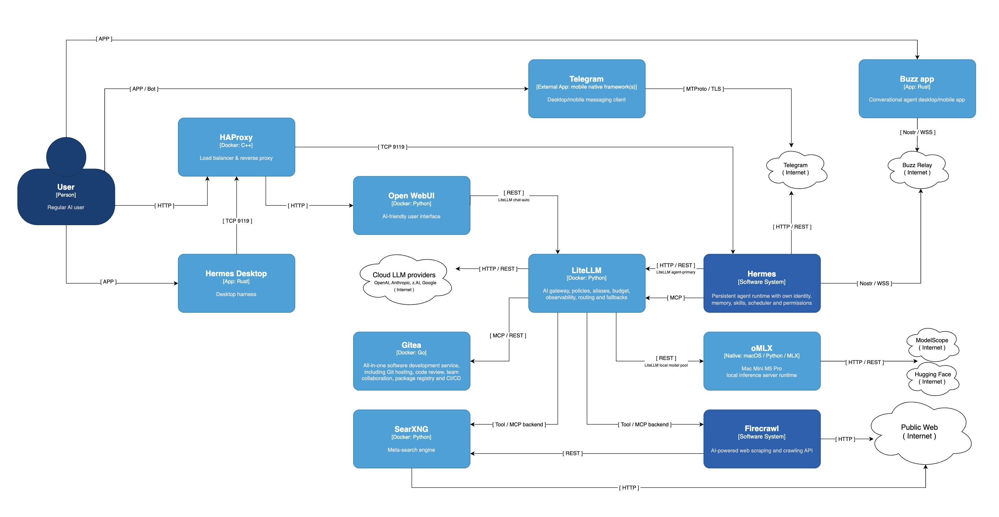
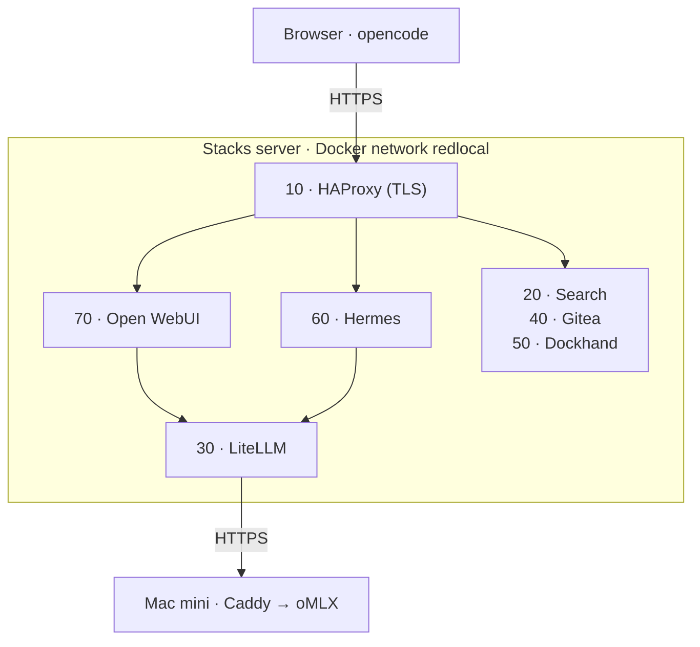

<!--
This Source Code Form is subject to the terms of the Mozilla Public
License, v. 2.0. If a copy of the MPL was not distributed with this
file, You can obtain one at https://mozilla.org/MPL/2.0/.
-->

# Local Hybrid AI

Local-first AI infrastructure: eight Docker Compose stacks on one Linux server, using a Mac mini running oMLX for inference. One command, `./local-ai`, prepares, starts, stops, and inspects each stack.

New to the project? Follow the [reading guide](#reading-guide).

## Architecture




```mermaid
flowchart TB
    Clients["Browser · opencode"]
    subgraph server["Stacks server · Docker network redlocal"]
        HAProxy["10 · HAProxy (TLS)"]
        WebUI["70 · Open WebUI"]
        Hermes["60 · Hermes"]
        Others["20 · Search<br/>40 · Gitea<br/>50 · Dockhand"]
        LiteLLM["30 · LiteLLM"]
    end
    oMLX["Mac mini · Caddy → oMLX"]
    Clients -->|HTTPS| HAProxy
    HAProxy --> WebUI & Hermes & Others
    WebUI & Hermes --> LiteLLM
    LiteLLM -->|HTTPS| oMLX
```

The diagram shows the main request path. Also:

- AI consumers reach models only through LiteLLM (Stack 30), each with its own scoped key. HAProxy also publishes LiteLLM for external tools such as opencode.
- Hermes and Open WebUI use Stack 20 for web search when it is running. Hermes can keep its memory in a Git repository, for example on Gitea.
- Git clients reach Gitea over SSH directly on port 2222.
- Stack 00 has no containers: it prepares the host (directories, network, CA trust, and TLS certificates).

HAProxy routes by host name below `ROOT_HOSTNAME` (default `casa.lan`). The subdomains are configurable in `.env`:

| Host | Service |
| --- | --- |
| `casa.lan` | static landing page (`/haproxy`: HAProxy stats) |
| `buscar.casa.lan` | SearXNG |
| `chat.casa.lan` | Open WebUI |
| `gwia.casa.lan` | LiteLLM |
| `git.casa.lan` | Gitea |
| `homelab.casa.lan` | Dockhand |
| `norai.casa.lan` | Hermes |

## Stacks

| Stack | Purpose | Install requires |
| --- | --- | --- |
| [00 · Platform](stack-00_-_platform/README.md) | Host directories, `redlocal` network, CA trust, HAProxy TLS | `.env` |
| [10 · HAProxy + Web](stack-10_-_haproxy_web/README.md) | HTTPS ingress and landing page | 00 |
| [20 · SearXNG + Firecrawl](stack-20_-_searxng_firecrawl/README.md) | Optional local web search and extraction | 00 |
| [30 · LiteLLM](stack-30_-_litellm/README.md) | AI gateway and model credentials | 00, `OMLX_API_KEY` |
| [40 · Gitea](stack-40_-_gitea/README.md) | Git server and Actions runner | 00 |
| [50 · Dockhand](stack-50_-_dockhand/README.md) | Optional Docker management UI | `redlocal` network only |
| [60 · Hermes](stack-60_-_hermes/README.md) | Agent with SSH sandbox | 00, 30 |
| [70 · Open WebUI](stack-70_-_open-webui/README.md) | Chat UI | 00, 30 and LiteLLM running |

## Quick start

On the server, as root, from the checkout (`STACKS_ROOT`, default `/opt/docker/stacks`):

```bash
./local-ai env bootstrap          # create .env from .env.template and generate local secrets
# edit .env: set OMLX_API_KEY and review hostnames and paths
# copy rootCA.pem, tls.crt, and tls.key to the paths set in .env (see the mkcert guide)
./local-ai stack-00 install
./local-ai stack-00 status --deep
./local-ai stack-10 install && ./local-ai stack-10 start
./local-ai stack-30 install && ./local-ai stack-30 start
# then, in any order: stack-20, 40, 50, 60, 70 (install, then start)
```

See [operations](docs/operations.md) for the full order, what each verb does, and how to read `status`.

## The `local-ai` command

```text
./local-ai stack-NN {install|start|stop|status [--deep]|reconfig [--apply]}
./local-ai env bootstrap
./local-ai completion {bash|zsh} [install|status]
```

`./local-ai stack-NN …` runs `wrapper/bin/stack-NN.py`, passing the arguments and exit code through unchanged. `reconfig` previews by default; only `reconfig --apply` delegates changes to the stack's own `reconfig.py`. Neither starts nor stops containers.

## Repository map

| Path | Content |
| --- | --- |
| `local-ai` | Dispatcher and shell completion |
| `stack-NN_-_*/` | Each stack's Compose file, configuration, and Python preparation scripts |
| `wrapper/bin/` | One CLI per stack (`install`, `start`, `stop`, `status`, and where supported `reconfig`) plus `env.py` |
| `wrapper/lib/` | Shared helpers: status reporting, progress bar, runtime-config synchronization for Stacks 60/70 |
| `wrapper/stubs/` | `.env` tools: bootstrap, template sync, and image upgrades ([operations](docs/operations.md#maintenance-tools)) |
| `.env.template` | The documented variable contract; copy it to the protected `.env` |
| `program_configs/` | Setup guides for the other hosts (Mac mini, workstations) |
| `tests/` | Automated tests ([tests/README.md](tests/README.md)) |
| `docs/` | [Operations](docs/operations.md) and [design principles](docs/design_principles.md) |

## Validation

```bash
python3 -B tests/run.py
python3 -B .github/workflows/gha_apply_mpl_headers.py --check
python3 -B .github/workflows/gha_apply_python_shebangs.py --check
```

The tests mock Docker and the host; they do not validate a live installation.

## Reading guide

All documentation, in the suggested reading order. Each step builds on the previous ones.

### 1. Understand the system

| # | Document | What you learn |
| --- | --- | --- |
| 1 | This README | Architecture, stacks, the `local-ai` command |
| 2 | [Design principles](docs/design_principles.md) | The rules behind every decision; they explain the "why" in the rest of the docs |

### 2. Learn how stacks are operated

| # | Document | What you learn |
| --- | --- | --- |
| 3 | [Operations](docs/operations.md) | Lifecycle (`install`, `start`, `stop`, `status`), install order, how to read `status`, maintenance tools |

### 3. Prepare the hosts around the server

Read these before your first deployment. They set up the Mac mini and the certificates that Stacks 00 and 30 need.

| # | Document | What you learn |
| --- | --- | --- |
| 4 | [Program configs](program_configs/README.md) | Which host needs what, and how certificates flow between them |
| 5 | [oMLX](program_configs/inference_server/omlx/README.md) | Inference server on the Mac mini (long runbook; read the overview first) |
| 6 | [mkcert](program_configs/inference_server/mkcert/README.md) | Local CA and wildcard certificate |
| 7 | [Caddy](program_configs/inference_server/caddy/README.md) | TLS in front of oMLX |
| 8 | [Root CA installation](program_configs/stacks_server/root-ca_install/README.md) | Trusting the CA on the server and on clients |

### 4. Learn the stacks

First the core path that every AI request follows, from the bottom up. Then the optional stacks.

| # | Document | What you learn |
| --- | --- | --- |
| 9 | [Stack 00 · Platform](stack-00_-_platform/README.md) | Foundation: directories, network, certificates |
| 10 | [Stack 10 · HAProxy](stack-10_-_haproxy_web/README.md) | How every service is published |
| 11 | [Stack 30 · LiteLLM](stack-30_-_litellm/README.md) | The AI gateway: models, keys, MCP |
| 12 | [Stack 70 · Open WebUI](stack-70_-_open-webui/README.md) | The simplest consumer of the gateway |
| 13 | [Stack 60 · Hermes](stack-60_-_hermes/README.md) | The agent: sandbox, optional web and memory (most complex) |
| 14 | [Stack 20 · SearXNG + Firecrawl](stack-20_-_searxng_firecrawl/README.md) | Optional web search used by 60 and 70 |
| 15 | [Stack 40 · Gitea](stack-40_-_gitea/README.md) | Optional Git server, also for Hermes memory |
| 16 | [Stack 50 · Dockhand](stack-50_-_dockhand/README.md) | Optional Docker UI |

### 5. Contribute

| # | Document | What you learn |
| --- | --- | --- |
| 17 | [Tests](tests/README.md) | How to run and extend the test suite |
| 18 | [MPL header exceptions](docs/license-header-exceptions.md) | Files exempt from license headers (generated) |
| 19 | [Pending work](pending.md) | Open items and known inconsistencies |

Optional workstation setup: [Syncthing for an Obsidian vault](program_configs/workstations/syncthing/README.md) and the [opencode configuration](program_configs/workstations/opencode/opencode.jsonc).
