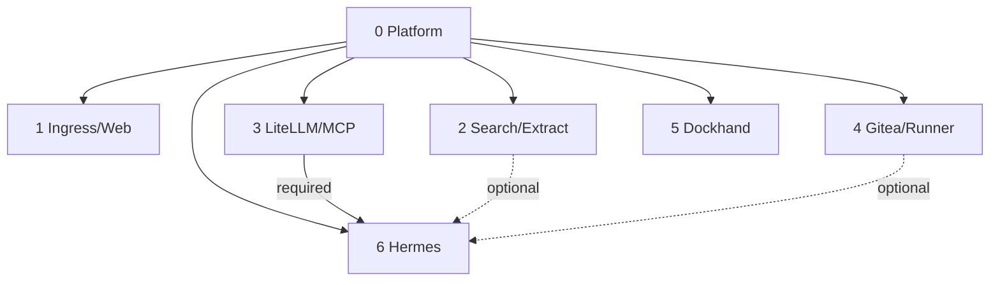

# A2A Knowledge — Local Hybrid AI

> Continuity contract for AI/coding agents and maintainers. Read this file, [`README.md`](README.md), [`pending.md`](pending.md), and for DR work [`bkp-dr/STATUS.md`](bkp-dr/STATUS.md) before modifying the project.

## Invariants

The platform is a set of atomic stacks, not a monolithic Compose application. Git source lives under `/opt/docker/stacks`; mutable state under `/opt/docker/runtime`; the operational root `.env` is protected and ignored by Git. Stack0 owns only shared foundation. Every application stack requires Stack0; Stack6 additionally requires Stack3. Stack2 and Stack4 are optional capability providers for Stack6.



Dependencies/capabilities belong in manifests. Generic installer or DR engines must not accumulate stack-number special cases when the contract can express the behavior.

## Lifecycle

PREPARE creates/validates stack-owned resources; DEPLOY establishes required processes; READY proves usability; RECONCILE adapts consumers to changed optional capabilities; VERIFY validates the result. `.lock` means PREPARED only. Running is not automatically READY.

A restart-causing RECONCILE must converge through READY again before final VERIFY. The destructive recovery exercise exposed a historical Stack6 race where Hermes was recreated and observed as `running/starting` before health converged; do not reintroduce that ordering bug.

The common installer must not rewrite `.env`, reset databases, prune Docker, run historical migration helpers or silently recreate healthy services because tracked configuration changed. Configuration/version drift detection and concurrency locking remain pending.

## Security/data ownership

PostgreSQL application stacks separate `postgres` admin/bootstrap identity from non-admin application roles. Stack2 application role is `firecrawl`; Stack3 uses the LiteLLM app role. Admin passwords are stack-owned restricted runtime secrets. Do not recursively chown/reset existing PGDATA.

Stack4/Gitea does **not** use PostgreSQL. It uses SQLite at `/var/lib/gitea/gitea.db` plus filesystem repositories/data. Its DR path rebuilds SQLite from the native Gitea dump and restores repositories/filesystem state.

Hermes has no Docker socket. Execution is via SSH to an isolated sandbox that is not attached to `redlocal`. Optional local capability absence must fail closed rather than silently use cloud.

Hermes is intentionally replaceable. Hermes runtime and sandbox are reconstructable/disposable for DR, including `SOUL.md`, SQLite state, caches, packages, sessions and logs. The only current durable Stack6 application state is portable user memory: `MEMORY.md` + `USER.md`, externalized to Git. Future Hermes-generated files remain disposable unless the platform explicitly promotes them to durable state.

## Stack6 Buzz contract

Buzz is optional as a Hermes integration but its CLI executable is an always-prepared reconstructable Stack6 component. Historically it was manually compiled/copied into `service_-_hermes/data/bin`; the destructive DR wipe proved that was an undeclared runtime dependency.

Current Stack6 PREPARE builds pinned Buzz source commit `78618804ec86a014524ad7d1fb55928e8f5c3edf` in a disposable Docker builder with `cargo build --locked --release -p buzz-cli`, extracts only the executable, records provenance, validates it against the exact Hermes image, and installs it at:

```text
/opt/docker/runtime/service_-_hermes/data/bin/buzz
container path: /opt/data/bin/buzz
```

Do not add Buzz to DR backups. A clean install/recovery must reconstruct it from the pinned source. Host qualification produced a 17,516,960-byte executable, mode `0755`, owner `10000:10000`; `/opt/data/bin/buzz --help` passed inside Hermes. After a manual gateway restart the Hermes UI reported Buzz connected alongside Telegram and API server.

## DR

DR is isolated under [`bkp-dr/`](bkp-dr/README.md). Recovery policy is manifest-driven and narrower than runtime persistence. ADR-0001 currently carries the exact protected operational root `.env` inside each complete private backup set as a global sensitive artifact; never print or commit it.

Current policy: Stack0 PKI BACKUP; Stack1 RECONSTRUCT; Stack2 RECONSTRUCT; Stack3 LiteLLM PostgreSQL DB BACKUP with salt in protected `.env`; Stack4 Gitea SQLite/filesystem/repos BACKUP via native dump; Stack5 RECONSTRUCT; Stack6 RECONSTRUCT with external Git-backed `MEMORY.md` + `USER.md` as sole durable application exception. Stack6's Git remote may be Gitea, another Git service/SaaS, or another configured repository and does not create a required Stack4 dependency.

### Backup all

Generic real `backup all` is implemented and host-qualified. The historical canonical qualification set remains `/opt/local-hybrid-ai-backups/backup-20260911T004927Z`. A fresh recovery point used for destructive proof is:

```text
/opt/local-hybrid-ai-backups/backup-20260911T172551Z
source_commit = 7cbfa2874f6e865a4de6e2854b2589de52a39913
```

It contains protected operational `.env`, Stack0 PKI, Stack3 logical PostgreSQL dump, Stack4 controlled-offline Gitea native dump, plus declared prerequisites. Checksums passed before and after recovery.

### Restore all — core path qualified

The operator explicitly authorized a real destructive clean-target test on the reference host. Platform containers and reconstructable Docker objects were removed and `/opt/docker` was destroyed. Recovery tooling ran from a checkout outside the target and rebuilt the platform from the fresh recovery point and its recorded source commit.

The exercise exposed recovery-tooling bugs rather than data corruption: historical global-artifact `id` vs schema `resource_id`, a `.strip()`-induced false source hash mismatch, and the historical Stack6 post-reconcile readiness race. These were corrected/handled fail-closed. A bounded resume avoided a second wipe and avoided blind managed-state re-import.

Final PASS evidence:

```text
resolved stacks: 0,1,2,3,4,5,6
LiteLLM PostgreSQL tables: 75
Gitea SQLite tables: 116
Gitea repositories: 8
portable memory HEAD: e9c220aa26b29303a18fa4b3f43f1c6edc0760ca
Stack6 memory-sync profile: running
```

All expected platform containers returned running and healthchecks were healthy where defined. Recovery-point checksums remained valid. Restored `install.py` matched the recorded source commit byte-for-byte.

**Conclusion:** core `backup all` + clean-target `restore all` is functionally qualified. Do not repeat a destructive wipe merely to prove this already-qualified path. Remaining DR backlog is hardening/operations (encryption, retention/off-host, validator/locking/refactoring), not an unproven restore architecture.

### External Stack6 Git credential

The memory-sync SSH material under `${BASE_PATH}/service_-_hermes-memory-sync/ssh` is an operator-provisioned external prerequisite. It is not Hermes application state and is not silently generated by maintenance. The destructive proof preserved/reprovisioned it explicitly and returned `hermes-memory-sync` to running. Future recovery UX should document/package this prerequisite cleanly without conflating it with portable memory data.

## Operator shell safety

The operator pastes command blocks into an existing interactive shell. Do not put `set -e`, `set -Eeuo pipefail`, `exit` or `exec` in pasted interactive blocks. Capture return codes and branch explicitly. Do not use broad cleanup. End blocks visibly with `echo "La shell permanece abierta."`.

## Never do casually

Do not run `docker compose down -v`, broad Docker prune, delete `/opt/docker/runtime`, overwrite `.env` from template, print secrets, rotate persistent identities merely because they can be regenerated, reset PGDATA, give Hermes Docker socket access, attach its sandbox to `redlocal`, silently enable cloud fallback, or infer DR importance solely from a bind mount/volume/database file.

The operator owns cleanup of rollback material under `/root`; do not automate its deletion. Verified backup sets under `/opt/local-hybrid-ai-backups` are recovery evidence, not cleanup debris.

## Change procedure

Identify the owning stack; inspect manifest/Compose/scripts/runtime contract; preserve invariants; make the smallest ownership-correct change; validate source first; test the real feature/failure path; verify runtime invariants; update docs; leave Git and deployed host on the same intended commit when deployment is in scope.

For project backlog and the planned independent Open WebUI stack, use [`pending.md`](pending.md). For stack-specific behavior use each stack README linked from [`README.md`](README.md).
