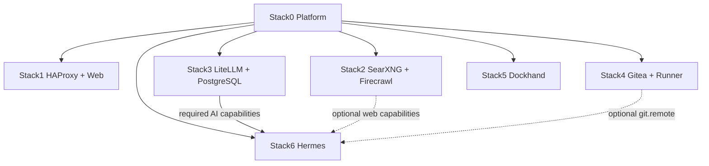

# A2A Knowledge — Local Hybrid AI

> **Audience:** AI assistants, coding agents, autonomous engineering agents and future maintainers.
>
> **Purpose:** give a newly arrived agent enough architectural, operational and historical context to understand this repository before proposing or making changes.
>
> **Read this before modifying the project.** Then read the root `README.md`, `INSTALLATION.md`, the affected stack's `README.md`, `manifest.json`, Compose file and lifecycle scripts. This document is context and operating doctrine; the repository itself remains the source of truth.

---

## 1. What this project is

`local_hybrid_ai` is a **local-first, hybrid AI platform** composed of independent Docker stacks. Useful AI infrastructure should run locally whenever practical, while cloud capabilities may be used deliberately when necessary. The operator—not an accidental fallback path—decides when external services are used.

The project is not one monolithic Docker Compose application. It is a small platform made of **atomic stacks with explicit ownership, dependencies, capabilities, readiness and security boundaries**.

Core qualities:

- local-first operation;
- explicit rather than accidental cloud use;
- composability;
- independent stack ownership;
- reproducible installation;
- persistent state separated from source code;
- safe incremental upgrades;
- no hidden cross-stack mutation;
- dependency/capability-driven automation rather than hard-coded orchestration;
- preservation of identities, databases, secrets and runtime state during maintenance.

The common installer is now implemented. It consumes the same manifest model used by the repository; do not redesign the stacks around a monolithic installer.

---

## 2. Current mental model

Think in lifecycle layers:

```text
                    OPERATOR / COMMON INSTALLER
                               |
                               v
                 manifest dependency/capability graph
                               |
                               v
                     observed current state
                               |
          +--------------------+--------------------+
          |                    |                    |
          v                    v                    v
       PREPARE               DEPLOY               VERIFY
    owned resources      required containers      contracts
          |                    |
          +-----------> READINESS <---------------+
                               |
                               v
                    capability transition
                               |
                               v
                  consumer-owned RECONCILE
                               |
                               v
                    persistent runtime state
```

The distinctions matter:

- **PREPARE** creates or validates resources owned by a stack.
- **DEPLOY** runs required services.
- **READY** means stack-specific service readiness checks have passed.
- **RECONCILE** adapts a prepared consumer to optional capabilities that are currently available and intentionally enabled.
- **VERIFY** validates the resulting stack-owned contract.

A `.lock` file means **PREPARED only**. It does **not** mean deployed, running, healthy, ready or reconciled.

A container being `running` does **not** automatically mean its capability is READY.

Do not use deletion of `.lock` as a generic update mechanism.

---

## 3. Permanent filesystem contract

Reference deployment layout:

```text
/opt/docker/
├── stacks/                         # Git working tree / source
│   ├── .git/
│   ├── .env                        # operational secrets, ignored by Git
│   ├── .env.template               # tracked variable contract
│   ├── install.py                  # canonical common installer
│   ├── install.sh                  # convenience wrapper
│   ├── installer/
│   │   ├── lifecycle.json
│   │   └── test_installer.py
│   ├── stack0_-_platform/
│   ├── stack1_-_haproxy_web/
│   ├── stack2_-_searxng_firecrawl/
│   ├── stack3_-_litellm/
│   ├── stack4_-_gitea/
│   ├── stack5_-_dockhand/
│   └── stack6_-_hermes/
└── runtime/                        # persistent mutable state
```

Central deployment variables:

```dotenv
STACKS_ROOT=/opt/docker/stacks
BASE_PATH=/opt/docker/runtime
NETWORK_NAME=redlocal
```

### Non-negotiable separation

`/opt/docker/stacks` is source.

`/opt/docker/runtime` is state.

Never solve a source-management problem by deleting runtime state. Never make mutable production state part of the Git working tree.

The operational root `.env` contains real deployment values and is not source material. On the reference deployment it is `root:root 0600`. Stack0 manages compatibility symlinks from stack directories to the central environment.

---

## 4. Stack map

| Stack | Directory | Purpose | Required dependencies | Important capabilities |
|---|---|---|---|---|
| 0 | `stack0_-_platform` | platform foundation | none | platform environment, network, PKI |
| 1 | `stack1_-_haproxy_web` | HAProxy ingress + static web | 0 | `ingress.https`, `web.static` |
| 2 | `stack2_-_searxng_firecrawl` | local search and extraction | 0 | `web.search`, `web.extract` |
| 3 | `stack3_-_litellm` | model-policy + MCP gateway | 0 | `ai.gateway`, `ai.mcp-gateway` |
| 4 | `stack4_-_gitea` | Git service + Actions runner | 0 | `git.remote`, `git.runner` |
| 5 | `stack5_-_dockhand` | container management | 0 | `containers.management` |
| 6 | `stack6_-_hermes` | AI agent + sandbox + memory | 0, 3 | `ai.agent`, `ai.sandbox`, `ai.memory` |

Current high-level dependency graph:



Every current application stack requires Stack0. Stack6 additionally requires Stack3. Stack2 and Stack4 are **optional providers** for Stack6 and must not become hidden mandatory dependencies.

A full deployment may be installed in numeric order for human convenience, but `0,1,2,3,4,5,6` is not the dependency model. The minimum required plan for Hermes is `0 -> 3 -> 6`.

### Next planned stack — Open WebUI

A new independent Open WebUI stack is planned next.

Do **not** assume its final stack ID, dependency graph or capability names before inspecting the desired Open WebUI architecture. The intended engineering pattern is nevertheless fixed:

1. create a new atomic `stackN_-_*` directory;
2. declare ownership and persistence explicitly;
3. declare required/optional dependencies and consumed/provided capabilities in `manifest.json`;
4. define required containers and lifecycle commands in `installer/lifecycle.json`;
5. define an HTTP/application readiness gate before any capability/ingress dependency relies on it;
6. integrate ingress through the appropriate existing contract rather than hidden cross-stack mutation;
7. add planner/lifecycle tests;
8. update root, installation, stack and A2A documentation in the same change.

Do not add `if open_webui` or `if stack7` logic to `install.py` merely to make tomorrow's work easy. The generic resolver should discover the new stack.

---

## 5. Manifest model is architectural truth

Every `stackN_-_*` directory has a `manifest.json`. Stack0's `manifests.py` discovers these directories dynamically; there should not be a hard-coded master table of stacks in the resolver.

Important manifest concepts:

- `requires`: mandatory stack dependencies;
- `target_requires`: alternate/target dependency graph for architecture evolution;
- `optional`: optional stack relationships;
- `provides`: capabilities exported by the stack;
- `consumes`: capabilities that must exist in the required dependency closure;
- `optional_consumes`: optional capabilities reachable through declared relationships;
- `owns`: containers, runtimes, volumes or other resources for which the stack is responsible;
- `atomic`: whether the stack satisfies the atomic-stack contract;
- `blockers`: explicit blockers if it does not.

The resolver validates dependency references, cycles, duplicate capability/resource entries, global ownership collisions and capability reachability.

Useful commands:

```bash
python3 stack0_-_platform/manifests.py validate
python3 stack0_-_platform/manifests.py validate --target
python3 stack0_-_platform/manifests.py list
python3 stack0_-_platform/manifests.py plan 3
python3 stack0_-_platform/manifests.py plan 6
python3 stack0_-_platform/manifests.py plan all
```

If an installer needs to know that Stack6 requires Stack3, it must learn that from manifests/capabilities. Do not encode:

```text
if stack == 6: install stack3
```

---

## 6. Common installer v1 — current behavior

Canonical portable entry point:

```bash
python3 install.py ...
```

The tracked root `install.sh` is a convenience wrapper. Some Git contents/update paths store newly-created files as `100644`, so do not assume a fresh checkout can execute `./install.sh`. Portable wrapper invocation is:

```bash
bash ./install.sh 6 --dry-run
```

Preferred real execution:

```bash
sudo python3 install.py 6 --yes
sudo python3 install.py all --yes
```

### Planner behavior

The installer:

1. validates manifest and lifecycle registry structure;
2. resolves required dependency closure from manifests;
3. observes PREPARED state from `.lock`;
4. observes DEPLOYED state from required-container process state;
5. schedules PREPARE only when not prepared;
6. schedules DEPLOY only when required services are not deployed;
7. executes provider-specific readiness commands in the stack lifecycle before consumer reconciliation;
8. treats capabilities as changed only for actual state transitions, not merely because a provider was requested;
9. discovers affected prepared consumers generically through `optional_consumes`;
10. invokes consumer-owned RECONCILE actions;
11. runs VERIFY actions;
12. validates required runtime containers after real execution.

`--reconcile` is the explicit operator override for intentionally reconciling a stable requested consumer.

### Proven installer states

Validated conceptual transitions:

```text
not prepared
    -> PREPARE
    -> DEPLOY
    -> readiness where declared
    -> RECONCILE affected consumers
    -> VERIFY

prepared / not deployed
    -> DEPLOY
    -> readiness where declared
    -> RECONCILE affected consumers
    -> VERIFY

prepared / deployed / converged
    -> VERIFY only

explicit --reconcile
    -> RECONCILE intentionally
    -> VERIFY
```

A healthy requested Stack2 or Stack4 must not spuriously reconcile Stack6.

---

## 7. Critical readiness lesson — DEPLOYED != READY

This was learned through a real controlled recovery test.

Originally the installer saw SearXNG transition from `exited` to `running`, immediately reconciled Stack6, and only afterwards a connectivity test found `searxng:8080` still refusing connections. The deployment itself was correct; the capability was simply not ready yet.

The repaired Stack2 lifecycle inserts:

```text
docker compose up -d
    -> 02-wait-ready.sh
       -> searxng:8080 READY
       -> firecrawl-api:3002 READY
    -> Stack6 RECONCILE
```

The readiness gate is also part of Stack2 VERIFY.

The repeated controlled recovery then validated:

- SearXNG was deliberately stopped;
- installer detected Stack2 as PREPARED + NOT-DEPLOYED;
- Compose restarted the same SearXNG container ID rather than recreating it;
- `02-wait-ready.sh` completed before Stack6 reconciliation;
- Hermes could reach SearXNG and Firecrawl afterwards;
- Hermes itself was not recreated because managed config was already converged;
- `.env` and all `.lock` files remained unchanged;
- the second run contained no state transitions.

General rule for future stacks—including Open WebUI: **a user-facing/provider capability must have an explicit readiness definition if `running` is not sufficient evidence of usability.**

---

## 8. Stack0 — platform foundation

Stack0 is mandatory and intentionally different from application stacks. It establishes shared platform contracts rather than running an application service.

It owns/manages:

- central environment contract and stack `.env` compatibility links;
- shared Docker network `redlocal`;
- platform runtime;
- platform PKI;
- manifest discovery and validation.

Application stacks consume shared platform resources rather than recreating substitutes.

Stack0's PKI is a persistent identity. Existing valid PKI must not be rotated implicitly by routine preparation.

---

## 9. Stack1 — HAProxy and static web

Stack1 is ingress/static web. It requires only Stack0.

Important boundaries:

- Stack0 owns the shared network and platform PKI;
- Stack1 consumes PKI read-only;
- Stack1 owns HAProxy and web containers/runtimes;
- other application stacks are optional backends from Stack1's installation perspective;
- HAProxy configuration can exist while a routed backend is absent.

A configuration-file update is not necessarily applied by `docker restart`; changes to Compose environment, mounts, groups or container definition usually require controlled recreation.

When Open WebUI is added, treat its HAProxy relationship as an explicit ingress integration. Do not make Stack1 own Open WebUI runtime or state.

---

## 10. Stack2 — SearXNG and Firecrawl

Stack2 is the local web capability provider:

```text
web.search
web.extract
```

Rules:

- requires Stack0 only;
- owns SearXNG and the Firecrawl service set/persistence;
- does not create `redlocal`;
- does not mutate Stack6 directly;
- remains independently deployable;
- provider appearance/disappearance is handled by consumer reconciliation;
- provider transition must pass `02-wait-ready.sh` before the common installer reconciles consumers.

Manual recovery/deployment should therefore use:

```bash
docker compose up -d
sudo bash ./02-wait-ready.sh
```

before manually reconciling Stack6.

---

## 11. Stack3 — LiteLLM and dedicated PostgreSQL

Stack3 is the **AI policy boundary**. It provides:

```text
ai.gateway
ai.mcp-gateway
```

Hermes consumes these capabilities. LiteLLM is where inference/provider policy belongs; Hermes should not silently bypass it for provider inference.

Stack3 owns its dedicated PostgreSQL service/runtime. This database is persistent identity, not disposable cache.

### PGDATA safety — critical historical lesson

An earlier PREPARE implementation forced existing PostgreSQL data-directory metadata to `root:root`, causing later PostgreSQL permission failures.

Current contract:

- if PGDATA exists, PREPARE validates it but does **not** change owner, mode or inode;
- if runtime is new, the PostgreSQL container initializes the empty directory according to its own requirements;
- do not recursively `chown` an existing cluster as routine repair;
- after relevant maintenance, test real database operations such as `SELECT 1` and `CHECKPOINT`.

Persistent identities include LiteLLM DB state, `LITELLM_SALT_KEY`, keys and PostgreSQL credentials.

`90-migrate-postgres-from-stack2.sh` is a one-time legacy migration helper only. The common installer must never invoke it for normal installation/convergence.

---

## 12. Stack4 — Gitea and runner

Stack4 provides:

```text
git.remote
git.runner
```

It owns Gitea and runner persistence. Persistent identities include Gitea data, runner registration state and registration secret/token.

Gitea web health does not prove SSH Git health. After path/environment changes, validate both web and a real Git-over-SSH operation.

---

## 13. Stack5 — Dockhand

Stack5 owns the external Docker volume `dockhand_data`. The volume is persistent state. PREPARE may create it when absent but must preserve an existing volume.

---

## 14. Stack6 — Hermes agent platform

Mandatory dependencies:

```text
Stack0
Stack3
```

Required consumed capabilities:

```text
ai.gateway
ai.mcp-gateway
```

Optional consumed capabilities:

```text
web.search
web.extract
git.remote
```

Provided capabilities:

```text
ai.agent
ai.sandbox
ai.memory
```

Stack6 owns Hermes, isolated SSH execution sandbox, Git-backed memory, optional conservative memory synchronization and deterministic sandbox cleanup.

### Security boundary

Hermes does not receive the Docker socket and does not need privileged mode.

Execution goes through SSH to `hermes-sandbox` on isolated `hermes-exec`. The sandbox is not attached to `redlocal`. Cleanup has no network.

Do not weaken these boundaries for convenience.

---

## 15. Optional web capability and fail-closed behavior

When Stack2 is unavailable, Hermes web tooling is deliberately disabled. Removing local configuration must not silently permit an external/keyless fallback.

Desired behavior:

```text
Stack2 READY
    -> Stack6 reconcile
    -> local web tools may be enabled

Stack2 unavailable/incomplete
    -> Stack6 reconcile
    -> web tools explicitly disabled
```

The common installer adds an important ordering guarantee during Stack2 transitions: provider readiness completes before consumer reconciliation.

`06-reconcile-capabilities.sh` remains consumer-owned and does not create Stack2 resources.

---

## 16. PREPARE vs RECONCILE

Optional providers may be installed later.

Example:

1. install Stack0;
2. install Stack3;
3. install Stack6;
4. Hermes runs without web capability;
5. later install Stack2;
6. Stack2 deploys and becomes READY;
7. common installer discovers changed `web.search`/`web.extract`;
8. prepared Stack6 is reconciled;
9. Hermes gains local web capability.

Provider stacks do not edit consumer runtime/configuration directly. Consumers own their own reconciliation.

---

## 17. Git-backed memory desired state

Gitea availability alone must not automatically turn Git-backed memory synchronization on.

Keep separate:

```text
operator intent
provider availability
```

A new deployment defaults Git-memory synchronization to disabled. The operator explicitly enables/disables persistent intent through Stack6 reconciliation.

If intent is enabled but Gitea disappears:

- stop only memory-sync if necessary;
- preserve local memory;
- preserve Git worktree;
- preserve SSH identity;
- preserve desired state.

Routine reconciliation must not silently clone, merge, rebase, force-push or invent divergence resolution.

---

## 18. Hermes sandbox lifecycle

The sandbox workspace is scratch space, not durable artifact storage.

Persistent lifecycle identity includes both:

```text
${BASE_PATH}/service_-_hermes-sandbox/data/workspace/.sandbox-generation
${BASE_PATH}/service_-_hermes-sandbox/data/state/state.db
```

They must agree. A mismatch is corruption and should fail closed.

The bounded reset intentionally resets only sandbox workspace/lifecycle state while preserving unrelated Hermes state, Git memory and SSH identities.

---

## 19. Scheduling philosophy

Hermes native Cron is the mechanism for deferred **agentic** work. Small deterministic sidecars are appropriate for mechanical tasks such as memory synchronization or sandbox cleanup.

```text
reasoning / agentic deferred work -> Hermes native Cron
mechanical deterministic work     -> small bounded sidecar
```

Scheduled agent prompts must be self-contained because future executions are fresh agent sessions.

---

## 20. Persistent identities: preserve by default

Treat these as sensitive persistent identities/state:

- operational root `.env`;
- platform PKI/private key;
- LiteLLM database and salt/key material;
- PostgreSQL clusters and credentials;
- Gitea data and secrets;
- runner registration identity/token;
- Hermes sessions/databases/auth state;
- Git-backed memory repository;
- memory-sync SSH identity;
- sandbox SSH host identity;
- sandbox generation marker/lifecycle DB;
- `dockhand_data` volume;
- stack `.lock` state unless intentionally re-preparing.

If a change genuinely requires rotation/reset/migration/destructive recreation, make that an explicit operator decision with rollback.

---

## 21. Things an AI agent must not do casually

Do not:

- run `docker compose down -v`;
- run broad Docker volume/system pruning;
- delete `/opt/docker/runtime`;
- reset databases to fix configuration errors;
- rerun legacy migrations without proving necessity;
- rotate secrets because regeneration is easier than preservation;
- overwrite operational `.env` from `.env.template`;
- print secrets/full effective config into chat/logs;
- recursively `chown` persistent application data without ownership analysis;
- make optional providers hidden mandatory dependencies;
- let providers mutate consumer runtime directly;
- give Hermes Docker socket access;
- attach sandbox to `redlocal` without explicit architectural decision;
- silently enable cloud fallback;
- force-push Git memory or auto-resolve divergence;
- assume `.lock` means healthy;
- assume `running` means READY;
- assume `docker restart` applies Compose-definition changes;
- assume a healthy container proves persistent storage safety;
- hard-code dependency knowledge that belongs in manifests;
- delete/recreate bind-mounted directories just to update files inside them.

---

## 22. How to approach a bug or requested modification

### Step 1 — establish ownership and scope

Identify the owning stack and whether the issue is source, runtime, dependency, capability, readiness, persistence, networking or security.

### Step 2 — read before changing

At minimum inspect:

```text
README.md
INSTALLATION.md
a2aknowledge.md
<affected-stack>/README.md
<affected-stack>/manifest.json
<affected-stack>/docker-compose.yml
<affected-stack>/01-prepare.sh
other lifecycle/readiness/reconcile scripts involved
installer/lifecycle.json when lifecycle orchestration changes
installer/test_installer.py when planner behavior changes
```

### Step 3 — identify invariants

Record what must not change: inode, owner/mode, hashes, container IDs, volume identity, DB identity, secrets, SSH identities, Git state, sandbox generation, `.env`, `.lock`.

### Step 4 — prefer the smallest ownership-correct fix

Fix the stack that owns the behavior. Provider appearance should usually trigger consumer reconciliation, not provider-side mutation.

### Step 5 — validate source before runtime

Typical checks:

```bash
bash -n <script>
docker compose config --quiet
python3 stack0_-_platform/manifests.py validate
python3 stack0_-_platform/manifests.py validate --target
python3 -m unittest -v installer.test_installer
git diff --check
```

### Step 6 — preserve availability

Do not stop the whole platform for convenience. Stop/recreate only affected services when possible.

### Step 7 — test the real failure mode

Examples:

- PostgreSQL: actual query + checkpoint/write path;
- Gitea: web + actual SSH Git operation;
- LiteLLM: authenticated gateway request;
- Hermes: gateway connectivity + sandbox SSH execution;
- Stack2: actual SearXNG/Firecrawl readiness and Hermes connectivity;
- Git memory: safe no-change sync and controlled round trip;
- sandbox: generation integrity/persistence;
- future Open WebUI: HTTP/application readiness plus its real LiteLLM/backend interaction, not merely container state.

### Step 8 — verify invariants again

A functional fix that unexpectedly rotates identities or mutates unrelated runtime is not clean.

### Step 9 — leave Git and deployment coherent

Desired end state:

- deliberate committed source change;
- clean worktree;
- deployment on intended commit;
- runtime preserved except intentional changes;
- affected services validated;
- no forgotten test artifacts/branches.

---

## 23. Shell-safety when giving commands to the operator

The operator often pastes command blocks into an existing interactive shell.

Interactive-paste blocks must not contain global constructs that can terminate that shell, such as:

```bash
set -e
set -Eeuo pipefail
exit
exec ...
```

Capture return codes and branch explicitly. End diagnostics with a visible line such as:

```bash
echo "La shell permanece abierta."
```

Repository scripts executed as child processes may legitimately use strict shell options.

Also avoid destructive cleanup in diagnostic blocks. Observe first, mutate only after the failure pattern is confirmed.

---

## 24. Security philosophy

Security is structural:

- secrets outside Git;
- agent without unrestricted Docker control;
- execution in isolated sandbox;
- sandbox network narrower than agent network;
- deterministic cleanup without network;
- provider policy centralized at LiteLLM;
- optional local capabilities fail closed rather than silently escalating to cloud;
- Git synchronization refuses unsafe divergence;
- destructive recovery bounded to the smallest state domain.

A convenience feature that violates these boundaries is an architectural change, not a small implementation detail.

---

## 25. Why architecture is capability-driven

Stack numbers are deployment identities; capabilities describe architectural meaning.

Stack6 conceptually needs:

```text
ai.gateway
ai.mcp-gateway
```

The current provider happens to be Stack3. Likewise optional features are expressed as `web.search`, `web.extract`, `git.remote`.

This lets future stacks—including Open WebUI—join the platform by declaring contracts rather than accumulating stack-number conditionals.

---

## 26. Why stacks are atomic

Atomic means a stack owns enough of its application resources to be prepared/deployed without borrowing hidden mutable state from another application stack.

Examples:

- LiteLLM owns its PostgreSQL;
- Stack2 owns Firecrawl persistence;
- Stack4 owns Gitea/runner identities;
- Stack5 owns its external volume;
- Stack6 owns agent/sandbox/memory/sidecars;
- Stack0 alone owns platform-shared resources.

When adding Open WebUI or any future service, ask:

1. Which stack owns it?
2. Where does persistent state live?
3. Which capability does it provide or consume?
4. Does this create hidden cross-stack mutable dependency?
5. Can its owner be prepared without modifying another application's runtime?
6. What proves it is READY?

If these are unclear, design is not finished.

---

## 27. Documentation rules

Documentation is part of the operational contract.

When changing architecture/lifecycle/readiness behavior, update relevant documentation in the same work.

Use GitHub-compatible Mermaid syntax. Keep root README high-level, `INSTALLATION.md` operational, stack READMEs stack-specific, and this file focused on AI-to-AI architecture/history handoff.

When adding Open WebUI, update at least:

- root `README.md` architecture/table/filesystem/interfaces;
- `INSTALLATION.md` dependency/lifecycle/install/update sections;
- new Open WebUI stack README(s);
- Stack1 documentation if ingress changes;
- relevant provider documentation if dependencies/capabilities change;
- `a2aknowledge.md` stack map and lessons;
- manifests/lifecycle tests.

---

## 28. Historical lessons worth preserving

1. Bind-mounted directory replacement can break running containers.
2. PostgreSQL PGDATA ownership is application-critical.
3. Container health can hide delayed storage problems; test the real operation.
4. Gitea web health does not prove SSH Git health.
5. Optional provider absence must not create cloud fallback.
6. Provider installation and consumer configuration are different lifecycle events.
7. Gitea availability is not Git-memory operator intent.
8. Git memory must prefer refusal over unsafe automation.
9. Sandbox cleanup/recovery must be bounded.
10. A stack should not create platform resources it does not own.
11. Persistent generated secrets are identities.
12. Installer dependencies belong in manifests, not folklore/conditionals.
13. **Running is not READY.** Stack2 recovery proved capability reconciliation must wait for real provider readiness.
14. A converged provider should not cause spurious consumer reconciliation merely because the operator requested it.
15. Idempotence must be demonstrated with a second run after recovery.

---

## 29. Validated installer history

The common installer has been exercised on the reference host through multiple phases:

- static validation of manifests/lifecycle/Python;
- planner dry-runs for Stack3, Stack6 and all stacks;
- state-aware change that removed unnecessary DEPLOY actions for healthy stacks;
- generic capability-driven discovery of prepared consumers;
- state-transition-aware change so stable providers do not trigger unnecessary reconciliation;
- unit tests for healthy providers/consumers, fresh providers/consumer and explicit `--reconcile`;
- first real healthy Stack6 execution: verification only, unchanged container identities, unchanged `.env`/locks, PostgreSQL query/checkpoint, Hermes->LiteLLM connectivity;
- controlled SearXNG stop/recovery;
- discovery of the RUNNING-vs-READY race;
- addition of Stack2 `02-wait-ready.sh`;
- repeated controlled recovery proving readiness-before-reconcile and post-recovery idempotence.

Current planner unit suite is in `installer/test_installer.py`.

---

## 30. When information conflicts

Use this precedence:

1. observed current runtime when diagnosing deployed system;
2. current executable source/manifests on intended Git commit;
3. current stack README / `INSTALLATION.md`;
4. this A2A document;
5. historical assumptions, branches, chats or memory.

If documentation and code disagree, identify the discrepancy and fix both coherently.

---

## 31. Minimum handoff checklist for the next AI

Before claiming a modification complete, answer:

- What stack owns the changed resource?
- What dependencies/capabilities are involved?
- What proves the service/provider is READY?
- Did manifest validation pass?
- Did installer planner tests pass if lifecycle changed?
- Did source/runtime separation remain intact?
- Were persistent identities preserved unless intentionally changed?
- Were secrets kept out of output/Git?
- Were Stack6 sandbox/network boundaries preserved?
- Was local-first/fail-closed behavior preserved?
- Was the actual feature/failure path tested?
- Were unrelated containers/runtime untouched?
- Are docs consistent with implementation?
- Is Git clean and on intended commit?
- Is deployed host on intended commit if deployment was part of the task?

If any answer is unknown, investigate before declaring success.

---

## 32. Final instruction to an AI maintainer

This project rewards **small, ownership-correct, reversible changes**.

Do not optimize for the shortest command sequence. Optimize for preserving data, identities, readiness guarantees, security boundaries and operator understanding.

Observe first. Determine ownership. Identify invariants. Change the smallest responsible component. Validate real behavior. Re-check what must not have changed.

The platform is designed so an AI agent can help maintain it safely, but only if the agent respects the same principle the platform applies to AI itself:

> **Capability should be explicit, bounded, ready before use, and under operator control.**
