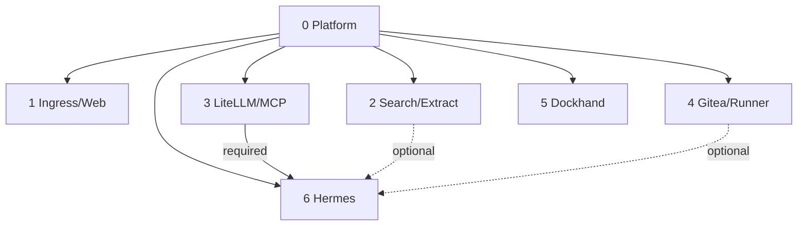

# A2A Knowledge — Local Hybrid AI

> Continuity contract for AI/coding agents and maintainers. Read this file, [`README.md`](README.md), [`pending.md`](pending.md), and for DR work [`bkp-dr/STATUS.md`](bkp-dr/STATUS.md) before modifying the project.

## Invariants

The platform is a set of atomic stacks, not a monolithic Compose application. Git source lives under `/opt/docker/stacks`; mutable state under `/opt/docker/runtime`; the operational root `.env` is protected and ignored by Git. Stack0 owns only shared foundation. Every application stack requires Stack0; Stack6 additionally requires Stack3. Stack2 and Stack4 are optional capability providers for Stack6.

Dependencies/capabilities belong in manifests. Generic installer or DR engines must not accumulate stack-number special cases when the contract can express the behavior.

## Lifecycle

PREPARE creates/validates stack-owned resources; DEPLOY establishes required processes; READY proves usability; RECONCILE adapts consumers to changed optional capabilities; VERIFY validates the result. `.lock` means PREPARED only. Running is not automatically READY.

The common installer must not rewrite `.env`, delete `.lock`, reset databases, prune Docker, run historical migration helpers or silently recreate healthy services because tracked configuration changed. Configuration/version drift detection and concurrency locking remain pending.

## Security/data ownership

PostgreSQL application stacks separate `postgres` admin/bootstrap identity from non-admin application roles. Stack2 application role is `firecrawl`; Stack3 uses the LiteLLM app role. Admin passwords are stack-owned restricted runtime secrets. Do not recursively chown/reset existing PGDATA.

Hermes has no Docker socket. Execution is via SSH to an isolated sandbox that is not attached to `redlocal`. Optional local capability absence must fail closed rather than silently use cloud.

Hermes is intentionally replaceable. The complete Hermes runtime and sandbox are reconstructable/disposable for DR, including `SOUL.md`, SQLite state, caches, packages, sessions and logs. The only current durable Stack6 application state is portable user memory: `MEMORY.md` + `USER.md`, externalized to Git. Future Hermes-generated files remain disposable unless the platform explicitly promotes them to durable state.

## DR

DR is isolated under [`bkp-dr/`](bkp-dr/README.md). Recovery policy is manifest-driven and narrower than runtime persistence. ADR-0001 currently carries the exact protected operational root `.env` inside each complete private backup set as a global sensitive artifact; never print or commit it.

Current policy: Stack0 PKI BACKUP; Stack1 RECONSTRUCT; Stack2 RECONSTRUCT; Stack3 LiteLLM DB BACKUP with its salt carried by the protected `.env`; Stack4 Gitea BACKUP; Stack5 RECONSTRUCT; Stack6 RECONSTRUCT with external Git-backed `MEMORY.md` + `USER.md` as the sole durable exception. Stack6's Git remote is configuration, not a required Stack4 dependency: it may be Gitea, another Git service/SaaS, or another configured repository.

Generic real `backup all` is implemented and host-qualified. It detects deployed stacks from validated manifest/lifecycle `required_containers`, stages artifacts privately, executes manifest recovery strategies, includes the global `.env`, writes checksums/metadata and publishes the final set atomically. The canonical qualified set is `/opt/local-hybrid-ai-backups/backup-20260911T004927Z`, created from source commit `f732f0e1bca533556d9a60fef5bd373b51675da2`.

That exact stored set passed recovery qualification: checksums PASS; Stack0 PKI isolated fingerprint PASS; Stack3 stored PostgreSQL dump restored 75/75 tables with 25 non-empty; Stack4 stored Gitea dump restored 116 SQLite tables and 8/8 repositories passed `git fsck`; backed-up `.env` hash matched live protected `.env` at qualification time; Stack6 external Git verifier PASS; live services remained unchanged/healthy.

Older focused verifiers exposed a coupling to single-purpose backup sets. Full-set compatibility is now the rule: a strategy adapter must locate/select its own resource inside a multi-resource recovery point. Do not reintroduce assumptions that a backup set contains only one stack/resource.

The first generic inverse-path milestone now exists: `bkp-dr/dr_restore_all.py` plus `bkp-dr/restore-all.py --dry-run`. It is strictly read-only and real mutation is blocked. It validates completed backup metadata, exact checksum-index coverage and hashes, verifies the recorded source commit exists locally, correlates stored artifacts/prerequisites with manifest strategies/restore phases, validates installer lifecycle correspondence and emits the ordered phase contract `global -> pre-prepare -> prepare -> post-prepare-pre-deploy -> deploy -> post-deploy -> external -> verify`. No Stack3/Stack4/Stack6 special-case orchestration belongs in this planner.

The next P0 is host qualification of that planner against the canonical full recovery point, followed by strategy-driven execution against an isolated clean target. The first end-to-end `restore all` qualification must not use the reference host as a destructive target. Exact evidence and continuation details are in [`bkp-dr/STATUS.md`](bkp-dr/STATUS.md).

## Operator shell safety

The operator pastes command blocks into an existing interactive shell. Do not put `set -e`, `set -Eeuo pipefail`, `exit` or `exec` in pasted interactive blocks. Capture return codes and branch explicitly. Do not use broad cleanup. End blocks visibly with `echo "La shell permanece abierta."`.

## Never do casually

Do not run `docker compose down -v`, broad Docker prune, delete `/opt/docker/runtime`, overwrite `.env` from the template, print secrets, rotate persistent identities merely because they can be regenerated, reset PGDATA, give Hermes Docker socket access, attach its sandbox to `redlocal`, silently enable cloud fallback, or infer DR importance solely from a bind mount/volume/database file.

The operator owns cleanup of rollback material under `/root`; do not automate its deletion. Verified backup sets under `/opt/local-hybrid-ai-backups` are recovery evidence, not cleanup debris.

## Change procedure

Identify the owning stack; inspect manifest/Compose/scripts/runtime contract; preserve invariants; make the smallest ownership-correct change; validate source first; test the real feature/failure path; verify runtime invariants; update docs; leave Git and deployed host on the same intended commit when deployment is in scope.

For project backlog and the planned independent Open WebUI stack, use [`pending.md`](pending.md). For stack-specific behavior use each stack README linked from [`README.md`](README.md).
