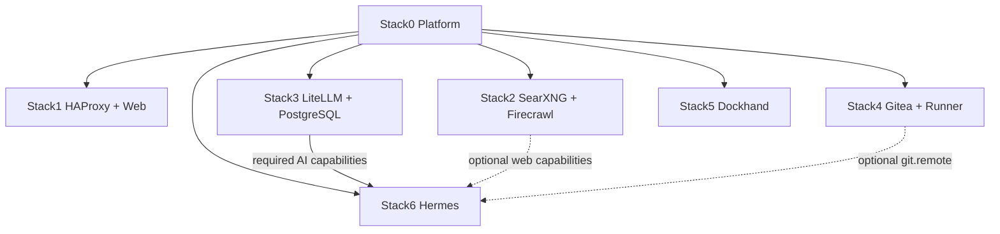
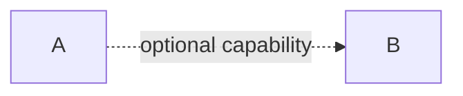

# A2A Knowledge — Local Hybrid AI

> **Audience:** AI assistants, coding agents, autonomous engineering agents and future maintainers.
>
> **Purpose:** give a newly arrived agent enough architectural, operational and historical context to understand this repository before proposing or making changes.
>
> **Read this before modifying the project.** Then read the root `README.md`, `INSTALLATION.md`, the affected stack's `README.md`, `manifest.json`, Compose file and lifecycle scripts. This document is context and operating doctrine; the repository itself remains the source of truth.

---

## 1. What this project is

`local_hybrid_ai` is a **local-first, hybrid AI platform** composed of independent Docker stacks. Its central idea is that useful AI infrastructure should run locally whenever practical, while cloud capabilities may be used deliberately when necessary. The operator, not an accidental fallback path, decides when external services are used.

The project is not a single Docker Compose application. It is a small platform made of **atomic stacks with explicit ownership, dependencies and capabilities**.

The intended qualities are:

- local-first operation;
- explicit rather than accidental cloud use;
- composability;
- independent stack ownership;
- reproducible installation;
- persistent state separated from source code;
- safe incremental upgrades;
- clear security boundaries;
- no hidden cross-stack mutation;
- dependency/capability-driven automation rather than hard-coded orchestration;
- preservation of identities, databases, secrets and runtime state during maintenance.

A future common installer is expected to consume the same manifest model already used by the repository. Do not redesign the stacks around a monolithic installer.

---

## 2. Mental model

Think of the repository as three layers:

```text
                 OPERATOR / FUTURE INSTALLER
                            |
                            v
              manifest dependency/capability graph
                            |
        +-------------------+-------------------+
        |                   |                   |
        v                   v                   v
     PREPARE              DEPLOY             RECONCILE
  owned resources       containers          optional caps
        |                   |                   |
        +-------------------+-------------------+
                            |
                            v
                 persistent runtime state
```

The important distinction is:

- **PREPARE** creates or validates resources owned by a stack.
- **DEPLOY/START** runs that stack's services.
- **RECONCILE** adapts a prepared consumer to optional capabilities that are currently available and intentionally enabled.

A `.lock` file means **PREPARED only**. It does **not** mean deployed, running, healthy or reconciled.

Do not use deletion of `.lock` as a generic update mechanism.

---

## 3. Permanent filesystem contract

Reference deployment layout:

```text
/opt/docker/
├── stacks/                         # Git working tree / source
│   ├── .git/
│   ├── .env                        # operational secrets, ignored by Git
│   ├── .env.template               # tracked variable contract
│   ├── stack0_-_platform/
│   ├── stack1_-_haproxy_web/
│   ├── stack2_-_searxng_firecrawl/
│   ├── stack3_-_litellm/
│   ├── stack4_-_gitea/
│   ├── stack5_-_dockhand/
│   └── stack6_-_hermes/
└── runtime/                        # persistent mutable state
```

Central deployment variables are conceptually:

```dotenv
STACKS_ROOT=/opt/docker/stacks
BASE_PATH=/opt/docker/runtime
NETWORK_NAME=redlocal
```

### Non-negotiable separation

`/opt/docker/stacks` is source.

`/opt/docker/runtime` is state.

Never solve a source-management problem by deleting runtime state. Never make mutable production state part of the Git working tree.

The operational root `.env` contains real deployment values and is not source material. On the reference deployment it is `root:root 0600`. Stack0 manages compatibility symlinks from stack directories to the central environment.

---

## 4. Stack map

| Stack | Directory | Purpose | Required dependencies | Important capabilities |
|---|---|---|---|---|
| 0 | `stack0_-_platform` | platform foundation | none | platform environment, network, PKI |
| 1 | `stack1_-_haproxy_web` | HAProxy ingress + static web | 0 | `ingress.https`, `web.static` |
| 2 | `stack2_-_searxng_firecrawl` | local search and extraction | 0 | `web.search`, `web.extract` |
| 3 | `stack3_-_litellm` | model-policy + MCP gateway | 0 | `ai.gateway`, `ai.mcp-gateway` |
| 4 | `stack4_-_gitea` | Git service + Actions runner | 0 | `git.remote`, `git.runner` |
| 5 | `stack5_-_dockhand` | container management | 0 | `containers.management` |
| 6 | `stack6_-_hermes` | AI agent + sandbox + memory | 0, 3 | `ai.agent`, `ai.sandbox`, `ai.memory` |

Current high-level dependency graph:



Every application stack requires Stack0.

Stack6 additionally requires Stack3.

Stack2 and Stack4 are **optional providers** for Stack6. They must not become hidden mandatory dependencies.

A full deployment may be installed in numeric order for human convenience, but `0,1,2,3,4,5,6` is not the dependency model. For example, the minimum required plan for Hermes is `0 -> 3 -> 6`.

---

## 5. Manifest model is architectural truth

Every `stackN_-_*` directory has a `manifest.json`. Stack0's `manifests.py` discovers these directories dynamically; there should not be a hard-coded master table of stacks in the resolver.

Important manifest concepts:

- `requires`: mandatory stack dependencies;
- `target_requires`: supported alternate/target dependency graph for architecture evolution;
- `optional`: optional stack relationships;
- `provides`: capabilities exported by the stack;
- `consumes`: capabilities that must exist in the required dependency closure;
- `optional_consumes`: capabilities reachable through required/optional dependencies;
- `owns`: containers, runtimes, volumes or other resources for which the stack is responsible;
- `atomic`: whether the stack currently satisfies the atomic-stack contract;
- `blockers`: explicit blockers if it does not.

The resolver validates dependency references, cycles, duplicate capability/resource entries, global ownership collisions and capability reachability.

Before changing dependencies or ownership, run and understand:

```bash
python3 stack0_-_platform/manifests.py validate
python3 stack0_-_platform/manifests.py validate --target
python3 stack0_-_platform/manifests.py list
python3 stack0_-_platform/manifests.py plan 3
python3 stack0_-_platform/manifests.py plan 6
python3 stack0_-_platform/manifests.py plan all
```

### Design rule for future automation

If an installer needs to know that Stack6 requires Stack3, it should learn that from manifests/capabilities. Do not encode logic such as:

```text
if stack == 6: install stack3
```

The desired pattern is generic graph resolution.

---

## 6. Stack0 — platform foundation

Stack0 is mandatory and intentionally different from application stacks. It establishes shared platform contracts rather than running an application service.

It owns or manages the platform-level concerns, including:

- the central environment contract and stack `.env` compatibility links;
- shared Docker network `redlocal`;
- platform runtime;
- platform PKI;
- manifest discovery and validation.

Application stacks must **consume** shared platform resources rather than independently recreating them.

For example, an application stack should validate that `redlocal` exists; it should not silently create its own substitute network.

Stack0's PKI is a persistent identity. Existing valid PKI must not be rotated implicitly by routine preparation.

---

## 7. Stack1 — HAProxy and static web

Stack1 is ingress/static web. It requires only Stack0.

Important boundaries:

- Stack0 owns the shared network and platform PKI.
- Stack1 consumes PKI read-only.
- Stack1 owns its own HAProxy and web containers/runtimes.
- Other application stacks are optional backends from Stack1's installation perspective.
- HAProxy configuration is designed so ingress can exist while a routed backend is absent.

A configuration-file update is not necessarily applied by `docker restart`; changes to Compose environment, mounts, supplementary groups or similar container definition details generally require controlled recreation.

Preserve bind-mounted runtime directory identity when a running container depends on it.

---

## 8. Stack2 — SearXNG and Firecrawl

Stack2 is the local web capability provider.

It provides:

```text
web.search
web.extract
```

It owns SearXNG and the Firecrawl service set, including its own persistence.

Important rules:

- requires Stack0 only;
- does not create `redlocal`;
- does not mutate Stack6 configuration directly;
- must remain independently deployable;
- appearing or disappearing as a provider is handled by consumer reconciliation.

If Stack2 is added after Hermes is already running, Stack2 should be deployed and verified first. Stack6 is then reconciled. This separation is deliberate.

---

## 9. Stack3 — LiteLLM and dedicated PostgreSQL

Stack3 is the **AI policy boundary**. It provides:

```text
ai.gateway
ai.mcp-gateway
```

Hermes consumes these capabilities.

LiteLLM is where inference/provider policy belongs. Hermes should not silently bypass LiteLLM for model-provider inference.

Stack3 owns its dedicated PostgreSQL service and runtime. This database is a persistent identity, not disposable cache.

### PGDATA safety — critical historical lesson

An earlier PREPARE implementation used host-side directory creation with forced `root:root` ownership on the PostgreSQL data directory. On an existing bind-mounted cluster this changed the PGDATA root metadata and later caused PostgreSQL permission failures such as inaccessible `pg_logical`, `pg_filenode.map` and relation files.

The repaired contract is:

- if PGDATA already exists, PREPARE validates it but **does not change its owner, mode or inode**;
- if the runtime is new, the PostgreSQL container is allowed to initialize the empty data directory according to its own runtime requirements;
- do not recursively `chown` an existing database tree as a routine repair;
- do not infer that a database is safe merely because a container temporarily reports healthy;
- after relevant maintenance, validate actual database operations such as `SELECT 1` and `CHECKPOINT`.

This incident is a general lesson for the entire repository: **preserving a path name is not enough; bind-mounted directory identity, ownership and process expectations matter.**

### Persistent LiteLLM identities

Do not casually rotate or regenerate:

- LiteLLM database state;
- `LITELLM_SALT_KEY`;
- master/inference/MCP keys;
- PostgreSQL administrative/application credentials.

The legacy `90-migrate-postgres-from-stack2.sh` is a one-time migration tool for old deployments. It is not a clean-install step and must not be rerun after a successful migration.

---

## 10. Stack4 — Gitea and runner

Stack4 provides:

```text
git.remote
git.runner
```

It owns Gitea and runner persistence.

Persistent identities include Gitea data, runner registration state and registration secret/token. Do not recreate them casually.

### Important Gitea configuration lesson

The deployment uses the rootless Gitea image. Web and Git-over-SSH subprocesses must resolve the same effective Gitea configuration. Configuration-path changes can therefore affect SSH Git even if the web service appears healthy.

When changing Gitea paths/environment, validate both web health and an actual Git/SSH operation.

---

## 11. Stack5 — Dockhand

Stack5 provides container-management capability and owns the external Docker volume `dockhand_data`.

The volume is persistent state. PREPARE may create it when absent, but must preserve an existing volume. Never use routine cleanup logic that deletes/recreates it.

---

## 12. Stack6 — Hermes agent platform

Stack6 is the agent/orchestration layer.

Mandatory dependencies:

```text
Stack0
Stack3
```

Required consumed capabilities:

```text
ai.gateway
ai.mcp-gateway
```

Optional consumed capabilities:

```text
web.search
web.extract
git.remote
```

Provided capabilities:

```text
ai.agent
ai.sandbox
ai.memory
```

Stack6 contains more than the Hermes process. Its security and persistence design includes:

- Hermes agent;
- isolated SSH execution sandbox;
- Git-backed memory;
- optional conservative memory synchronization;
- deterministic sandbox cleanup.

### Security boundary

Hermes does not receive the Docker socket and does not need privileged mode.

Execution goes through SSH to `hermes-sandbox` on the isolated `hermes-exec` network.

The sandbox is not attached to `redlocal`.

The cleanup sidecar has no network.

Do not weaken these boundaries merely because direct Docker/host access would be easier for an agent.

---

## 13. Optional web capability and fail-closed behavior

When Stack2 is unavailable, Hermes web tooling is deliberately disabled.

This is important because simply removing local backend configuration may permit a tool/framework to fall through to an external or keyless provider. That would violate the project's local-first/operator-choice principle.

Therefore:

```text
Stack2 available and healthy
        -> Stack6 reconcile
        -> local web tools may be enabled

Stack2 unavailable/incomplete
        -> Stack6 reconcile
        -> web tools explicitly disabled
```

Do not replace explicit disablement with "configuration absent" unless upstream behavior has been proven to fail closed.

---

## 14. PREPARE vs RECONCILE

This distinction exists because optional providers may be installed later.

Example:

1. install Stack0;
2. install Stack3;
3. install Stack6;
4. Hermes runs without web capability;
5. later install Stack2;
6. verify Stack2;
7. reconcile Stack6;
8. Hermes gains local web capability.

Stack2 does not edit Stack6 files. Stack6 owns its own managed configuration.

The current Stack6 reconciliation entry point is:

```bash
sudo ./06-reconcile-capabilities.sh --restart
```

The future installer should generalize this pattern: detect changed provider capabilities, identify prepared consumers and invoke the consumer-owned reconciliation mechanism. Avoid provider-specific mutation of consumers.

---

## 15. Git-backed memory desired state

Gitea availability alone must not automatically turn Git-backed memory synchronization on.

There are two independent concepts:

```text
operator intent
provider availability
```

A new deployment defaults Git-memory synchronization to disabled. The operator can explicitly enable or disable persistent intent through Stack6 reconciliation.

If intent is enabled but Gitea disappears:

- stop only the memory-sync sidecar as needed;
- preserve local memory;
- preserve Git worktree;
- preserve SSH identity;
- preserve desired state.

When Gitea returns, reconciliation can resume only after safe Git-state checks.

Routine reconciliation must not silently clone, merge, rebase, force-push or resolve divergence.

The memory-sync behavior is intentionally conservative: refuse unsafe ambiguity rather than inventing conflict resolution.

Only the bounded memory files are automatically mutable; unrelated tracked files in the memory repository are not an invitation for the sidecar to rewrite them.

---

## 16. Hermes sandbox lifecycle

The sandbox workspace is scratch space, not a durable artifact store.

Persistent lifecycle identity includes both:

```text
${BASE_PATH}/service_-_hermes-sandbox/data/workspace/.sandbox-generation
${BASE_PATH}/service_-_hermes-sandbox/data/state/state.db
```

These must agree.

Do not delete one and preserve the other casually. A generation mismatch is treated as corruption and should fail closed.

The bounded reset mechanism intentionally resets only sandbox workspace/lifecycle state while preserving unrelated Hermes state, Git memory and SSH identities.

Never turn a bounded recovery into a whole-stack wipe.

---

## 17. Scheduling philosophy

Hermes native Cron is the mechanism for deferred **agentic** work. There is no need for a separate scheduler stack merely to schedule Hermes reasoning.

Small deterministic sidecars are appropriate for mechanical tasks such as memory synchronization or sandbox cleanup.

Keep the distinction:

```text
reasoning / agentic deferred work -> Hermes native Cron
mechanical deterministic work     -> small bounded sidecar
```

Scheduled agent prompts must be self-contained because future executions are fresh agent sessions and cannot depend on transient conversational context or scratch files that may no longer exist.

---

## 18. Persistent identities: assume preservation unless explicitly told otherwise

An agent should treat the following as sensitive persistent identities/state:

- operational root `.env`;
- platform PKI and private key;
- LiteLLM database and salt/key material;
- PostgreSQL clusters and credentials;
- Gitea data and secrets;
- runner registration identity/token;
- Hermes sessions/databases/auth state;
- Git-backed memory repository;
- memory-sync SSH identity;
- sandbox SSH host identity;
- sandbox generation marker and lifecycle database;
- `dockhand_data` volume;
- stack `.lock` state unless intentionally re-preparing.

The safe default is **preserve**.

If a change genuinely requires rotation, reset, migration or destructive recreation, that should be an explicit operator decision with a rollback plan.

---

## 19. Things an AI agent must not do casually

Do not:

- run `docker compose down -v`;
- run broad Docker volume pruning;
- delete `/opt/docker/runtime`;
- reset databases to fix configuration errors;
- rerun legacy migrations without proving they are required;
- rotate secrets because generation is easier than preservation;
- overwrite the operational `.env` from `.env.template`;
- print secrets or full effective configuration into logs/chat;
- recursively `chown` persistent application data without understanding ownership semantics;
- make Stack2 or Stack4 hidden mandatory dependencies of Stack6;
- let Stack2 mutate Stack6 directly;
- give Hermes the Docker socket as a shortcut;
- attach the execution sandbox to `redlocal` without an explicit architectural decision;
- silently enable cloud fallback;
- force-push Git memory or auto-resolve divergence;
- assume `.lock` means healthy;
- assume `docker restart` applies Compose definition changes;
- assume a healthy container proves persistent storage is safe;
- hard-code dependency knowledge that already belongs in manifests;
- delete/recreate a bind-mounted directory just to update files inside it.

---

## 20. How to approach a bug or requested modification

A new agent should use this sequence.

### Step 1 — establish scope

Identify:

- which stack owns the affected resource;
- whether the problem is source, runtime, dependency, capability, persistence, networking or security;
- which other stacks are actual required dependencies versus merely optional providers/consumers.

### Step 2 — read before changing

At minimum inspect:

```text
README.md
INSTALLATION.md
a2aknowledge.md
<affected-stack>/README.md
<affected-stack>/manifest.json
<affected-stack>/docker-compose.yml
<affected-stack>/01-prepare.sh
other lifecycle scripts involved in the change
```

For cross-stack changes, inspect both provider and consumer manifests/scripts.

### Step 3 — identify invariants

Before touching runtime, record what must not change. Depending on the stack this may include:

- file/directory inode;
- owner/mode;
- content hash;
- container ID;
- volume identity;
- secret hash;
- database identity;
- SSH host/user key;
- Git branch/remote/equality state;
- sandbox generation;
- `.env` hash;
- `.lock` presence/content.

### Step 4 — prefer the smallest ownership-correct fix

Modify the stack that owns the behavior.

If an optional provider appears, prefer consumer reconciliation over provider-side edits.

If a shared platform resource is wrong, fix Stack0 rather than teaching every stack to create its own version.

### Step 5 — validate source before runtime

Typical checks include:

```bash
bash -n <script>
docker compose config --quiet
python3 stack0_-_platform/manifests.py validate
python3 stack0_-_platform/manifests.py validate --target
git diff --check
```

Use the checks relevant to the change; do not blindly run commands that expose secrets.

### Step 6 — preserve service availability

Do not stop the entire platform for convenience. Stop/recreate only the affected services when possible.

A database repair should not require stopping unrelated Gitea, Firecrawl, Dockhand or Hermes services unless a demonstrated dependency requires it.

### Step 7 — test the real failure mode

Health checks are necessary but not sufficient.

Examples:

- PostgreSQL: actual query + checkpoint/write path;
- Gitea: web health + real SSH Git operation;
- LiteLLM: authenticated request through the gateway;
- Hermes: gateway connectivity + sandbox SSH execution;
- web capability: actual local provider reachability and correct enabled/disabled managed config;
- Git memory: no-change sync and controlled write round trip;
- sandbox: generation integrity and persistence across restart.

### Step 8 — verify invariants again

Compare before/after state. A fix that restores functionality but unexpectedly rotates identities or mutates unrelated runtime is not a clean fix.

### Step 9 — leave Git and deployment coherent

The desired end state is:

- source change committed deliberately;
- repository worktree clean;
- deployment using the intended commit;
- runtime preserved except for intentional changes;
- affected services validated;
- no forgotten temporary branches/test artifacts unless intentionally retained.

---

## 21. Shell-safety when giving commands to the operator

The operator often pastes command blocks into an existing interactive shell.

Therefore command blocks intended for direct interactive pasting should be designed so a failed check does not terminate the user's shell session.

Avoid interactive-paste blocks containing global constructs such as:

```bash
set -e
set -Eeuo pipefail
exit
exec ...
```

Instead, capture return codes and branch explicitly:

```bash
some_command
RC=$?

echo "rc=$RC"

if [ "$RC" -eq 0 ]; then
    echo "OK"
else
    echo "REVIEW REQUIRED"
fi

echo "La shell permanece abierta."
```

This rule is about commands pasted into the operator's current shell. Repository scripts executed as child processes may legitimately use strict shell options when appropriate.

Also avoid destructive cleanup in diagnostic blocks. Diagnostics should observe first, mutate only after the failure pattern is confirmed.

---

## 22. Security philosophy

Security is structural, not a final hardening pass.

Key principles:

- secrets remain outside Git;
- the agent does not get unrestricted Docker control;
- code execution occurs in an isolated sandbox;
- the sandbox has a narrower network than the agent;
- deterministic cleanup has no network;
- provider policy is centralized at LiteLLM;
- optional local capabilities fail closed rather than silently escalating to cloud;
- Git synchronization refuses unsafe divergence;
- destructive recovery is bounded to the smallest state domain possible.

A proposed convenience feature that violates one of these boundaries should be treated as an architectural change, not a small implementation detail.

---

## 23. Why the architecture is intentionally capability-driven

Stack numbers are deployment identities, but capabilities describe architectural meaning.

For example, Stack6 does not conceptually need "directory stack3". It needs:

```text
ai.gateway
ai.mcp-gateway
```

The current provider happens to be Stack3, and the manifest graph guarantees those required capabilities are available through its required dependency closure.

Likewise Stack6 can optionally consume:

```text
web.search
web.extract
git.remote
```

This matters for future evolution. A common installer or future architecture should reason about declared contracts rather than accumulate stack-number conditionals.

---

## 24. Why stacks are atomic

Atomic means a stack owns enough of its own application resources to be prepared/deployed without borrowing hidden mutable state from another application stack.

Examples of the direction taken by the project:

- LiteLLM moved to its own PostgreSQL instead of depending on another application's database;
- Stack2 owns its own Firecrawl persistence;
- Stack4 owns Gitea and runner identities;
- Stack5 owns its external volume;
- Stack6 owns its agent, sandbox, memory and sidecar runtimes;
- Stack0 alone owns platform-shared resources.

When adding a service, ask:

1. Which stack owns it?
2. Where does its persistent state live?
3. Which capability does it provide or consume?
4. Does this create a hidden cross-stack mutable dependency?
5. Can its owner be prepared without modifying another application's runtime?

If those answers are unclear, the design is not finished.

---

## 25. Common installer direction

The repository is being prepared for a future common installer.

That installer should eventually be able to request one or more stacks and derive the required plan from manifests.

Desired conceptual flow:

```text
requested stacks
      |
      v
validate manifests
      |
      v
resolve required dependency closure
      |
      v
PREPARE in dependency order
      |
      v
deploy/verify selected stacks
      |
      v
identify changed capabilities
      |
      v
reconcile affected prepared consumers
```

The installer should not redefine ownership or lifecycle rules. It should orchestrate the contracts already implemented by stacks.

Do not make the common installer a privileged dumping ground for stack-specific repair logic. Stack-specific behavior belongs with the owning stack; the installer coordinates it.

---

## 26. Documentation rules

Documentation is part of the operational contract.

When changing architecture or lifecycle behavior, update the relevant documentation in the same work.

Use Mermaid syntax that GitHub actually renders. For labelled dotted edges use GitHub-compatible syntax such as:



Do not use the older/problematic form:

```text
A -. optional capability .-> B
```

Keep the root README high-level, `INSTALLATION.md` operational, stack READMEs stack-specific, and this file focused on transferring architectural and maintenance context from one AI agent to another.

---

## 27. Current project-specific historical knowledge worth preserving

Several engineering lessons shaped the current contracts:

1. **Bind-mounted directory replacement can break running containers.** Updating managed files must preserve directory identity when the container holds a bind mount to that directory.
2. **PostgreSQL PGDATA ownership is application-critical.** A PREPARE script must not normalize an existing database directory to root ownership.
3. **Container health can hide delayed storage problems.** Exercise the operation that previously failed.
4. **Gitea web health does not prove SSH Git health.** Validate both paths after configuration changes.
5. **Optional provider absence must not create cloud fallback.** Hermes web tools are explicitly disabled when local providers are unavailable.
6. **Provider installation and consumer configuration are different lifecycle events.** This led to the PREPARE/RECONCILE split.
7. **Gitea availability is not operator intent.** Git-memory enablement is persisted separately from provider availability.
8. **Git memory must prefer refusal over unsafe automation.** No force-push or automatic divergence resolution.
9. **Sandbox cleanup must be bounded.** Generation marker and lifecycle database form one integrity contract.
10. **A stack should not create platform resources it does not own.** Shared network and PKI belong to Stack0.
11. **Persistent generated secrets are identities.** Re-preparation must preserve them.
12. **A future installer should resolve manifests, not encode folklore.** If important architecture exists only in an `if stack6` branch, the contract is incomplete.

---

## 28. When information conflicts

Use this precedence when deciding what is true:

1. **Observed current runtime**, when diagnosing the deployed system.
2. **Current executable source and manifests** on the intended Git commit.
3. **Current stack README / `INSTALLATION.md`.**
4. **This A2A knowledge document.**
5. Historical assumptions, old branches, chat transcripts or memory.

This file deliberately contains history because history explains safeguards, but history must never override current code.

If documentation and code disagree, do not silently choose one. Identify the discrepancy, determine intended behavior and fix both coherently.

---

## 29. Minimum handoff checklist for the next AI

Before claiming a modification is complete, be able to answer:

- What stack owns the changed resource?
- What dependencies/capabilities are involved?
- Did manifest validation still pass?
- Did the change preserve source/runtime separation?
- Did it preserve persistent identities that were not intentionally changed?
- Did it avoid exposing secrets?
- Did it preserve Stack6 sandbox/network boundaries?
- Did it preserve local-first/fail-closed provider behavior?
- Was the actual failure mode or feature path tested, not merely container health?
- Were unrelated containers and runtime state left untouched?
- Are docs consistent with the implementation?
- Is Git in the intended clean state?
- Is the deployed host on the intended commit if deployment was part of the task?

If any answer is unknown, say so and investigate before declaring success.

---

## 30. Final instruction to an AI maintainer

This project rewards **small, ownership-correct, reversible changes**.

Do not optimize for the shortest command sequence. Optimize for preserving the operator's data, identities, security boundaries and ability to understand what changed.

Observe first. Determine ownership. Identify invariants. Change the smallest responsible component. Validate the real behavior. Re-check what must not have changed.

The platform is designed so that an AI agent can help maintain it safely, but only if the agent respects the same principle the platform applies to AI itself:

> **Capability should be explicit, bounded and under operator control.**
