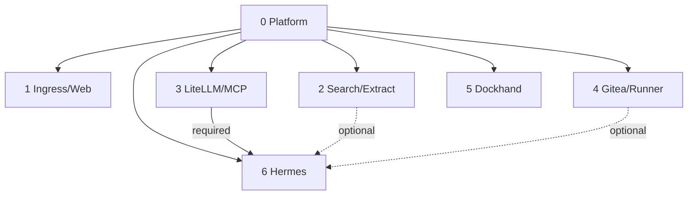

# A2A Knowledge — Local Hybrid AI

> Continuity contract for AI/coding agents and maintainers. Read this file, [`README.md`](README.md), [`pending.md`](pending.md), and for DR work [`bkp-dr/STATUS.md`](bkp-dr/STATUS.md) before modifying the project.

## Invariants

The platform is a set of atomic stacks, not a monolithic Compose application. Git source lives under `/opt/docker/stacks`; mutable state under `/opt/docker/runtime`; the operational root `.env` is protected and ignored by Git. Stack0 owns only shared foundation. Every application stack requires Stack0; Stack6 additionally requires Stack3. Stack2 and Stack4 are optional capability providers for Stack6.

Dependencies/capabilities belong in manifests. Generic installer or DR engines must not accumulate stack-number special cases when the contract can express the behavior.

## Lifecycle

PREPARE creates/validates stack-owned resources; DEPLOY establishes required processes; READY proves usability; RECONCILE adapts consumers to changed optional capabilities; VERIFY validates the result. `.lock` means PREPARED only. Running is not automatically READY.

The common installer must not rewrite `.env`, delete `.lock`, reset databases, prune Docker, run historical migration helpers or silently recreate healthy services because tracked configuration changed. Configuration/version drift detection and concurrency locking remain pending.

## Security/data ownership

PostgreSQL application stacks separate `postgres` admin/bootstrap identity from non-admin application roles. Stack2 application role is `firecrawl`; Stack3 uses the LiteLLM app role. Admin passwords are stack-owned restricted runtime secrets. Do not recursively chown/reset existing PGDATA.

Hermes has no Docker socket. Execution is via SSH to an isolated sandbox that is not attached to `redlocal`. Optional local capability absence must fail closed rather than silently use cloud.

## DR

DR is isolated under [`bkp-dr/`](bkp-dr/README.md). Recovery policy is manifest-driven and narrower than runtime persistence. Global prerequisites are Git source at a known commit/tag and a protected operational `.env`.

Current policy: Stack0 PKI BACKUP; Stack1 RECONSTRUCT; Stack2 RECONSTRUCT; Stack3 LiteLLM DB BACKUP + salt external prerequisite; Stack4 Gitea BACKUP; Stack5 RECONSTRUCT; Stack6 RECONSTRUCT after durable knowledge externalization.

Real evidence and exact continuation state are in [`bkp-dr/STATUS.md`](bkp-dr/STATUS.md). Do not enable generic real `backup all` until the blockers in [`pending.md`](pending.md) are closed.

## Operator shell safety

The operator pastes command blocks into an existing interactive shell. Do not put `set -e`, `set -Eeuo pipefail`, `exit` or `exec` in pasted interactive blocks. Capture return codes and branch explicitly. Do not use broad cleanup. End blocks visibly with `echo "La shell permanece abierta."`.

## Never do casually

Do not run `docker compose down -v`, broad Docker prune, delete `/opt/docker/runtime`, overwrite `.env` from the template, print secrets, rotate persistent identities merely because they can be regenerated, reset PGDATA, give Hermes Docker socket access, attach its sandbox to `redlocal`, silently enable cloud fallback, or infer DR importance solely from a bind mount/volume/database file.

The operator owns cleanup of rollback material under `/root`; do not automate its deletion.

## Change procedure

Identify the owning stack; inspect manifest/Compose/scripts/runtime contract; preserve invariants; make the smallest ownership-correct change; validate source first; test the real feature/failure path; verify runtime invariants; update docs; leave Git and deployed host on the same intended commit when deployment is in scope.

For project backlog and the planned independent Open WebUI stack, use [`pending.md`](pending.md). For stack-specific behavior use each stack README linked from [`README.md`](README.md).
