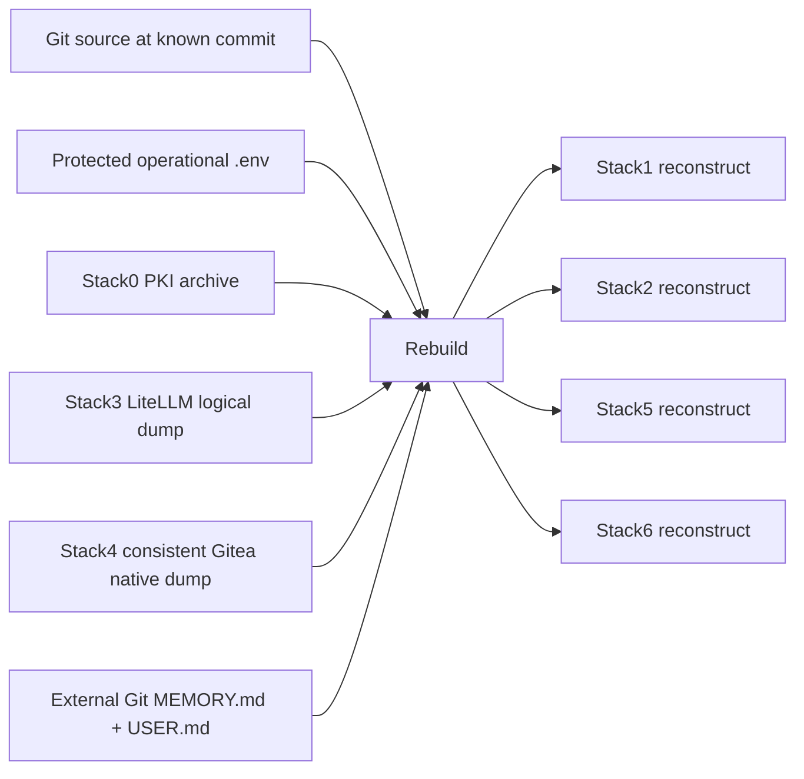

# Backup & Disaster Recovery

This directory is the single home for the project's backup/DR implementation, schemas, tests and operational documentation.

## Start here

- [`STATUS.md`](STATUS.md): verified state, real backup evidence and exact handoff to the next AI agent.
- [`dr-howto.md`](dr-howto.md): operational recovery contract.
- [`recovery.schema.json`](recovery.schema.json): normalized per-stack recovery declaration.
- [`backup-set.schema.json`](backup-set.schema.json): completed backup-set metadata contract.
- [`dr-gitea.md`](dr-gitea.md): Gitea native consistent-backup/restore notes.
- [`dr-postgres.md`](dr-postgres.md): PostgreSQL logical-backup verification.
- [`dr-archive.md`](dr-archive.md): archive strategy.
- [`dr-filesystem.md`](dr-filesystem.md): backup destination/filesystem contract.
- [`dr_stack6_verify.py`](dr_stack6_verify.py): read-only proof of the externalized Stack6 portable-memory prerequisite.

## Code

The DR engine and adapters are colocated here: `dr.py`, `dr_archive.py`, `dr_filesystem.py`, `dr_postgres_verify.py`, Stack3/Stack4 adapters/verifiers and the Stack6 portable-memory verifier. DR tests live under [`tests/`](tests/).

Because the implementation was moved from repository root without changing its project-root assumptions, compatibility symlinks in this directory point back to the root `.env` and stack directories. They contain no secret data; `.env` itself remains ignored and protected. A future cleanup may replace this compatibility layer with an explicit project-root resolver; track that in [`../pending.md`](../pending.md).

## DR coverage

Current recovery boundary:

- Stack0 `platform-pki`: real backup + isolated restore verification passed.
- Stack3 `litellm-database`: real custom-format dump + temporary-database restore verification passed.
- Stack4 `gitea-state`: real controlled-offline native backup + isolated SQLite/repository restore verification passed; the generic execution-context implementation also passed a fresh real regression.
- Stack1, Stack2 and Stack5 are reconstructable by policy.
- Stack3 `LITELLM_SALT_KEY` is an external protected `.env` prerequisite, not copied into backup sets.
- Stack6/Hermes is reconstructable in its entirety. Runtime `SOUL.md`, SQLite databases, caches, packages, logs and the whole sandbox tree are explicitly disposable. The only durable application-level exception is Git-backed `MEMORY.md` + `USER.md`.
- The Stack6 verifier is implemented and must be qualified on the reference host before that external prerequisite is marked fully verified.

## Safety

Never use DR work as a reason to run `docker compose down -v`, prune Docker broadly, delete `/opt/docker/runtime`, overwrite `.env`, rotate persistent identities, or copy raw PostgreSQL PGDATA as the recovery mechanism. Do not expand the Stack6 backup scope merely because Hermes creates new runtime files.
