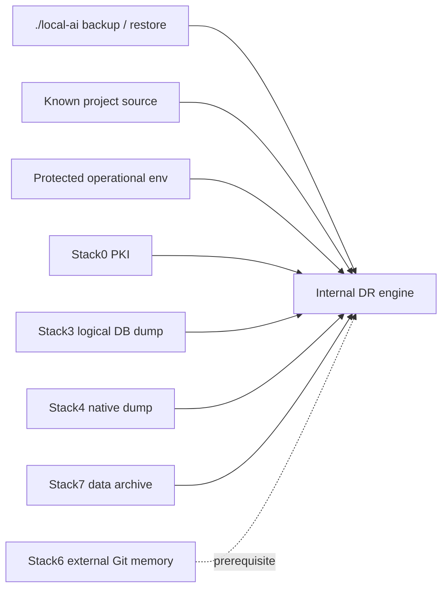

# Disaster recovery engine

DR is manifest-driven: persistence is backed up because a recovery resource declares it, not because a Docker mount happens to exist.

This directory is an **internal implementation area**. Its Python entry points are not a supported external API. Operators, automation and wrappers use `./local-ai`; see [ADR-0002](../adr/0002-single-management-cli.md).



## Supported management entry points

```bash
./local-ai backup
./local-ai --json backup
./local-ai restore plan <backup-set>
./local-ai restore drill <backup-set>
./local-ai restore apply <backup-set>
```

The files in this directory may still be invoked directly by internal code and tests. Their paths and argument contracts are deliberately not stable for external consumers.

Recovery schemas remain implementation-owned here: `recovery.schema.json` and `backup-set.schema.json`. Tests are centralized under [../tests/disaster_recovery/](../tests/disaster_recovery/).

Long-form DR design, qualification evidence and procedures live in [../docs/dr/](../docs/dr/), especially [howto.md](../docs/dr/howto.md) and [status.md](../docs/dr/status.md).
