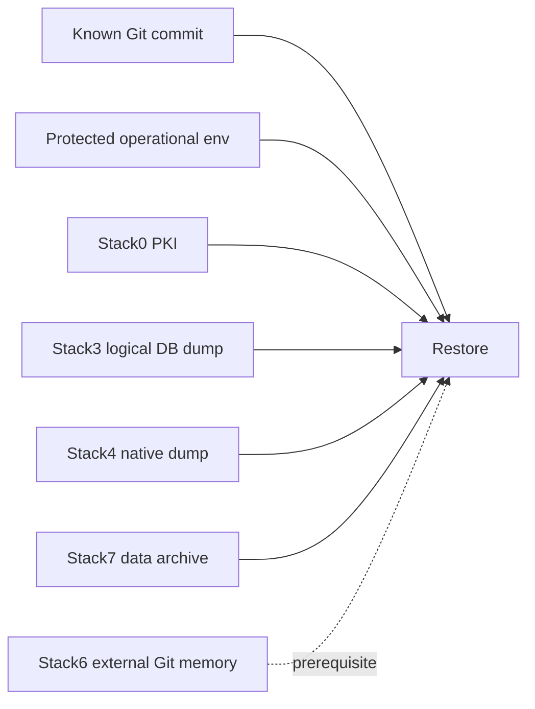

# Disaster recovery engine

DR is manifest-driven: persistence is backed up because a recovery resource declares it, not because a Docker mount happens to exist.



## Main entry points

```bash
python3 bkp-dr/dr.py plan all
python3 bkp-dr/backup-all.py --json
python3 bkp-dr/restore-all.py <backup-set> --json
```

Recovery schemas remain implementation-owned here: `recovery.schema.json` and `backup-set.schema.json`. Tests are centralized under [../tests/disaster_recovery/](../tests/disaster_recovery/).

Long-form DR design, qualification evidence and procedures live in [../docs/dr/](../docs/dr/), especially [howto.md](../docs/dr/howto.md) and [status.md](../docs/dr/status.md).
