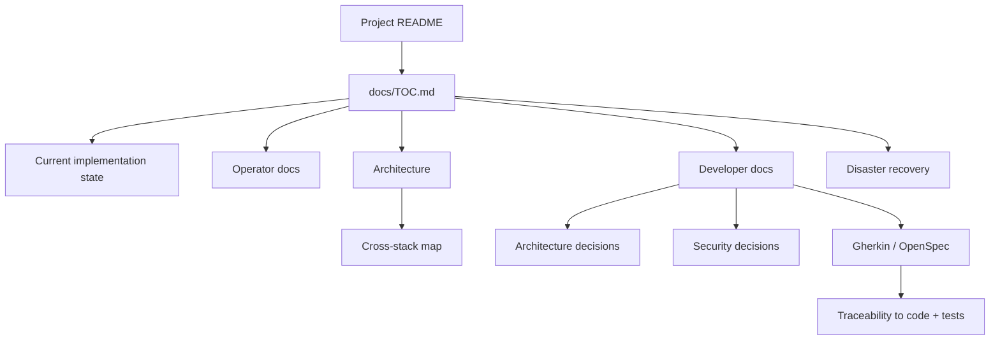

<!--
This Source Code Form is subject to the terms of the Mozilla Public
License, v. 2.0. If a copy of the MPL was not distributed with this
file, You can obtain one at https://mozilla.org/MPL/2.0/.
-->

# Local Hybrid AI documentation

[← Project README](../README.md) · [Full documentation map](TOC.md)

This directory contains operator guidance, architecture and decision records, disaster-recovery material, behavioural contracts and development guidance. The canonical navigation entry is [`TOC.md`](TOC.md); every documentation folder links back to it. For a compact statement of what is implemented now and what has been retired, read [current implementation state](current-state.md).

## Choose your path

| If you want to… | Start here |
|---|---|
| Understand what exists now | [Current implementation state](current-state.md) |
| Understand the system | [Architecture](architecture/README.md) and [stack map](stacks/README.md) |
| Install or reconcile it | [Installation](installation.md) |
| Operate it | [User documentation](user-docs/README.md) |
| Configure secrets | [Configuration](configuration/README.md) |
| Back up or recover it | [Disaster recovery](dr/README.md) |
| Understand upgrade rules | [Upgrade policy](upgrade-policy.md) |
| Change the architecture | [Developer docs](devel-docs/README.md) and [ADRs](devel-docs/adr/README.md) |
| Review security choices | [SDRs](devel-docs/sdr/README.md) |
| Review behavioural contracts | [OpenSpec](devel-docs/openspec/README.md) |
| Run or extend tests | [Testing](devel-docs/testing.md) |
| See unfinished work | [Pending work](pending.md) |

## Documentation model

Folder READMEs are indexes, not competing sources of truth. Machine-readable ownership, component topology, dependency, capability and recovery facts remain authoritative in stack manifests. Architectural rationale belongs in ADRs, security rationale in SDRs, observable behaviour in OpenSpec/Gherkin, and implementation verification in tests.

## Language and legacy policy

Canonical project documentation is maintained in English so that code, contracts and documentation use one working language. Obsolete Spanish per-stack documentation and other migrated legacy duplicates have already been removed. Historical implementation names remain only where they are necessary to explain an accepted decision, a compatibility contract, or recovery of an older recorded source revision; they must not be presented as current operator interfaces or current repository layout.
