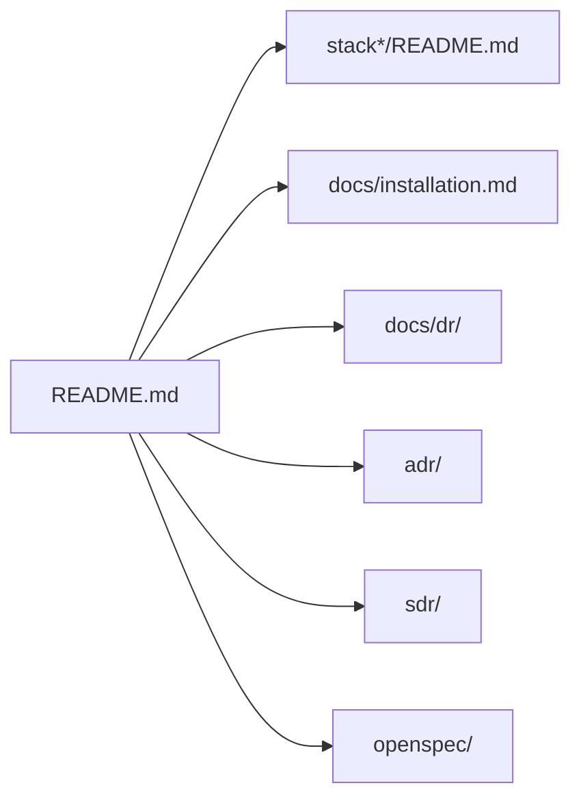

# Documentation

The repository keeps executable contracts close to the code and longer operational material here.

## What lives where

- `stack*/README.md`: short contract for one stack: purpose, dependencies, owned runtime, persistence and lifecycle.
- `installation.md`: operator installation flow.
- `dr/`: disaster-recovery design, evidence and operating procedures.
- `architecture/`: architecture reference material.
- `configuration/`: configuration and secret-handling documentation.
- `a2aknowledge.md`: continuity/handoff context for AI-assisted work.
- `pending.md`: active backlog and closed qualification evidence.
- `adr/`: architectural decisions.
- `sdr/`: security decisions and accepted risk.
- `openspec/`: executable-oriented behaviour specification linked to tests.

Historical verbose per-stack Spanish documents are retained under `docs/stacks/legacy/`; the canonical stack documentation is each stack's `README.md`.
