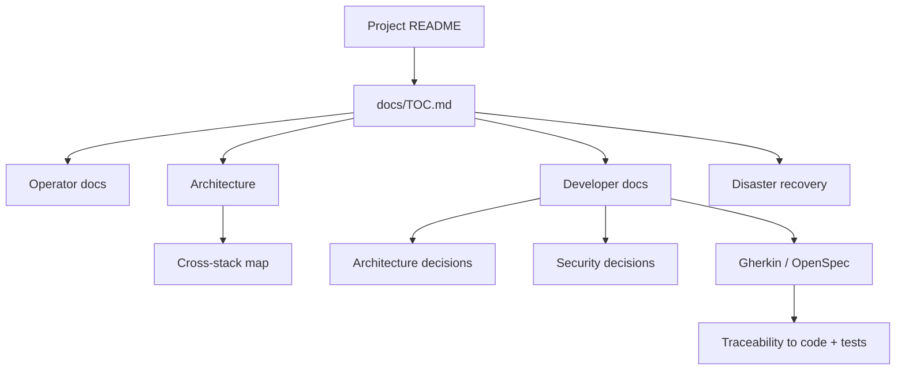

# Local Hybrid AI documentation

[← Project README](../README.md) · [Full documentation map](TOC.md)

This directory contains operator guidance, architecture and decision records, disaster-recovery material, behavioural contracts and development guidance. The canonical navigation entry is [`TOC.md`](TOC.md); every documentation folder links back to it.

## Choose your path

| If you want to… | Start here |
|---|---|
| Understand the system | [Architecture](architecture/README.md) and [stack map](stacks/README.md) |
| Install or reconcile it | [Installation](installation.md) |
| Operate it | [User documentation](user-docs/README.md) |
| Configure secrets | [Configuration](configuration/README.md) |
| Back up or recover it | [Disaster recovery](dr/README.md) |
| Understand upgrade rules | [Upgrade policy](upgrade-policy.md) |
| Change the architecture | [Developer docs](devel-docs/README.md) and [ADRs](devel-docs/adr/README.md) |
| Review security choices | [SDRs](devel-docs/sdr/README.md) |
| Review behavioural contracts | [OpenSpec](devel-docs/openspec/README.md) |
| Run or extend tests | [Testing](devel-docs/testing.md) |
| See unfinished work | [Pending work](pending.md) |

## Documentation model

Folder READMEs are indexes, not competing sources of truth. Machine-readable ownership and dependency facts remain authoritative in stack manifests. Architectural rationale belongs in ADRs, security rationale in SDRs, observable behaviour in OpenSpec/Gherkin, and implementation verification in tests.

## Language and legacy policy

Canonical project documentation is maintained in English so that code, contracts and documentation use one working language. Historical material is kept only while it contains unique knowledge. The old Spanish per-stack documents are being evaluated against current manifests and stack READMEs; useful invariants are migrated to canonical documentation and stale duplicates are deleted rather than maintained indefinitely.
