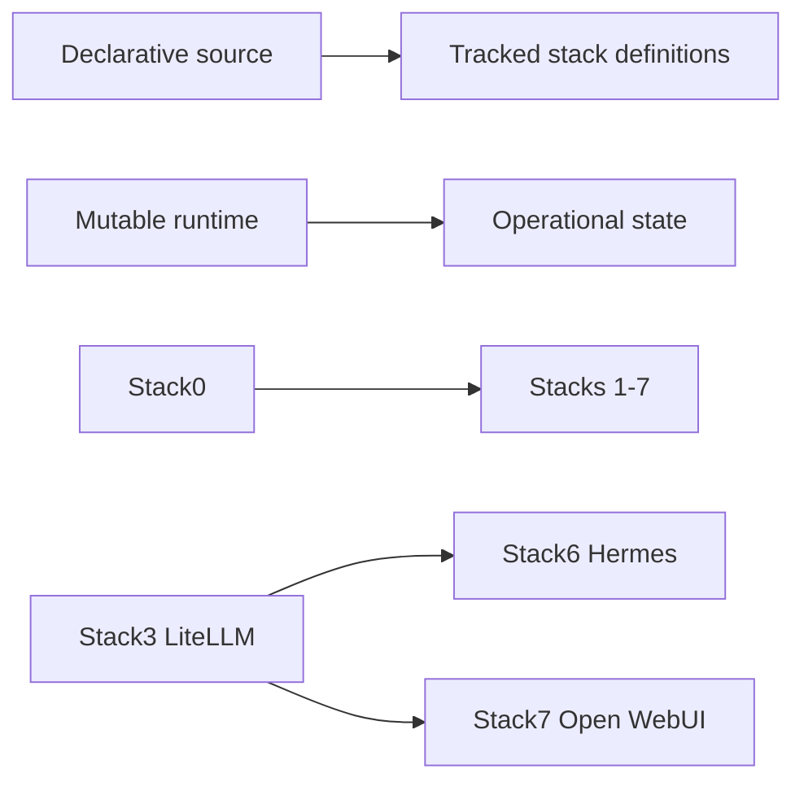

<!--
This Source Code Form is subject to the terms of the Mozilla Public
License, v. 2.0. If a copy of the MPL was not distributed with this
file, You can obtain one at https://mozilla.org/MPL/2.0/.
-->

# AI-assisted maintenance context

This document provides compact maintenance context for contributors and automation. It is not an alternative source of truth: durable architecture and security decisions remain in ADRs/SDRs, observable behaviour remains in OpenSpec, current work remains in [pending.md](pending.md), and detailed chronology remains in Git history.

Recommended starting points are the root [README.md](../README.md), [pending.md](pending.md), the affected stack README/manifest and the current Git history. Disaster-recovery work should also consult [dr/status.md](dr/status.md).

## Platform invariants

- The platform is a set of atomic stacks, not one monolithic Compose project.
- Every application stack requires Stack0; Stack6 and Stack7 additionally require Stack3.
- Stack2 capabilities are optional to Stack6/7. Stack4 Git hosting is optional to Stack6 memory configuration.
- `.lock` means PREPARED only.
- The operational root `.env` is protected and ignored by Git; normal PREPARE must not silently regenerate it.
- Runtime ownership is explicit in manifests; durability must not be inferred solely from Docker mounts.
- Lifecycle is `PREPARE → DEPLOY → READY → RECONCILE → VERIFY`; restart-causing reconcile returns through READY before final verification.
- Installer and DR orchestration remain generic. Stack-number special cases belong in manifests, adapters or stack-owned scripts rather than common orchestration.

## Security invariants

- Hermes has no Docker socket; execution is isolated in its sandbox.
- Applications use dedicated LiteLLM virtual credentials rather than the administrative master key.
- Internal services normally communicate over Stack0-owned `redlocal`; host exposure must be explicit.
- Open WebUI keeps model access control enabled and grants `basic_autorouter` explicit public read access instead of bypassing access control.
- Security rationale is recorded in [devel-docs/sdr/](devel-docs/sdr/).

## Persistence and disaster recovery

Stack0 PKI, Stack3 logical LiteLLM database, Stack4 Gitea native state and Stack7 Open WebUI data are managed recovery artifacts. Stack6 runtime is reconstructable; Git-backed `MEMORY.md` and `USER.md` are the durable user-memory contract. The protected operational `.env` is a sensitive global recovery artifact under ADR-0001/SDR-0001.

Qualified capability-level evidence is summarized in [dr/status.md](dr/status.md). Destructive recovery should not be repeated solely to recreate evidence for behaviour that is already qualified.

## Change discipline

Changes should begin by identifying the owning stack or subsystem and inspecting its manifest, Compose definition, lifecycle scripts and relevant decisions/specifications. The smallest ownership-correct change should be preferred, followed by deterministic repository tests and runtime qualification only where the behaviour cannot be established from source and automated evidence alone.

Deployment or runtime verification must never be inferred from source-only evidence.

All automated tests live under [`../tests/`](../tests/). Behaviour contracts live in [`devel-docs/openspec/`](devel-docs/openspec/) and link to tests through [`traceability.md`](devel-docs/openspec/traceability.md).
