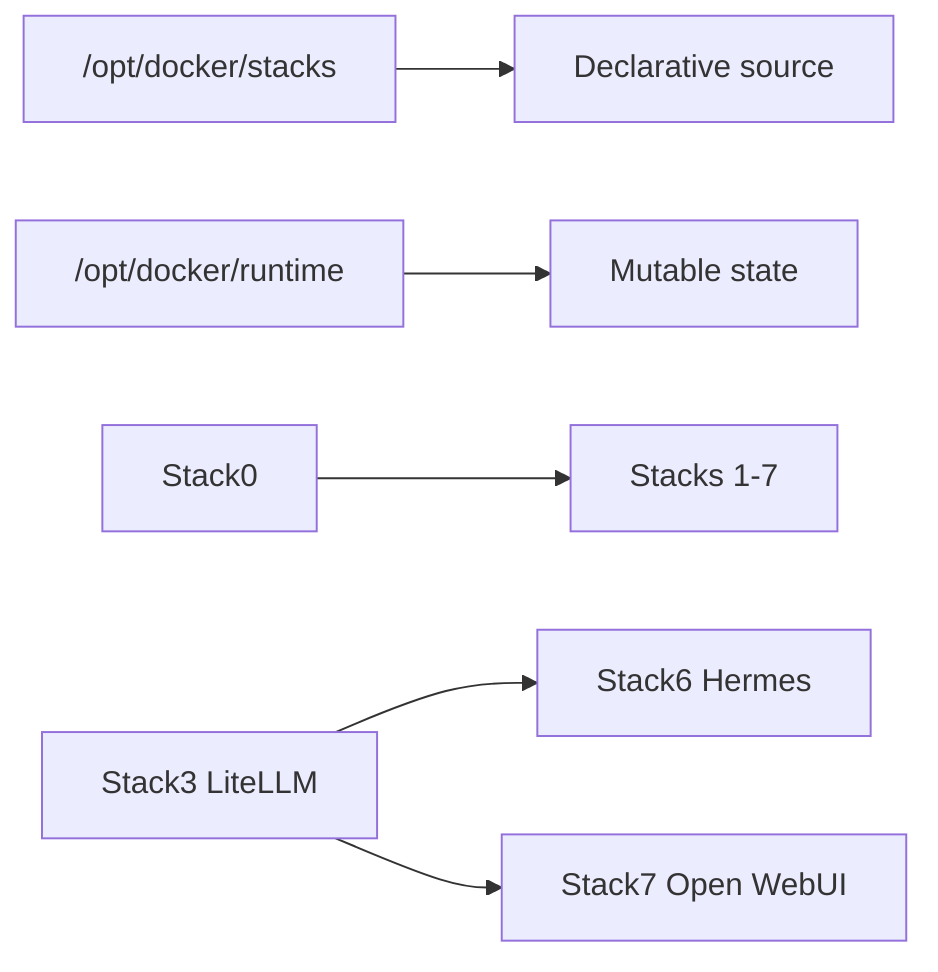

<!--
This Source Code Form is subject to the terms of the Mozilla Public
License, v. 2.0. If a copy of the MPL was not distributed with this
file, You can obtain one at https://mozilla.org/MPL/2.0/.
-->

# A2A Knowledge — Local Hybrid AI

Continuity contract for AI-assisted maintenance. Start with the root [README.md](../README.md), [pending.md](pending.md), the affected stack README/manifest and current Git history. For DR, also read [dr/status.md](dr/status.md).

## Platform invariants

- The platform is a set of atomic stacks, not one monolithic Compose project.
- Every application stack requires Stack0; Stack6 and Stack7 additionally require Stack3.
- Stack2 capabilities are optional to Stack6/7. Stack4 Git hosting is optional to Stack6 memory configuration.
- `.lock` means PREPARED only.
- The operational root `.env` is protected/ignored by Git and must not be silently regenerated by normal PREPARE.
- Runtime ownership is explicit in manifests; do not infer durability from Docker mounts.
- Lifecycle is `PREPARE → DEPLOY → READY → RECONCILE → VERIFY`; restart-causing reconcile must return through READY before final verification.
- Installer and DR orchestration should remain generic. Stack-number special cases belong in manifests/adapters/stack-owned scripts, not common orchestration.

## Security invariants

- Hermes has no Docker socket; execution is isolated in its sandbox.
- Applications use dedicated LiteLLM virtual credentials rather than the administrative master key.
- Internal services normally communicate over Stack0-owned `redlocal`; host exposure must be explicit.
- Open WebUI keeps model access control enabled and grants `basic_autorouter` explicit public read access instead of bypassing access control.
- Security rationale is recorded in [devel-docs/sdr/](devel-docs/sdr/).

## Persistence / DR

Stack0 PKI, Stack3 logical LiteLLM DB, Stack4 Gitea native state and Stack7 Open WebUI data are managed recovery artifacts. Stack6 runtime is reconstructable; only Git-backed `MEMORY.md` + `USER.md` is durable user memory. The protected operational `.env` is a sensitive global recovery artifact under ADR-0001/SDR-0001.

Qualified evidence is summarized in [dr/status.md](dr/status.md). Do not repeat destructive recovery solely to recreate evidence.

## Change discipline

Before changing a stack: identify the owner, inspect its manifest/Compose/lifecycle/scripts, make the smallest ownership-correct change, run repository tests, then qualify runtime behaviour only when necessary. Never claim deployment or runtime verification from source-only evidence.

All automated tests live under [`../tests/`](../tests/). Behaviour contracts live in [`devel-docs/openspec/`](devel-docs/openspec/) and link to tests through [`traceability.md`](devel-docs/openspec/traceability.md).
