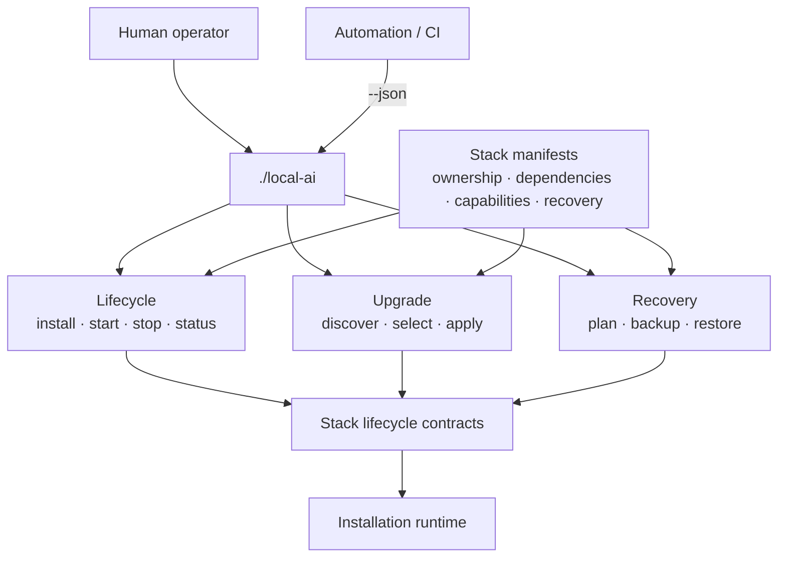
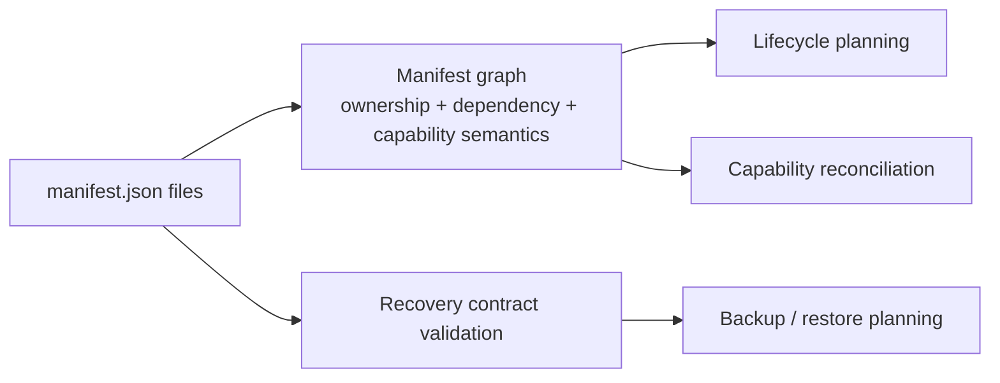
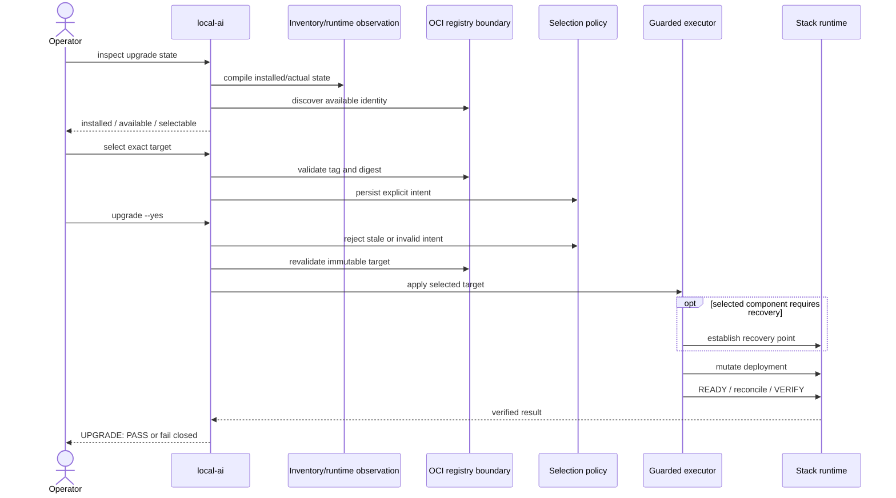

<!--
This Source Code Form is subject to the terms of the Mozilla Public
License, v. 2.0. If a copy of the MPL was not distributed with this
file, You can obtain one at https://mozilla.org/MPL/2.0/.
-->

# Management-plane architecture

[← Documentation map](../TOC.md) · [Architecture index](README.md) · [Current state](../current-state.md)

The management plane is the control surface behind `./local-ai`. It translates operator intent into manifest-aware lifecycle, version-maintenance and recovery operations while keeping stack scripts, Compose files and Python modules private implementation details.

## Responsibility map

The public boundary is intentionally narrow. A consumer depends on `./local-ai` and its documented JSON/text contracts, not on internal module names or individual stack scripts.

## Manifest compilation boundary

Each stack manifest is the machine-readable declaration of physical ownership and operational semantics. The platform manifest layer compiles the cross-stack graph used by lifecycle and capability planning. Recovery validation is a separate responsibility so that backup and restore constraints remain explicit rather than becoming incidental dependency-parser behaviour.

The implementation currently separates the general manifest planner in `stack0_-_platform/manifests.py` from recovery-specific validation in `stack0_-_platform/manifest_recovery.py`. Those file names describe current implementation boundaries; they are not public APIs.

## Upgrade control flow

Upgrade deliberately separates observation, operator intent and mutation. Registry discovery does not become desired state, and a selected target is revalidated before execution.

The current implementation reflects those responsibilities across focused modules: entry/command orchestration, selection policy, inventory/catalog/plan/cache state, runtime observation, OCI registry handling and the guarded mutation executor. The separation is intended to make consent and failure boundaries auditable rather than to expose those modules as supported integration points. A recovery point is created only when at least one selected component declares `recovery_required=true`; reconstructable upgrades can execute without manufacturing an unnecessary backup.

## Recovery control flow

Recovery separates read-only planning and preflight from backup publication and destructive restore phases. A recovery point is treated as a recorded contract, not merely as a directory containing copied files.

`commands/recovery/dr.py` owns recovery planning/orchestration while `commands/recovery/dr_preflight.py` owns destination and runtime-source preflight. Backup, staging, managed restore, live restore and resume verification remain separate implementation phases because their mutation and safety properties differ.

## Lifecycle boundary

The common stack lifecycle remains:

PREPARE establishes prerequisites and installation-owned structure. DEPLOY changes runtime. READY proves required runtime health. RECONCILE applies capability-dependent policy. VERIFY proves the resulting contract. A `.lock` records PREPARED state only.

## Relationship to the stack plane

The management plane does not replace stack ownership. It interprets the declared graph and invokes stack-owned lifecycle contracts. The runtime topology itself is documented in [Stack architecture](../stacks/README.md). Architectural rationale is preserved in [ADRs](../devel-docs/adr/README.md), security rationale in [SDRs](../devel-docs/sdr/README.md), and externally observable behaviour in [OpenSpec](../devel-docs/openspec/README.md).
