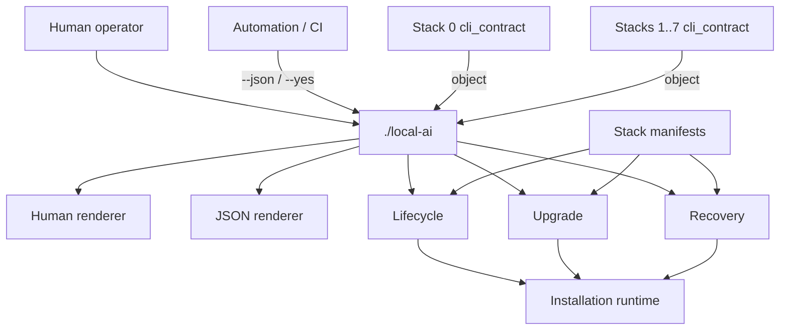
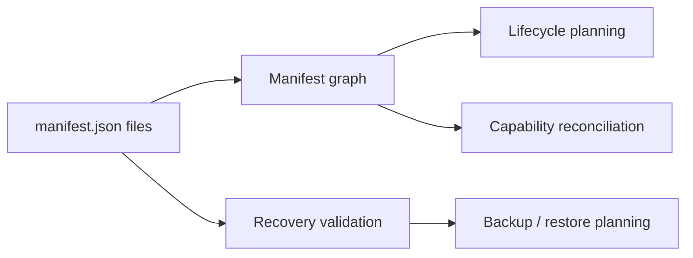
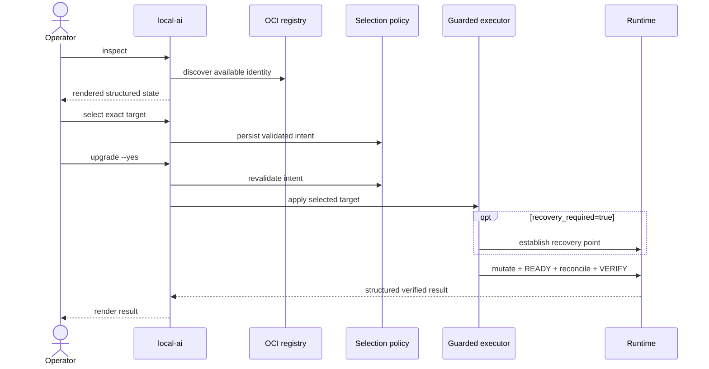
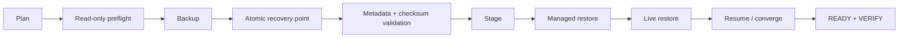

<!--
This Source Code Form is subject to the terms of the Mozilla Public
License, v. 2.0.
-->
# Management-plane architecture
[← Documentation map](../TOC.md) · [Architecture index](README.md) · [Current state](../current-state.md)

The management plane is the control surface behind `./local-ai`. Stack scripts, Compose files and Python modules remain implementation details.

## Responsibility map

The boundary deliberately separates facts from presentation. Every stack owns a `cli_contract.py` module whose `json_payload()` returns a JSON-compatible Python object. A stack contract never prints, serializes JSON, adds terminal decoration or interprets global automation flags. The management CLI composes those objects and is the only layer that renders human or machine output.

`src/local_ai_cli/render.py` is the presentation boundary. Its JSON renderer emits one machine document without banners or prose. Its human renderer can prepend a configurable text banner/header. Consequently, presentation changes cannot alter stack logic and stack changes cannot silently change JSON serialization.

## Global automation context
`--json` and `--yes` are properties of `local-ai`, not stack-specific options. The public boundary normalizes them independently of position and passes explicit context to operations. `--json` selects machine presentation. `--yes` supplies non-interactive consent; it is accepted as a no-op by read-only operations. Operation-specific assertions remain independent safety gates. In particular, `restore apply --execute` requires the DR-specific `--confirm-clean-target` assertion in addition to global execution consent.

## Manifest compilation boundary
Each stack manifest declares ownership and operational semantics. The platform manifest layer compiles the cross-stack graph used by lifecycle, capability, upgrade and recovery planning. Recovery validation remains separate so backup/restore constraints are explicit.

The general planner currently lives in `stack0_-_platform/manifests.py` and recovery-specific validation in `stack0_-_platform/manifest_recovery.py`; these names are implementation details.

## Upgrade control flow

Discovery never creates desired state. Mutation revalidates runtime baseline, policy, immutable target and executor eligibility. A recovery point is created only when selected components require one.

## Recovery control flow

`src/local_ai_cli/recovery/dr.py` owns planning/orchestration and `dr_preflight.py` owns destination/runtime-source preflight. Mutation phases remain separate because their safety properties differ.

## Lifecycle boundary

PREPARE establishes prerequisites and installation-owned structure. DEPLOY changes runtime. READY proves required runtime health. RECONCILE applies capability-dependent policy. VERIFY proves the resulting contract. A `.lock` records PREPARED state only.

The runtime topology is documented in [Stack architecture](../stacks/README.md). Architectural rationale remains in [ADRs](../devel-docs/adr/README.md), security rationale in [SDRs](../devel-docs/sdr/README.md), and observable behaviour in [OpenSpec](../devel-docs/openspec/README.md).