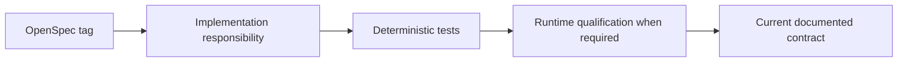

<!--
This Source Code Form is subject to the terms of the Mozilla Public
License, v. 2.0. If a copy of the MPL was not distributed with this
file, You can obtain one at https://mozilla.org/MPL/2.0/.
-->

# OpenSpec traceability

[← OpenSpec index](README.md) · [Documentation map](../../TOC.md) · [Management plane](../../architecture/management-plane.md)

Every tagged behavioural contract needs automated or qualified evidence. Contract tags are stable behaviour identifiers; implementation files and individual test names may evolve as long as equivalent evidence remains. Runtime qualification complements automated tests when a rule depends on real Docker, registry or application interaction.

## Platform and installation

- `PLATFORM-DEP-001` — `tests/test_openspec_contracts.py::test_PLATFORM_DEP_001_required_dependencies_are_declared` plus manifest planner tests.
- `PLATFORM-RUNTIME-001` — installer/manifest and repository-layout tests; source/runtime separation.
- `INSTALL-PLAN-001` — `tests/test_installer.py`, `tests/test_management_cli.py`, and plan qualification.
- `INSTALL-LIFECYCLE-001` — OpenSpec contract tests plus `tests/test_stack6_reconcile_ready.py` and representative runtime qualification.
- `INSTALL-LOCK-001` — installer tests and stack PREPARE contracts.

General manifest graph/capability semantics are implemented in `stack0_-_platform/manifests.py`; Recovery-specific manifest validation is separated into `stack0_-_platform/manifest_recovery.py`. The behavioural contract remains manifest-driven rather than file-name-driven.

## Disaster recovery

- `DR-BACKUP-001` — OpenSpec contract test plus `tests/disaster_recovery/test_dr_backup_all.py` and qualified global backup. Planning/orchestration is owned by `src/local_ai_cli/recovery/dr.py`; source/destination preflight is owned by `src/local_ai_cli/recovery/dr_preflight.py`.
- `DR-BACKUP-002` — backup destination/preflight overlap tests plus runtime rejection of equal/descendant/ancestor protected paths.
- `DR-RESTORE-001` — restore planning/staging/managed/live/resume tests plus qualified clean-target recovery.
- `DR-STACK7-001` — OpenSpec contract test plus [DR status](../../dr/status.md).

## Stack contracts

| Contract | Primary evidence |
|---|---|
| `STACK0-FOUNDATION-001` | recovery/manifest tests + Stack0 verify |
| `STACK1-INGRESS-001` | stack/install contracts + HAProxy qualification |
| `STACK2-WEB-001` | `tests/test_stack7_web_capabilities.py` |
| `STACK3-GATEWAY-001` | DR/recovery-contract tests + SDR-0003 |
| `STACK4-GIT-001` | `test_dr_stack4_restore_verify.py` |
| `STACK5-RECONSTRUCT-001` | recovery-contract tests |
| `STACK6-ISOLATION-001` | OpenSpec contract test + SDR-0002 |
| `STACK6-MEMORY-001` | `test_dr_stack6_verify.py` |
| `STACK7-POLICY-001` | OpenSpec contract test + SDR-0005 |
| `STACK7-WEB-001` | OpenSpec contract test + runtime web qualification |

## Management CLI

### Boundary and machine contracts

- `CLI-BOUNDARY-001` — management CLI boundary tests; [ADR-0002](../adr/0002-single-management-cli.md).
- `CLI-LAYOUT-001` — repository-layout tests; [ADR-0005](../adr/0005-unified-command-implementation-package.md).
- `CLI-JSON-001`, `CLI-JSON-002` — `tests/test_management_json_contracts.py`.
- `CLI-DOCTOR-001` — `tests/test_doctor.py`.

### Manifest component inventory

- `CLI-INVENTORY-001` — `tests/test_component_inventory.py`; manifest ownership/classification and Compose bindings.
- `CLI-INVENTORY-002` — component-inventory, management-CLI and upgrade-policy tests; retired static catalog remains absent. [ADR-0007](../adr/0007-manifest-component-inventory.md).
- `CLI-INVENTORY-003` — component-inventory and management-CLI tests for rescan fingerprint/snapshot/diff semantics.

### Selective runtime lifecycle

- `CLI-RUNTIME-001` — runtime-lifecycle and management-runtime tests plus qualified stop/start preserving container identity and returning READY. Public dispatch tests require numeric stack selectors and reject internal names/directories.
- `CLI-RUNTIME-002` — runtime-lifecycle tests plus qualified provider-stop refusal while required consumers are active.

### Shell completion

- `CLI-COMPLETION-001` — `tests/test_completion.py` verifies upgrade-component candidates are compiled from current manifest inventory and public stack candidates are numeric rather than internal `stackN` identities.
- `CLI-COMPLETION-002` — `tests/test_completion.py` verifies the completion module does not import/call runtime or registry discovery paths; source-local candidate calculation is the contract.
- `CLI-COMPLETION-003` — `tests/test_completion.py` verifies Bash/Zsh generated adapters delegate to `__complete`, share the same candidate engine, use numeric lifecycle/upgrade stack ids and expose only implemented upgrade actions (`select`/`clear`, policy `set`/`clear`).
- `CLI-COMPLETION-004` — `tests/test_completion.py` verifies Bash/Zsh detection, root/user targets, exact generated content and idempotent installation; deployment qualification has additionally exercised the root Bash target.
- `CLI-COMPLETION-005` — `tests/test_completion.py` verifies unsupported shells fail rather than selecting a guessed target.
- `CLI-COMPLETION-006` — implementation boundary in `src/local_ai_cli/completion.py` plus installation tests: only the adapter target/parent is written; shell startup files are outside installer ownership.

### Registry discovery semantics

- `CLI-REGISTRY-001` — `tests/test_registry_failure_contract.py` injects HTTP 429/401/403 and proves failure remains `available=unknown`, never `current`; positive registry families are separately runtime-qualified. OCI parsing/probing belongs to `src/local_ai_cli/upgrade_registry.py`.
- `CLI-REGISTRY-002` — `tests/test_registry_discovery_cache.py` verifies TTL reuse/expiry, local-digest invalidation and bounded cache size; cache ownership remains separate from registry HTTP semantics.

### Upgrade execution

The refactored implementation separates orchestration (`upgrade_entry`), selection/stale-plan policy (`upgrade_selection`), runtime observation (`upgrade_runtime`), inventory/catalog/plan/cache state, OCI identity (`upgrade_registry`) and guarded mutation (`upgrade_executor`). Compatibility wrappers preserve existing public and tested seams while these responsibilities remain internal.

- `CLI-UPGRADE-001` — management CLI/version-authority tests; human output uses Installed while JSON retains stable runtime fields.
- `CLI-UPGRADE-002` — selection-policy/version-authority tests; plan stores runtime baseline and immutable target digest.
- `CLI-UPGRADE-003` — management CLI proves `--yes` never auto-selects available versions.
- `CLI-UPGRADE-004` — selection/stale-plan tests fail before execution with `UPGRADE_PLAN_STALE`.
- `CLI-UPGRADE-005` — `tests/test_upgrade_executor.py`; targeted guarded deployment, with runtime qualification required before promotion.
- `CLI-UPGRADE-006` — executor/selection/registry tests prove digest capture and moved-tag rejection.
- `CLI-UPGRADE-007` — execution-metadata tests distinguish guarded from inventory-only components.
- `CLI-UPGRADE-008` — [upgrade qualification](../upgrade-qualification.md), execution metadata and representative runtime qualification establish selectability as proven executor support.
- `CLI-UPGRADE-009` — executor failure tests and human apply contract prove `UPGRADE: PASS` only on successful guarded completion.
- `CLI-UPGRADE-010` — force-override tests prove explicit administrative qualification bypass is stored only for deterministic known mutation paths; runtime qualification includes a forced Dockhand update.

### Compatibility policy

- `CLI-POLICY-001` — local override/clear tests.
- `CLI-POLICY-002` — same major/minor-series compatibility; [ADR-0004](../adr/0004-upgrade-compatibility-policy.md).
- `CLI-POLICY-003` — major-series and date-like version qualification.
- `CLI-POLICY-004` — manual explicit-target policy.
- `CLI-POLICY-005` — runtime qualification of policy clear.
- `CLI-POLICY-006` — incompatible selections become invalid without silent deletion.
- `CLI-POLICY-007` — selectability remains independent from policy; force is recorded separately.
- `CLI-POLICY-008` — executor revalidates policy before mutation, including forced selections.

### Status

- `CLI-STATUS-001` — `tests/test_status.py` verifies stack-oriented human output (`STACK`, `NAME`, `STATE`, `HEALTH`, `DRIFT`).
- `CLI-STATUS-002` — status schema 3/tests preserve detailed component diagnostics and drift vocabulary `yes`/`no`/`n/a`.
- `CLI-STATUS-003` — status tests exercise shared component identity semantics; read-only identity/drift interpretation remains a shared state responsibility rather than being duplicated by each presentation path.

## Traceability maintenance

A new tagged scenario is added here in the same change and names real evidence. A test rename may update the evidence reference without renaming the behavioural tag. A removed behaviour states whether it was superseded or retired; silently deleting its traceability entry is insufficient. Implementation paths may change during refactoring without changing a tag when the observable contract and equivalent evidence remain intact.
