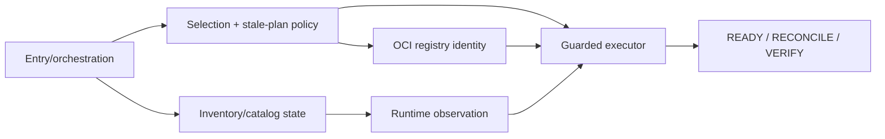
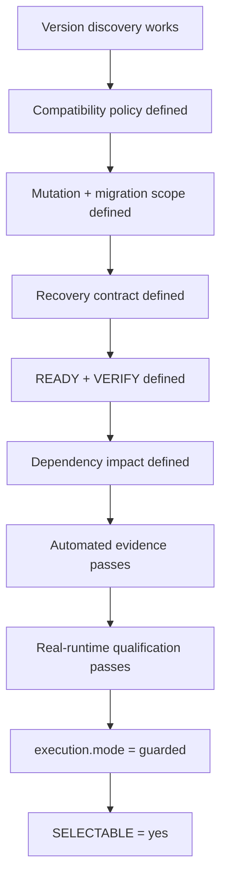

<!--
This Source Code Form is subject to the terms of the Mozilla Public
License, v. 2.0. If a copy of the MPL was not distributed with this
file, You can obtain one at https://mozilla.org/MPL/2.0/.
-->

# Upgrade executor qualification

[← Developer documentation](README.md) · [Operator upgrade guide](../user-docs/upgrade.md) · [Management plane](../architecture/management-plane.md) · [ADR-0006](adr/0006-operational-version-authority.md)

`SELECTABLE` is a support statement, not a UI convenience. Setting a manifest-declared component to `execution.mode=guarded` means the project accepts `./local-ai upgrade` as a supported mutation path for that component.

A component remains inventory-only until the upgrade path satisfies every applicable gate below.

## Internal responsibility boundary

Qualification is intentionally evaluated across several responsibilities rather than by one monolithic upgrade module.

The current implementation distributes these responsibilities across `upgrade_entry`, `upgrade_selection`, `upgrade_inventory`, `upgrade_catalog`, `upgrade_plan`, `upgrade_cache`, `upgrade_registry`, `upgrade_runtime` and `upgrade_executor`. The names document the present source layout; qualification attaches to the behavioural boundaries, not to permanent module APIs. Shared runtime-image/version and OCI-reference primitives are delegated to their owning modules rather than duplicated inside the executor.

## Qualification gates

### 1. Identity

The implementation determines concrete installed identity through the runtime-observation boundary rather than trusting mutable source/runtime tag strings. Registry lookup failure fails closed when policy evaluation needs a concrete identity.

The target is resolved through the OCI registry boundary from the same configured repository used by the component. Selection records the exact target reference and immutable digest.

### 2. Compatibility policy

A project default policy is explicit (`minor-series`, `major-series`, or `manual`). Any installation override remains separate from executor capability.

Selection and apply reject current targets, prohibited series changes, semantic downgrades where comparable, moved immutable targets and stale selections.

### 3. Version authority mutation

The component has one unambiguous installation-owned version authority. The guarded executor can update it atomically or with equivalent fail-closed semantics. Registry availability is never written as desired state merely because a newer version exists.

### 4. Deployment scope

The exact runtime mutation is known. The owning stack manifest metadata names the service(s) that may be recreated or restarted. The procedure does not broaden mutation to unrelated services merely because they share a Compose project.

### 5. Migration contract

If the application, database, schema, queue format, filesystem state or configuration needs migration, its ordering and compatibility constraints are documented and automated where possible.

A component with unresolved migration semantics remains blocked by `migration-policy-required`.

### 6. Recovery

Failure consequences are understood. Components whose state can be damaged or made incompatible by the upgrade require a proven recovery point before mutation. Reconstructable state may use a lighter contract when loss does not violate project recovery requirements.

Automatic destructive rollback is not assumed safe. A failure preserves the selection and exposes the error plus any recovery point created before mutation. The current executor appends upgrade history only after successful completion; qualification must not rely on a persistent failure-history event that the implementation does not write.

### 7. READY

A meaningful post-deployment readiness condition exists. Process/container existence alone is insufficient when the component exposes a stronger application-level readiness signal. Timeout and failure behaviour are deterministic and surfaced as failed upgrade execution.

### 8. VERIFY

The executor proves that the selected target version is running after deployment. Component-specific verification additionally proves the service is usable when version identity alone is insufficient.

### 9. Dependency impact

Required providers, consumers and capability relationships are known. Prepared consumers affected by the change are reverified when their contract could be invalidated by the upgrade.

### 10. Automated tests

At minimum, evidence covers allowed-target selection, current/disallowed target rejection, stale runtime baseline, immutable target movement, registry/auth/rate-limit failures where applicable, exact mutation scope, READY/VERIFY failure propagation, required recovery-point behaviour, failure preservation of the selection, and successful history recording/selection clearing.

Tests exercise the supported `./local-ai` contract where public behaviour is involved; private-module tests supplement rather than replace that evidence.

### 11. Runtime qualification

Before promotion, the procedure is executed against a representative real deployment. Qualification records evidence for the actual component transition, verifies the expected mutation scope, confirms READY/VERIFY behaviour, and runs the project's required regression gate. Unit-test-only implementation is insufficient for `SELECTABLE=yes`.

## Administrator override is not qualification

An inventory-only component may expose a deterministic mutation recipe before that recipe is project-qualified. In that case an administrator may explicitly select a target with `--force`.

This override does not change manifest-declared support status, does not set `SELECTABLE=yes`, and does not satisfy any qualification gate. It records only that the administrator accepted the missing project qualification for that one selection.

The forced path still preserves every protection the implementation can enforce: version policy, target availability, immutable digest, stale-plan detection, exact mutation scope, declared recovery behaviour, READY/RECONCILE/VERIFY and dependency re-verification. A component with no deterministic mutation recipe cannot be made executable merely by supplying `--force`.

Successful forced upgrades retain the forced marker in successful history so operational evidence cannot be mistaken for a normally supported upgrade.

## Promotion sequence

The manifest metadata change is the last step. It records an already-proven capability; it does not create that capability.

## Current runtime qualification evidence

Redis (`stack2/redis`) has completed a real guarded transition from `8.10.0-alpine3.23` to `8.10.1-alpine3.23`. The executor recorded `success=true`, immutable target identity, dependent-stack re-verification, and post-upgrade status converged with no drift. Redis therefore remains `SELECTABLE=yes`.

HAProxy, RabbitMQ and Dockhand have deterministic executor recipes but remain `SELECTABLE=no` until equivalent real-runtime qualification is completed. They may be exercised deliberately through the administrator `--force` path without changing that support statement.

## Demotion

A selectable component returns to inventory-only when a newly discovered upstream migration requirement, unresolved breaking change, failed qualification, or unsupported runtime condition invalidates the existing executor contract. Keeping a component selectable while its safety assumptions are known to be false is a contract bug.

## Blocker vocabulary

Blocker reasons describe missing qualification rather than implementation history:

- `executor-not-qualified`: mutation/readiness/verification procedure is not yet fully qualified.
- `migration-policy-required`: migration/compatibility/recovery semantics remain unresolved.
- `local-build`: normal registry-version selection is not applicable.
- `non-versioned-component`: the component does not have a meaningful versioned upgrade path.

Source-layout accidents such as Compose pinning are not permanent blockers. Source representation and executor qualification are separate concerns.
