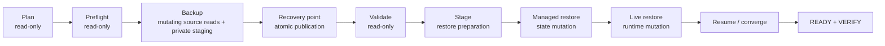

<!--
This Source Code Form is subject to the terms of the Mozilla Public
License, v. 2.0. If a copy of the MPL was not distributed with this
file, You can obtain one at https://mozilla.org/MPL/2.0/.
-->

# Disaster recovery

[← Documentation map](../TOC.md) · [Management-plane architecture](../architecture/management-plane.md)

Disaster recovery is manifest-driven and exposed only through the supported `./local-ai` management boundary. Recovery distinguishes state that must be backed up from state that is reconstructable from declarative source.

## Recovery model

Planning and preflight establish whether a requested operation is safe before durable state is published or runtime is changed. Backup publication is atomic. Restore validates the recorded recovery contract and integrity evidence before entering mutating phases. Late failures remain explicit and resumable where supported; recovery does not blindly repeat managed-state imports.

## Operator path

The normal reading path is:

1. [Backup and restore operation](howto.md) — current supported commands, durable-state policy and recovery flow.
2. [Current qualification status](status.md) — recovery behaviours with runtime evidence.
3. Resource/strategy records below — implementation and historical qualification detail for maintainers.

## Strategy and qualification records

- [Filesystem qualification history](filesystem.md) — backup-root and publication assumptions established before full backup execution.
- [Archive qualification history](archive.md) — bounded archive strategy first qualified with Stack0 PKI.
- [PostgreSQL qualification](postgres.md) — Stack3 logical database dump and isolated restore verification.
- [Gitea qualification](gitea.md) — controlled-offline native dump and isolated reconstruction proof.

These documents retain useful strategy evidence, but their historical standalone helper commands and milestone restrictions are not current operator interfaces. `./local-ai backup` is the public full-backup boundary.

## Implementation boundaries

`commands/recovery/dr.py` owns recovery planning/orchestration and intentionally keeps its direct backup subcommand dry-run-only. `commands/recovery/dr_preflight.py` owns destination and runtime-source preflight. The public `./local-ai backup` command dispatches to the private full-backup execution entry. Backup execution, staging, managed restore, live restore and resume remain separate phases because their mutation and failure properties differ. These modules are private implementation boundaries rather than supported integration APIs.

Schemas remain implementation-owned under `commands/recovery/`; manifests declare which resources participate in recovery. The architecture is summarized in [Management-plane architecture](../architecture/management-plane.md).

## Related decisions and contracts

- [ADR-0001 — protected operational `.env` in backups](../devel-docs/adr/0001-backup-operational-env.md)
- [SDR-0001 — security treatment of protected operational configuration](../devel-docs/sdr/0001-protected-operational-config-in-backups.md)
- [Disaster-recovery OpenSpec](../devel-docs/openspec/disaster-recovery.feature)
- [OpenSpec traceability](../devel-docs/openspec/traceability.md)

A backup set is not considered valid merely because files exist. Publication is atomic and restore paths validate the recovery contract and integrity evidence before mutation.
