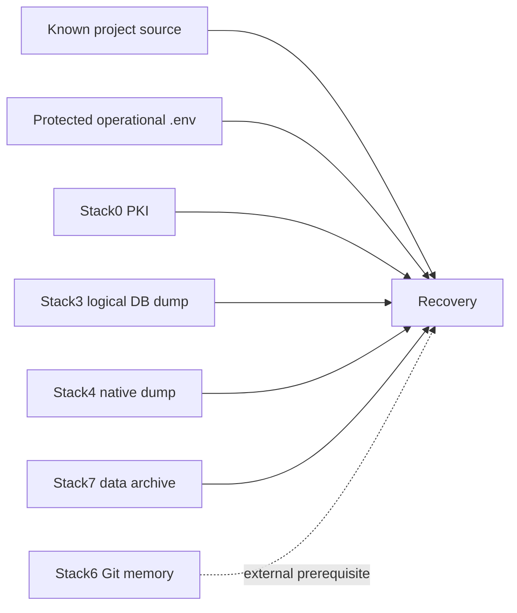

# Disaster recovery

The DR rule is simple: preserve only state whose loss would prevent a correct rebuild. A Docker volume or bind mount is not a backup target unless a manifest declares it.

`./local-ai` is the supported operator and integration boundary. Files under `bkp-dr/` remain the internal DR engine and schema ownership area; external automation must not couple to their direct invocation contracts.



## Recovery policy

| Stack | Policy | Durable input |
|---|---|---|
| 0 Platform | mixed | PKI archive |
| 1 HAProxy/Web | reconstruct | none |
| 2 SearXNG/Firecrawl | reconstruct | none |
| 3 LiteLLM | mixed | logical PostgreSQL dump + original salt |
| 4 Gitea | managed | native Gitea dump |
| 5 Dockhand | reconstruct | none |
| 6 Hermes | reconstruct + external | Git-backed `MEMORY.md` + `USER.md` |
| 7 Open WebUI | mixed | `/app/backend/data` archive + secret key |

Schemas are implementation-owned by [`../../bkp-dr/`](../../bkp-dr/): [`recovery.schema.json`](../../bkp-dr/recovery.schema.json) and [`backup-set.schema.json`](../../bkp-dr/backup-set.schema.json).

## Backup

Supported operator entry point:

```bash
./local-ai backup
```

For machine consumers, use the JSON contract where supported:

```bash
./local-ai --json backup
```

A real backup validates source/runtime prerequisites, stages sensitive data privately, performs integrity checks, writes `backup.json` and `checksums.sha256`, then atomically publishes one immutable `backup-*` directory. The operational `.env` is a sensitive global artifact; its contents never belong in logs or metadata. See [ADR-0001](../../adr/0001-backup-operational-env.md) and [SDR-0001](../../sdr/0001-protected-operational-config-in-backups.md).

## Restore

```mermaid
flowchart LR
    CLI["./local-ai restore"] --> Validate["Validate backup + checksums"]
    Validate --> Source["Materialize recorded source"]
    Source --> Config["Restore protected config"]
    Config --> Pre["Pre-prepare archives"]
    Pre --> Prepare["PREPARE"]
    Prepare --> Managed["Managed state restore"]
    Managed --> Deploy["DEPLOY"]
    Deploy --> Ready["READY / VERIFY"]
    Ready --> External["External prerequisite convergence"]
```



Supported management forms are exposed through `./local-ai restore ...`; the underlying DR scripts remain internal implementation details.

The generic restore path has passed a real destructive clean-target qualification for stacks 0–6. Stack7 has separately passed a current isolated archive restore from a global recovery point without modifying the live runtime. Do not repeat destructive qualification merely to recreate evidence.

## Current qualified recovery points

- Core destructive clean-target proof: `/opt/local-hybrid-ai-backups/backup-20260911T172551Z`.
- First Stack7-aware global point: `/opt/local-hybrid-ai-backups/backup-20260912T213405Z`.

Detailed evidence is in [status.md](status.md).

## Deliberately excluded

Raw PostgreSQL PGDATA, containers, images, logs, queues, caches, `.lock`, migration markers, Firecrawl transient DB/queue state, SearXNG cache, Dockhand state, Gitea runner registration, Hermes SQLite/session/cache state and sandbox contents are not DR artifacts merely because they exist.

## Remaining hardening

Encryption-at-rest, retention generations, off-host replication, external Stack6 SSH prerequisite packaging, overlap/type/schema validation hardening, resumable-recovery improvements and the final safe upgrade executor remain active work. See [../pending.md](../pending.md).
