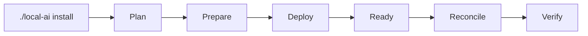

<!--
This Source Code Form is subject to the terms of the Mozilla Public
License, v. 2.0. If a copy of the MPL was not distributed with this
file, You can obtain one at https://mozilla.org/MPL/2.0/.
-->

# Installation

[← Documentation map](TOC.md) · [Operator CLI](user-docs/cli.md) · [Management plane](architecture/management-plane.md)

`./local-ai` is the supported management interface. The lifecycle registry, stack scripts, Compose files and Python modules are implementation details rather than integration contracts.



## 1. Protected configuration

An operator creates the operational root `.env` from `.env.template` and supplies real values before installation. The operational `.env` is ignored by Git and is not a stack-owned generated file. PREPARE does not silently replace an existing operational file.

## 2. Plan inspection

```bash
./local-ai install --plan all
```

Planning is read-only. For one application, the operator supplies its numeric stack id; required dependencies are resolved from manifests.

## 3. Installation

```bash
./local-ai install 0 1 2 3 4 5 6 7 --yes
```

For a single stack:

```bash
./local-ai install 7 --yes
```

A `.lock` records successful PREPARE only. Runtime readiness and verification are separate lifecycle facts.

## 4. Reconciliation and explicit bootstrap

The common lifecycle is `PREPARE → DEPLOY → READY → RECONCILE → VERIFY`. Reconciliation may depend on capabilities or application state that exists only after deployment. If reconciliation restarts runtime, READY is re-established before final verification.

Some credential/bootstrap operations remain explicitly gated because they issue credentials or depend on a real application identity. The supported workflow still crosses `./local-ai`; stack scripts are not promoted to public APIs merely because they implement one lifecycle stage.

## 5. Machine integration

External automation uses `./local-ai --json ...` where a command exposes a stable JSON contract. It does not import `src/local_ai_cli/` modules or invoke individual stack scripts. Machine schema versions are independent from private implementation versions.

## 6. Development validation

The canonical full repository gate is:

```bash
PYTHONDONTWRITEBYTECODE=1 python3 -m unittest discover -s tests -p 'test_*.py'
```

Tests are a development interface, not an operator management interface.

## Runtime and component ownership

Project source and mutable installation state are separate. Each stack manifest declares owned resources and semantic components. `components[]` is the operational component inventory; Compose supplies implementation bindings. The retired static `src/local_ai_cli/upgrade-components.json` catalog is not part of the current architecture.

`./local-ai inventory rescan` validates current manifest/Compose topology and writes a diagnostic snapshot. Normal management compiles current manifests directly; the snapshot is not version authority and is not required before `status` or `upgrade`.

## Operational version authority

Git/Compose provides a fresh-install bootstrap baseline. After adoption, ongoing version intent belongs to the installation. The normal human version view is:

```bash
./local-ai upgrade
```

`./local-ai upgrade check` remains a compatibility alias, not the preferred documented workflow.

Registry discovery answers what is available; it never changes desired state or creates consent. Existing deployments that predate installation-owned exact version authority can record their already-running identities non-disruptively with:

```bash
./local-ai upgrade adopt
sudo ./local-ai upgrade adopt --yes
```

Adoption does not pull, recreate or restart containers.

## Compatibility policy and explicit selection

The public CLI always uses numeric stack selectors. Policy inspection and overrides therefore use forms such as:

```bash
./local-ai upgrade policy
./local-ai upgrade policy 2 redis
./local-ai upgrade policy 2 redis set major-series
./local-ai upgrade policy 2 redis clear
```

The compatibility modes are `minor-series`, `major-series` and `manual`. Policy is independent from project qualification: changing policy cannot turn an inventory-only component into a normally selectable component.

An operator selects a real published target explicitly before apply:

```bash
./local-ai upgrade 2 redis select <published-version>
./local-ai upgrade 7 open-webui select <published-version>
```

For a stack with exactly one upgrade-visible component, the CLI may resolve the component when omitted; documentation names the component explicitly because it remains unambiguous if a stack later gains more components.

`--yes` means only “apply already-selected targets”:

```bash
sudo ./local-ai upgrade --yes
```

Before mutation the executor revalidates runtime baseline, compatibility policy, target existence, immutable digest and executor eligibility. Required recovery, targeted deployment, READY, reconciliation, VERIFY, final runtime identity and prepared dependent-consumer checks remain part of guarded execution. A selection is cleared only after successful completion and `UPGRADE: PASS`.

An administrator may use `select ... --force` only when an inventory-only component already has a deterministic mutation recipe. Force bypasses project qualification, not the remaining safety gates.

On late failure the executor does not perform a destructive automatic rollback. It preserves explicit state/evidence and reports a recovery point where applicable so recovery remains an operator decision.

The detailed flow is documented in [upgrade workflow](user-docs/upgrade.md), [version authority](user-docs/version-authority.md), [upgrade policy](upgrade-policy.md) and [disaster recovery](dr/README.md).

## Shell completion

Bash/Zsh completion can be installed persistently after checkout/install without changing stack lifecycle:

```bash
./local-ai completion install
./local-ai completion status
```

The completion installer is explicit, idempotent and separate from `./local-ai install` because it changes the operator shell environment rather than platform runtime. [Shell completion](user-docs/completion.md) describes that contract.
