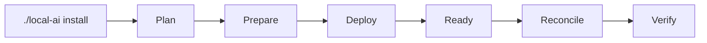

# Installation

`./local-ai` is the supported management interface. The installer, lifecycle registry, stack scripts and Compose files are internal implementation details and are not integration contracts.



## 1. Prepare protected configuration

Copy `.env.template` to the operational root `.env` and set real values. The operational `.env` is ignored by Git and is not a stack-owned generated file.

## 2. Inspect the plan

```bash
./local-ai install --plan all
```

Planning must be read-only. For one application, request its stack id; required dependencies are resolved automatically.

## 3. Install

```bash
./local-ai install 0 1 2 3 4 5 6 7 --yes
```

For a single stack:

```bash
./local-ai install 7 --yes
```

A `.lock` only records successful PREPARE. Runtime readiness and verification are separate.

## 4. Explicit stack bootstrap/reconcile steps

Some actions are intentionally operator-explicit because they issue credentials or depend on a real user identity. Stack7, for example, bootstraps its dedicated LiteLLM credential explicitly and reconciles model policy only after the first Open WebUI administrator exists. Those implementation mechanisms may remain stack-owned, but supported operator workflows must be surfaced through `local-ai` as the management CLI evolves.

## 5. Machine integration

External automation must not import internal modules or invoke individual Python/shell scripts. Use `./local-ai ... --json` for commands that expose the stable JSON contract. The JSON schema version is independent from internal implementation versions.

## 6. Validate tests

```bash
python3 -m unittest discover -s tests -p 'test_*.py'
```

Tests are a development interface, not an operator management interface.

## Runtime ownership

Project source normally lives at `/opt/docker/stacks`; persistent mutable state lives at `/opt/docker/runtime`. Each installation owns its management state. GitHub publishes the project; it does not silently dictate an installation's selected upgrade target or local compatibility policy.

Upgrade selections are recorded under the installation runtime area and are visible through:

```bash
./local-ai upgrade check
```

The human table shows numeric stack ids, while the JSON contract preserves stable ids such as `stack7`.

Registry discovery and upgrade authorization are separate. Inspect or change the installation's effective compatibility policy with:

```bash
./local-ai upgrade policy
./local-ai upgrade policy stack7
./local-ai upgrade policy stack7 set major-series
./local-ai upgrade policy stack7 clear
```

The only compatibility modes are `minor-series`, `major-series` and `manual`. The project catalog supplies a default; an installation-local override, when present, wins. `clear` removes only that override and returns to the project default. Policy does not override the independent `selectable` gate.

A version is selected explicitly before execution. Use a real target version published by the component's configured container registry, for example:

```bash
./local-ai upgrade stack6 select <published-version>
./local-ai upgrade stack7 select <published-version>
```

Selection proves that the exact target exists, that the component is selectable, and that the effective compatibility policy permits the target. `--yes` means only "apply the versions already selected". It never selects all available upgrades.

```bash
./local-ai upgrade --yes
```

Before mutation, the executor compares each component's actual runtime version with `current_at_selection` and revalidates the current effective compatibility policy. A runtime mismatch fails closed with `UPGRADE_PLAN_STALE`; a selection invalidated by a later policy change fails with `UPGRADE_TARGET_UNSUPPORTED`. Components that require durable recovery create a global recovery point before the operational version key is changed. Only catalog-declared targeted deploy commands are executable. After deployment the selected stack must become READY, reconciliation runs where declared, stack verification must pass, the actual running image must match the selected target, and prepared dependent consumers are reverified. The selection is removed only after all of those gates pass.

The explicit upgrade operation may atomically change only the version keys corresponding to selected executable components in the protected operational `.env`; PREPARE remains forbidden from silently rewriting that file. On a late failure the executor does not attempt a destructive automatic rollback. It preserves the selection and reports the recovery point when one exists so recovery remains an explicit operator decision.

Compatibility-policy details and CLI examples are documented in [upgrade-policy.md](upgrade-policy.md). Backup and recovery are documented in [dr/howto.md](dr/howto.md).
