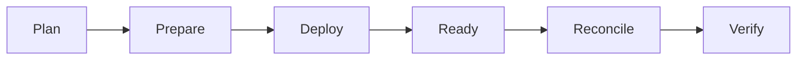

# Installation

The platform installs stacks through the common manifest/lifecycle engine. Run commands from the repository root.



## 1. Prepare protected configuration

Copy `.env.template` to the operational root `.env` and set real values. The operational `.env` is ignored by Git and is not a stack-owned generated file.

## 2. Inspect the plan

```bash
python3 install.py plan all
```

Planning must be read-only. For one application, request its stack id; required dependencies are resolved automatically.

## 3. Install

```bash
python3 install.py 0 1 2 3 4 5 6 7 --yes
```

For a single stack:

```bash
python3 install.py 7 --yes
```

A `.lock` only records successful PREPARE. Runtime readiness and verification are separate.

## 4. Explicit stack bootstrap/reconcile steps

Some actions are intentionally operator-explicit because they issue credentials or depend on a real user identity. Stack7, for example, bootstraps its dedicated LiteLLM credential explicitly and reconciles model policy only after the first Open WebUI administrator exists.

## 5. Validate tests

```bash
python3 -m unittest discover -s tests -p 'test_*.py'
```

## Runtime ownership

Git source normally lives at `/opt/docker/stacks`; persistent mutable state lives at `/opt/docker/runtime`. Stacks must not hide mutable application state inside the checkout.

Backup, recovery and future upgrade UX are documented separately; current DR procedures are in [dr/howto.md](dr/howto.md).
