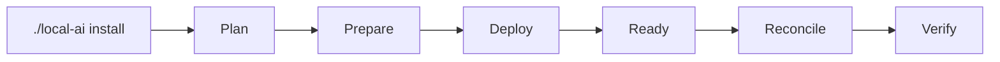

# Installation

`./local-ai` is the supported management interface. The installer, lifecycle registry, stack scripts and Compose files are internal implementation details and are not integration contracts.



## 1. Prepare protected configuration

Copy `.env.template` to the operational root `.env` and set real values. The operational `.env` is ignored by Git and is not a stack-owned generated file.

## 2. Inspect the plan

```bash
./local-ai install --plan all
```

Planning must be read-only. For one application, request its stack id; required dependencies are resolved automatically.

## 3. Install

```bash
./local-ai install 0 1 2 3 4 5 6 7 --yes
```

For a single stack:

```bash
./local-ai install 7 --yes
```

A `.lock` only records successful PREPARE. Runtime readiness and verification are separate.

## 4. Explicit stack bootstrap/reconcile steps

Some actions are intentionally operator-explicit because they issue credentials or depend on a real user identity. Stack7, for example, bootstraps its dedicated LiteLLM credential explicitly and reconciles model policy only after the first Open WebUI administrator exists. Those implementation mechanisms may remain stack-owned, but supported operator workflows must be surfaced through `local-ai` as the management CLI evolves.

## 5. Machine integration

External automation must not import internal modules or invoke individual Python/shell scripts. Use `./local-ai ... --json` for commands that expose the stable JSON contract. The JSON schema version is independent from internal implementation versions.

## 6. Validate tests

```bash
python3 -m unittest discover -s tests -p 'test_*.py'
```

Tests are a development interface, not an operator management interface.

## Runtime ownership

Project source normally lives at `/opt/docker/stacks`; persistent mutable state lives at `/opt/docker/runtime`. Each installation owns its management state. GitHub publishes the project; it does not silently dictate an installation's selected upgrade target.

Upgrade selections are recorded under the installation runtime area and are visible through:

```bash
./local-ai upgrade check
```

Backup and recovery are documented in [dr/howto.md](dr/howto.md).
