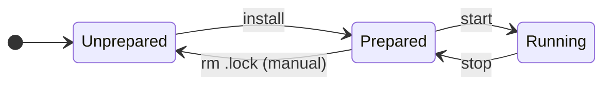
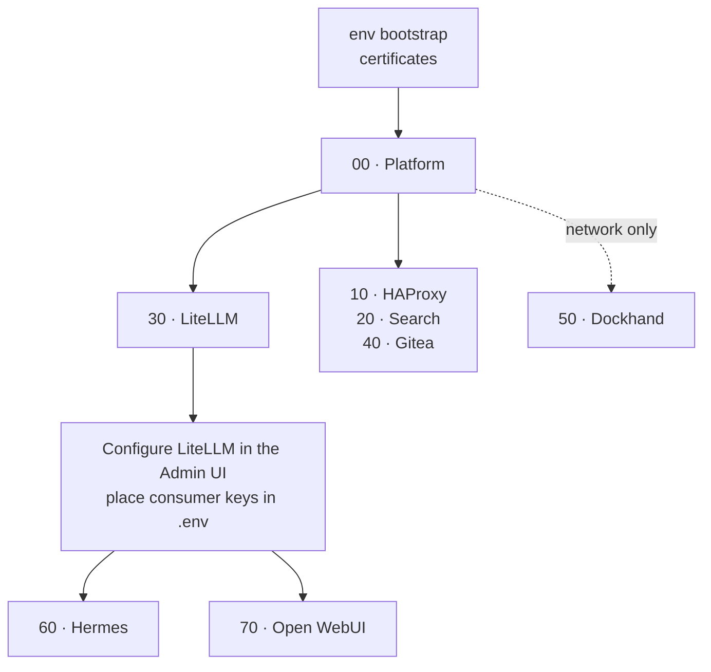

<!--
This Source Code Form is subject to the terms of the Mozilla Public
License, v. 2.0. If a copy of the MPL was not distributed with this
file, You can obtain one at https://mozilla.org/MPL/2.0/.
-->

# Operations

[Reading guide](../README.md#reading-guide) · Next: [Program configs](../program_configs/README.md)

Run every command as root from the repository root. Each stack is managed on its own: `./local-ai` never starts, stops, or installs another stack for you.

## Stack lifecycle



- **`.lock` means prepared, nothing more.** It does not mean running or healthy. While it exists, `install` does nothing (except in Stack 00, see below).
- **`install`** writes configuration and runtime directories, then the `.lock`. It never leaves services running.
- **`start`** runs `docker compose up -d` and requires the `.lock`. A successful `start` does not mean the stack is ready; check with `status`.
- **`stop`** runs `docker compose down` and works without a `.lock`. Persistent data, the `.lock`, and the network are kept.
- **`status`** is read-only and works in any state.

Wrappers run their phases with closed stdin and never prompt. On a terminal they show an elapsed-time activity bar.

## Installation order



Arrows show the deployment sequence. Stack 30 starts with no models or consumer keys. Configure LiteLLM in its Admin UI, then place scoped consumer keys in `.env` before installing Stacks 60 or 70. Both require LiteLLM *running* during installation. A database snapshot and restore process are planned, not yet available.

## What each verb does per stack

| Stack | `install` phases | `start` | `stop` | `status --deep` adds |
| --- | --- | --- | --- | --- |
| 00 | bootstrap → prepare → CA → TLS → verify → `.lock` | — | — | platform `verify.py` |
| 10 | prepare | `up -d` | `down` | — |
| 20 | dirs → prepare | checks SearXNG config, `up -d` | `down` | PostgreSQL `SELECT 1`, SearXNG test search |
| 30 | dirs → prepare → provision PostgreSQL | `up -d` | `down` | PostgreSQL `SELECT 1` |
| 40 | dirs → prepare → create admin | `up -d` | `down` | — |
| 50 | create `dockhand_data` volume | `up -d` | **`stop`** (keeps container) | — |
| 60 | check LiteLLM keys → dirs → prepare | checks keys, syncs runtime config, `up -d --build` | `down` incl. `git-memory` profile | — |
| 70 | check LiteLLM key → dirs → bootstrap `.env` → prepare | checks key, syncs saved LiteLLM key, `up -d` | `down` | — |

*dirs* = `stack-00_-_platform/00-bootstrap.py --stack NN`, which creates only that stack's runtime directories. The stack READMEs explain the stack-specific phases.

The Stack 60/70 key checks reject missing, empty, or template-placeholder values before a fresh `install` or `start`. They do not verify that LiteLLM accepts the keys, that permissions are sufficient, or that a model responds. An existing `.lock` makes `install` a no-op; `start` still checks the keys.

## Reconfiguration

`./local-ai stack-NN reconfig` shows a read-only plan. Review it, then run `./local-ai stack-NN reconfig --apply` to make the reported changes. Both delegate to `stack-NN_-_*/reconfig.py`, which accepts the same `--apply` option directly. Neither starts, stops, nor restarts containers. Applying changed runtime files creates backups inside runtime and prints the explicit `local-ai stop` and `start` commands needed to activate staged changes. A preparation `.lock` is never removed or rewritten. Compose-only `.env` changes are not tracked by the file comparison; the plan says so rather than claiming they are unchanged.

| Stack | `reconfig` behavior |
| --- | --- |
| 00, 50 | Reports that nothing is available to reconfigure |
| 10 | Stages the managed HAProxy and web files |
| 20 | Stages the three managed SearXNG files |
| 30 | Reports that LiteLLM reconfiguration is under development (nonzero exit) |
| 40 | Stages Gitea/runner files and rotates the initial administrator password via the running Gitea admin CLI, with a private database backup |
| 60 | Updates the managed Hermes model/config and removes stale runtime environment overrides |
| 70 | Synchronizes the LiteLLM key only while Open WebUI is stopped; model selection remains in the application |

For Stack 70, if the key is stale while Open WebUI runs, `reconfig --apply` refuses to edit SQLite. Run `stack-70 stop`, preview and apply `stack-70 reconfig`, then `stack-70 start`. All commands in this sequence are prefixed with `./local-ai` from the repository root.

For Stack 40, the initial administrator username remains the installation identity. The first `reconfig --apply` on an installation without a runtime fingerprint reapplies the password from `.env` once; later runs are idempotent. Gitea must already be running for that phase. No password is printed or saved in the runtime fingerprint. File changes are staged and require an explicit `stack-40 stop` followed by `stack-40 start`.

**Stack 00 is different.** It has no containers. Its `install` is a repeatable audit: every run checks and repairs the platform, then keeps or rewrites the `.lock`. If a phase fails, the `.lock` is removed.

## Reading `status`

```text
Stack 30: preparation=PREPARED
  litellm-postgres: running / healthy
  litellm: running / healthy
runtime=READY
overall=READY
```

| `runtime` | Meaning |
| --- | --- |
| `READY` | Every required container is running and healthy |
| `RUNNING (health pending or unavailable)` | Running, but some healthcheck has not passed yet or does not exist |
| `PARTIAL` | Some required containers are not running |
| `DEGRADED` | A container is unhealthy or exited with an error |
| `STOPPED` | No required container is running |
| `UNKNOWN` | Docker could not be queried |

`overall=READY` (exit 0) requires `PREPARED`, `READY`, and any `--deep` checks to pass. Otherwise exit 1; exit 2 means Docker is unavailable. `status` finds containers by their Compose labels, so it also reports a running stack whose `.lock` is missing.

Healthchecks prove that processes are alive, not that search, inference, runner jobs, or memory sync work end to end.

Stack 00 `status` reports only the `.lock`. Use `status --deep` to run the platform verifier.

## Reconfiguring a prepared stack

`install` will not touch a stack that has a `.lock`. To prepare it again:

1. `./local-ai stack-NN stop` and back up its runtime data under `BASE_PATH`.
2. Read the stack README: some state is never regenerated (PostgreSQL data, secrets, Gitea admin).
3. Remove `stack-NN_-_*/.lock`, then run `install` and `start`.

## Shell completion

```bash
./local-ai completion zsh install   # or bash
./local-ai completion zsh status
```

`install` writes the completion file where the shell loads it automatically: system-wide as root, under `~/.local/share` otherwise. Startup files are never edited. `status` opens a login shell and reports what is still missing (for example `fpath`, `compinit`, or `bash-completion`). For a single session, run `eval "$(./local-ai completion zsh)"` instead.

## Maintenance tools

| Command | Purpose |
| --- | --- |
| `./local-ai env bootstrap` | Create or complete `.env` from `.env.template`. Generates missing local secrets, never rotates existing ones, and backs up to `.env-backup-YYMMDD-HHMMSS`. Lists external or service-issued credentials still pending, such as consumer keys. |
| `python3 -B wrapper/stubs/sync_envs.py [--check\|--dry-run]` | Add new template variables to `.env`, keeping local values. |
| `python3 -B wrapper/stubs/upgrade.py check` | Compare image tags in `.env` with their registries and write the plan `.env--upgrading`. |
| `python3 -B wrapper/stubs/upgrade.py apply` | Apply the plan after confirming each change. Then `stop` and `start` the affected stacks. |

`.env` must be `root:root 0600`. Keep its backups just as private.

Certificate rotation is described in [Stack 00](../stack-00_-_platform/README.md#certificates).
