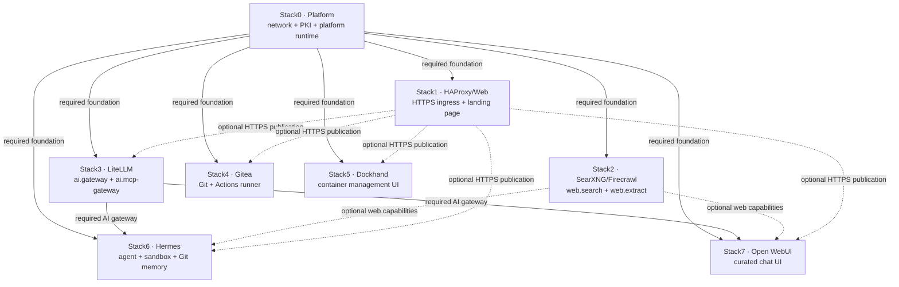
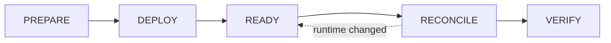

# Stack architecture

[← Documentation map](../TOC.md)

Local Hybrid AI is split into atomic stacks so that ownership, persistence, recovery and lifecycle decisions remain explicit. Stack0 is the platform foundation. Other stacks own their own application runtime and declare hard dependencies, optional providers, capabilities and recovery contracts in `manifest.json`.

## System map

Solid arrows are hard runtime/installation dependencies. Dashed arrows are optional capability or publication relationships; they must not be treated as hard dependencies by lifecycle orchestration.

## Stack responsibilities

| Stack | Responsibility | Key relationship |
|---|---|---|
| 0 | Shared platform foundation | Required by every application stack |
| 1 | HTTPS ingress and static landing page | Publishes backends without owning them |
| 2 | Local web search and extraction | Optional provider for AI consumers |
| 3 | Model and MCP gateway | Required by Hermes and Open WebUI |
| 4 | Local Git service and runner | Owns Git/runner persistent state |
| 5 | Container-management UI | Leaf application stack |
| 6 | Agent runtime and sandbox | Requires Stack3; optionally consumes Stack2 |
| 7 | Chat UI and model policy | Requires Stack3; optionally consumes Stack2 |

Detailed ownership remains authoritative in each `manifest.json`; this document explains the relationships rather than duplicating every manifest field.

## Lifecycle and management

All stacks are managed through [`./local-ai`](../user-docs/cli.md), never by treating private scripts or Compose commands as the external API. The common lifecycle is:

A stack `.lock` proves **PREPARED only**. It does not prove DEPLOYED, READY or healthy. See [installation](../installation.md) and [ADR-0002](../devel-docs/adr/0002-single-management-cli.md).

Selective `start`/`stop` follows the same ownership graph: stopping a provider fails closed while a required consumer is running, and starting a consumer does not implicitly start missing providers.

## Architecture decisions connected to stacks

- [ADR-0002 — single management CLI](../devel-docs/adr/0002-single-management-cli.md): all stack lifecycle operations cross the `local-ai` boundary.
- [ADR-0003 — human version vs image digest](../devel-docs/adr/0003-human-version-vs-image-digest.md): registry identity applies to versioned container components across stacks.
- [ADR-0004 — upgrade compatibility policy](../devel-docs/adr/0004-upgrade-compatibility-policy.md): availability is separate from compatibility and consent.
- [ADR-0005 — unified command implementation package](../devel-docs/adr/0005-unified-command-implementation-package.md): orchestration code lives behind the CLI rather than inside individual stack APIs.

## Security decisions connected to stacks

- [SDR-0002](../devel-docs/sdr/0002-agent-runtime-without-docker-socket.md): Stack6/Hermes does not receive the Docker socket.
- [SDR-0003](../devel-docs/sdr/0003-least-privilege-ai-gateway-credentials.md): AI consumers use scoped LiteLLM credentials.
- [SDR-0004](../devel-docs/sdr/0004-internal-only-service-networking.md): service-to-service traffic stays internal unless explicitly published.
- [SDR-0005](../devel-docs/sdr/0005-open-webui-explicit-model-access.md): Stack7 model visibility is an explicit policy, not an accidental default.

## Implementation documentation

Each stack directory has its own `README.md`, `manifest.json` and implementation files:

- [Stack0](../../stack0_-_platform/README.md)
- [Stack1](../../stack1_-_haproxy_web/README.md)
- [Stack2](../../stack2_-_searxng_firecrawl/README.md)
- [Stack3](../../stack3_-_litellm/README.md)
- [Stack4](../../stack4_-_gitea/README.md)
- [Stack5](../../stack5_-_dockhand/README.md)
- [Stack6](../../stack6_-_hermes/README.md)
- [Stack7](../../stack7_-_open-webui/README.md)

Executable-oriented per-stack contracts are indexed under [OpenSpec stacks](../devel-docs/openspec/stacks/README.md).
