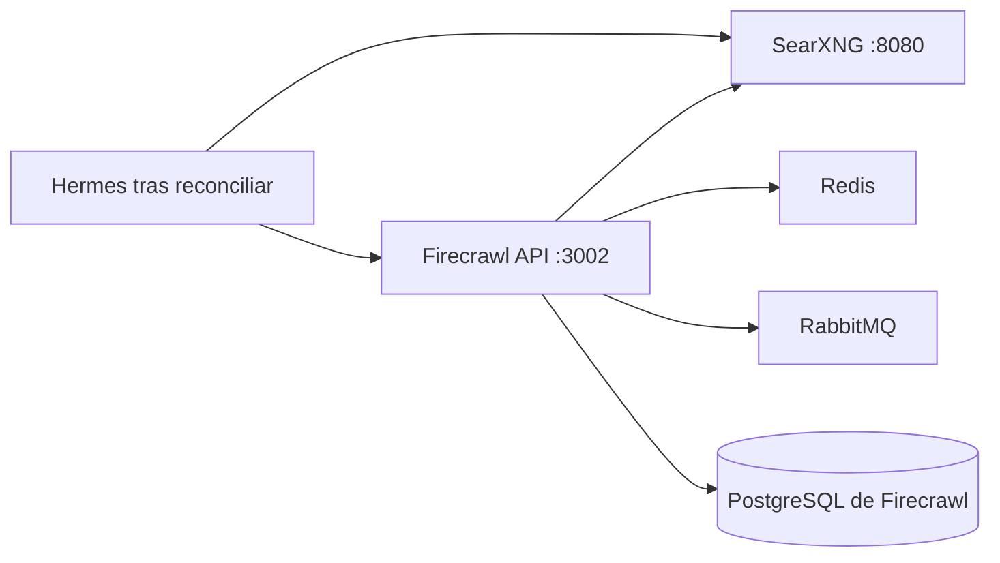

# Stack2 — SearXNG + Firecrawl

Stack2 proporciona las capacidades locales de búsqueda y extracción web. Es atómico, requiere únicamente Stack0 y proporciona `web.search` y `web.extract`.



Ningún puerto de aplicación de Stack2 se publica directamente en el host. SearXNG puede exponerse mediante Stack1/HAProxy; Firecrawl y sus servicios auxiliares permanecen internos a `redlocal`.

## Propiedad

Stack2 posee:

```text
contenedores:
  searxng
  firecrawl-api
  firecrawl-playwright
  firecrawl-redis
  firecrawl-rabbitmq
  firecrawl-postgres

runtime:
  ${BASE_PATH}/service_-_searxng
  ${BASE_PATH}/service_-_firecrawl-redis
  ${BASE_PATH}/service_-_firecrawl-rabbitmq
  ${BASE_PATH}/service_-_firecrawl-postgres
```

Stack2 consume `redlocal`; Stack0 es propietario y creador de esa red.

## Estado persistente

```text
${BASE_PATH}/service_-_searxng/config
${BASE_PATH}/service_-_searxng/data
${BASE_PATH}/service_-_firecrawl-redis/data
${BASE_PATH}/service_-_firecrawl-rabbitmq/data
${BASE_PATH}/service_-_firecrawl-postgres/data
${BASE_PATH}/service_-_firecrawl-postgres/secret/postgres_admin_password
```

PREPARE conserva los directorios persistentes existentes. En particular, nunca hace `chown` recursivo ni normaliza permisos sobre un PGDATA ya inicializado. El inode, propietario y modo de un PGDATA existente pertenecen al runtime PostgreSQL y deben preservarse.

## Modelo de seguridad PostgreSQL

Stack2 utiliza un único cluster PostgreSQL y una única base llamada `postgres`, pero separa de forma explícita dos identidades.

```text
firecrawl-postgres
└── database: postgres
    ├── postgres
    │   rol administrativo/bootstrap
    │   SUPERUSER
    │   propietario de objetos NUQ, extensiones y trabajos pg_cron
    │   password fuera de .env:
    │   ${BASE_PATH}/service_-_firecrawl-postgres/secret/postgres_admin_password
    │
    └── firecrawl
        rol LOGIN de aplicación
        NOSUPERUSER
        NOCREATEDB
        NOCREATEROLE
        NOREPLICATION
        NOBYPASSRLS
        password: FIRECRAWL_DB_PASSWORD en el .env operativo protegido
```

La base continúa llamándose `postgres` porque la imagen NuQ PostgreSQL fijada configura `pg_cron` contra esa base. La separación de seguridad se hace por roles, no moviendo Firecrawl a una segunda base.

`postgres` queda reservado para bootstrap, ownership, extensiones, cron y administración explícita. Firecrawl no debe usarlo durante la operación normal.

Contrato de aplicación:

```dotenv
FIRECRAWL_DB_NAME=postgres
FIRECRAWL_DB_USER=firecrawl
FIRECRAWL_DB_PASSWORD=<credencial persistente de aplicación>
```

La credencial administrativa no pertenece a `.env`. En un runtime nuevo, `01-prepare.sh` la genera una vez con permisos restringidos. Compose la monta read-only dentro de `firecrawl-postgres` y el entrypoint oficial de PostgreSQL la consume mediante `POSTGRES_PASSWORD_FILE`.

Durante el primer `initdb`, el `010-nuq.sql` upstream crea el esquema y las tablas NuQ. A continuación, `config/postgres/020-firecrawl-app-role.sh` crea/reconcilia el rol `firecrawl`, concede únicamente acceso a base/esquema/tablas/secuencias necesario para la aplicación y establece privilegios por defecto para futuros objetos NuQ creados por `postgres`.

Ese bootstrap forma parte de la instalación limpia. Los helpers históricos de migración de una sola ejecución se eliminan del repositorio una vez la plataforma desplegada ha convergido al modelo definitivo.

## Frontera de red PostgreSQL

PostgreSQL no publica `5432` en el host.

```text
Firecrawl -> firecrawl-postgres:5432 por redlocal
```

Para administración desde el host se prefieren comandos `docker exec` acotados frente a exponer PostgreSQL en la LAN.

## Preparación y despliegue

```bash
cd /opt/docker/stacks/stack2_-_searxng_firecrawl
sudo ./01-prepare.sh
docker compose up -d
sudo bash ./02-wait-ready.sh
docker compose ps
```

`01-prepare.sh`:

1. exige Stack0 preparado;
2. valida la red bridge compartida sin crearla;
3. valida las variables requeridas de `.env`;
4. prepara el runtime propio de Stack2;
5. preserva metadatos de un PGDATA existente;
6. genera/preserva el secreto administrativo PostgreSQL en runtime;
7. sincroniza la configuración gestionada de SearXNG;
8. valida Compose;
9. escribe `.lock` sólo después de una preparación correcta.

`.lock` significa únicamente PREPARED. No significa desplegado, healthy ni READY.

## Readiness

`docker compose up -d` establece estado de proceso, pero DEPLOYED no equivale a READY. `02-wait-ready.sh` espera a ambos endpoints del proveedor:

```text
web.search  -> searxng:8080
web.extract -> firecrawl-api:3002
```

El instalador común ejecuta esta puerta tras un despliegue de Stack2 y durante VERIFY. Los consumidores opcionales se reconcilian únicamente después de que la readiness del proveedor haya pasado.

## Endpoints internos

```text
SearXNG:        http://searxng:8080
Firecrawl API: http://firecrawl-api:3002
PostgreSQL:    firecrawl-postgres:5432
Redis:         firecrawl-redis:6379
RabbitMQ:      firecrawl-rabbitmq:5672
```

## Integración con Stack6

Stack6 no requiere Stack2. Si Stack2 no existe o no está READY, las herramientas web de Hermes permanecen explícitamente deshabilitadas.

Operación incremental preferida:

```bash
cd /opt/docker/stacks
sudo python3 install.py 2 --yes
```

Si Stack2 atraviesa una transición de despliegue/recuperación, el instalador común espera readiness y después descubre/reconcilia consumidores preparados mediante capabilities del manifest. Un Stack2 sano y ya READY debe quedar en verificación únicamente y no recrear Hermes de forma espuria.

Equivalente manual tras recuperar Stack2:

```bash
cd /opt/docker/stacks/stack2_-_searxng_firecrawl
sudo bash ./02-wait-ready.sh
cd /opt/docker/stacks/stack6_-_hermes
sudo ./06-reconcile-capabilities.sh --restart
```

## Re-preparación

Eliminar `.lock` es una decisión explícita de mantenimiento, no un mecanismo de actualización. Si PREPARE se repite deliberadamente sobre una instalación existente, los datos persistentes, PGDATA y secretos runtime generados deben permanecer intactos.

## Invariantes de seguridad

- `postgres` es sólo administrativo; Firecrawl usa `firecrawl`.
- el password administrativo PostgreSQL vive fuera de `.env` y de Git;
- `FIRECRAWL_DB_PASSWORD` es persistente y no debe rotarse editando sólo `.env`;
- PostgreSQL sólo es alcanzable por la red Docker salvo rediseño explícito;
- PREPARE nunca resetea ni repara recursivamente PGDATA;
- ningún helper de migración forma parte de la instalación normal ni de la convergencia rutinaria;
- la ausencia de Stack2 no debe habilitar un fallback web externo en los consumidores.
