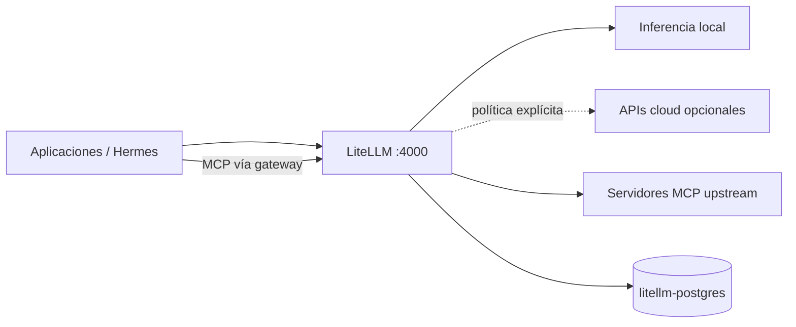
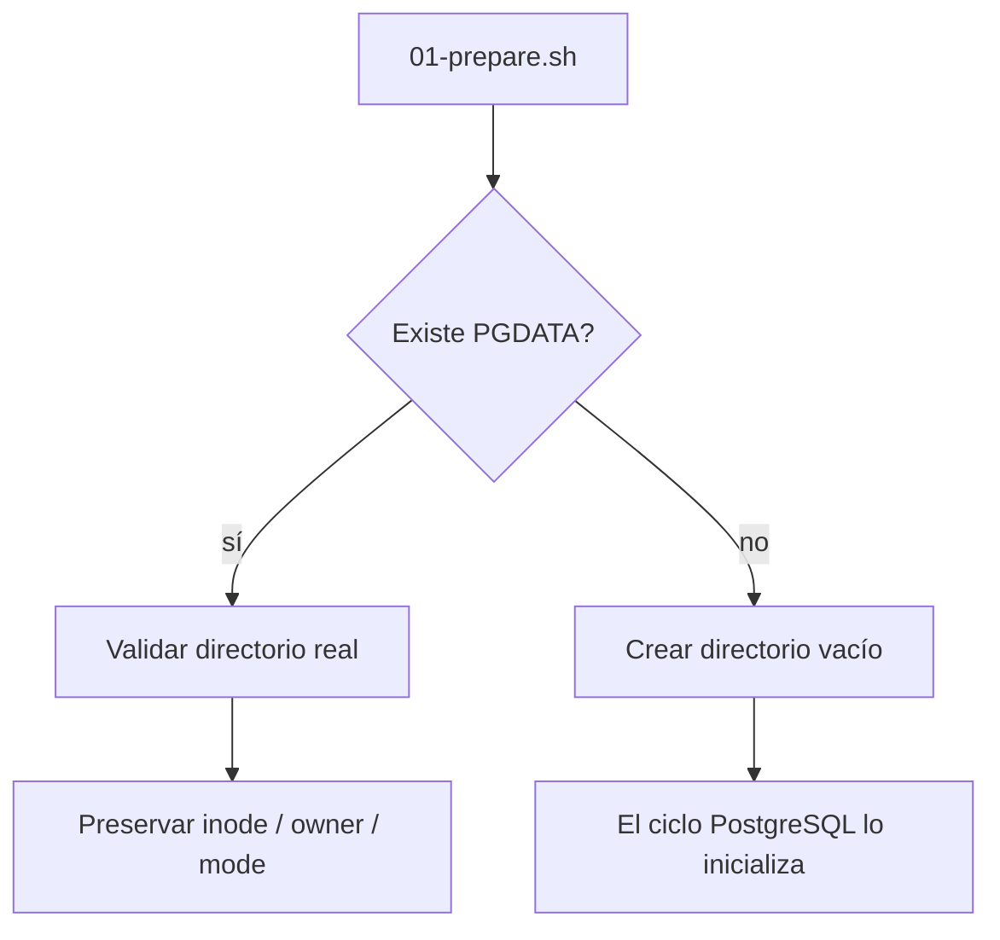

# Stack3 — LiteLLM + PostgreSQL

Stack3 actúa como gateway de modelos y MCP. Es atómico, requiere únicamente Stack0 y proporciona `ai.gateway` y `ai.mcp-gateway`.



Stack6 requiere ambas capacidades AI. Stack3 no depende de Stack2.

## Propiedad

```text
contenedores:
  litellm
  litellm-postgres

runtime:
  ${BASE_PATH}/service_-_litellm
  ${BASE_PATH}/service_-_litellm-postgres
```

Endpoints internos:

```text
http://litellm:4000
litellm-postgres:5432
```

Stack1 puede publicar LiteLLM mediante HAProxy, pero no es una dependencia dura de Stack3.

## Modelo de identidad PostgreSQL

Stack3 posee un cluster PostgreSQL dedicado. Igual que Stack2, separa la identidad administrativa de la identidad de aplicación.

```text
litellm-postgres
├── postgres
│   rol administrativo/bootstrap
│   password fuera de .env:
│   ${BASE_PATH}/service_-_litellm-postgres/secret/postgres_admin_password
│
└── ${LITELLM_DB_USER}
    rol de aplicación de LiteLLM
    base: ${LITELLM_DB_NAME}
    password: LITELLM_DB_PASSWORD en el .env operativo protegido
```

El rol `postgres` queda reservado para bootstrap y administración del cluster. LiteLLM utiliza su rol dedicado durante la operación normal.

`LITELLM_SALT_KEY`, la base LiteLLM y ambas credenciales PostgreSQL son identidades persistentes. No deben regenerarse durante PREPARE ni durante una actualización rutinaria.

## Contrato de seguridad PGDATA

El cluster dedicado vive en:

```text
${BASE_PATH}/service_-_litellm-postgres/data
```

PREPARE nunca cambia owner/mode/inode de un PGDATA existente.



No se debe usar `chown` recursivo, reset de base ni recreación del cluster como reparación rutinaria de configuración.

## Preparación y arranque

```bash
cd /opt/docker/stacks/stack3_-_litellm
sudo ./01-prepare.sh
sudo ./02-postgres.sh
docker compose up -d litellm
docker compose ps
```

`01-prepare.sh` exige Stack0, valida red y entorno, prepara/preserva el runtime propio, genera o conserva el secreto administrativo PostgreSQL, sincroniza la configuración gestionada de LiteLLM, valida Compose y sólo entonces escribe `.lock`.

`02-postgres.sh` establece/valida el servicio PostgreSQL dedicado y el contrato de base/rol de aplicación antes de arrancar LiteLLM.

`.lock` significa únicamente PREPARED; no es una señal de health de PostgreSQL ni de LiteLLM.

Validaciones acotadas útiles después de mantenimiento:

```bash
docker exec litellm-postgres psql -U postgres -d postgres -Atc 'SELECT 1;'
docker exec litellm-postgres psql -U postgres -d postgres -v ON_ERROR_STOP=1 -c 'CHECKPOINT;'
```

## Re-preparación

Eliminar `.lock` es una operación explícita de mantenimiento. Si PREPARE se repite deliberadamente sobre una instalación existente, deben conservarse PGDATA, owner/mode/inode, secretos de base, `LITELLM_SALT_KEY` y la identidad de los directorios bind.

Los helpers históricos de migración no forman parte del repositorio ni del camino de instalación actual. El repositorio describe y despliega únicamente la arquitectura ya convergida.

## Seguridad

No deben versionarse ni rotarse de forma casual `LITELLM_MASTER_KEY`, `LITELLM_SALT_KEY`, las virtual keys de inferencia/MCP, las credenciales de la base de aplicación ni el secreto administrativo PostgreSQL en runtime. La política de proveedores debe permanecer detrás de LiteLLM y no saltarse desde los consumidores.
