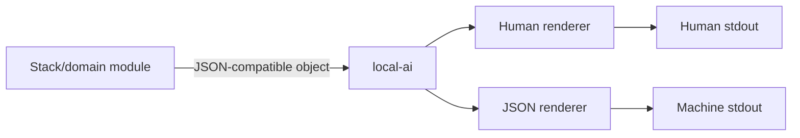

<!--
This Source Code Form is subject to the terms of the Mozilla Public
License, v. 2.0. If a copy of the MPL was not distributed with this
file, You can obtain one at https://mozilla.org/MPL/2.0/.
-->
# `local-ai` command-line interface
[← User documentation](README.md) · [Documentation map](../TOC.md) · [Management plane](../architecture/management-plane.md)

`./local-ai` is the sole supported management interface. Python modules, shell scripts, Compose files and stack-local lifecycle commands are implementation details.

## Global interface contract
Every public command accepts the transversal automation options `--json` and `--yes`. They belong to `local-ai`, not to individual stack engines, and may be placed before or after the command/action. For example, `./local-ai --json --yes status` and `./local-ai status --yes --json` have the same public meaning.

`--json` selects the machine presentation. Domain/stack modules return JSON-compatible Python objects and do not serialize them; the public CLI owns serialization through its JSON renderer. JSON stdout contains one JSON document and no banner, human heading, prompt or diagnostic prose. `--yes` represents non-interactive operator consent. Read-only commands accept it as a semantic no-op. A mutation that requires consent fails closed when non-interactive consent is absent. Command-specific safety assertions can remain additional requirements; for example, restore execution requires both global `--yes` and the DR-specific `--confirm-clean-target` assertion.

Human output is owned by the CLI renderer. It can prepend a configurable text banner/header without changing domain logic. Machine output never receives that decoration.

## Stack selector contract
Every public command identifying a stack uses the numeric id shown by `status` and `upgrade`, currently `0` through `7`. An operator supplies `7`, not `stack7` or a stack directory name. Machine data may retain identities such as `stack7`.

## Public command map
```text
./local-ai [--json] [--yes] COMMAND ...
├── install <stack...> [--plan|--dry-run] [--target] [--reconcile]
├── start <0..7>
├── stop <0..7>
├── backup [--destination PATH]
├── restore list-backup-sets [--backup-root PATH]
├── restore plan BACKUP_SET
├── restore drill BACKUP_SET --destination PATH
├── restore apply BACKUP_SET --check-clean-target
├── restore apply BACKUP_SET --execute --confirm-clean-target [--memory-sync-ssh-bootstrap PATH]
├── restore resume BACKUP_SET --memory-sync-ssh-bootstrap PATH
├── inventory rescan
├── status
├── doctor
├── completion bash|zsh|install|status
└── upgrade
    ├── [check] [--offline]
    ├── policy [0..7 [component] [set POLICY|clear]]
    ├── 0..7 [component] select VERSION [--force]
    ├── 0..7 [component] clear
    └── adopt
```

## Lifecycle and recovery
`install` is the public facade over `PREPARE -> DEPLOY -> READY -> RECONCILE -> VERIFY`. Planning and dry-run are read-only; real execution requires global consent. `start` and `stop` operate one already-prepared numeric stack and preserve dependency gates.

`backup` creates one atomic recovery point. Interactive human use may confirm at a prompt; non-interactive and JSON execution require `--yes`. `restore list-backup-sets` reports a set as completed only after authoritative completed-metadata validation. `restore plan` is read-only. `restore apply --execute` requires both `--confirm-clean-target` and global consent; the former asserts the DR precondition while the latter authorizes non-interactive mutation.

## Operational views
`inventory rescan` validates manifest-declared topology and updates the diagnostic snapshot. `status` returns stack operational state and detailed component state in its machine payload. `doctor` checks management prerequisites and metadata consistency. These read-only commands accept `--yes` without changing behavior.

## Completion
Shell completion follows the same public grammar. Every branch exposes `--json` and `--yes`, numeric stack selectors remain numeric, and private Python/script names are never completion candidates. `completion bash|zsh` emits adapters; `completion install` installs the appropriate adapter and `completion status` verifies it.

## Upgrade
`upgrade` remains the guarded version-management workflow. Check, policy display and selection inspection are structured domain results rendered by `local-ai`. Selection and policy mutations produce structured results before presentation. Applying selected upgrades requires global `--yes`; it revalidates baseline, policy, target identity/digest, executor eligibility, recovery requirements, READY, VERIFY and dependent consumers. Administrator `--force` remains a selection-specific risk acknowledgement and does not replace global execution consent.

Typical flow:
```bash
./local-ai upgrade
./local-ai upgrade 2 redis select 8.10.1-alpine3.23
sudo ./local-ai upgrade --yes
```

## Human and JSON contracts
The presentation boundary is intentionally one-way:



Domain modules own facts and operations. They do not own terminal formatting or JSON serialization. The CLI owns both renderers, global automation flags, public error envelopes, help and completion. This keeps the machine contract independent from private implementation paths and allows the human renderer to add a configurable banner/header without contaminating automation output.