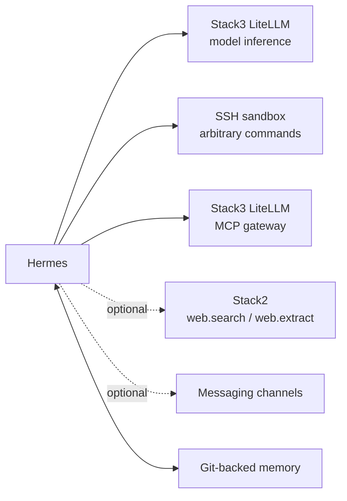

<!--
This Source Code Form is subject to the terms of the Mozilla Public
License, v. 2.0. If a copy of the MPL was not distributed with this
file, You can obtain one at https://mozilla.org/MPL/2.0/.
-->

# Hermes integrations

[Documentation TOC](../../TOC.md) · [User documentation](../README.md) · [Stack6 contract](../../../stack6_-_hermes/README.md)

Stack6 extends Hermes with local inference through LiteLLM, isolated command execution, optional web capabilities, messaging channels, MCP access and Git-backed portable memory. These integrations preserve the Stack6 security boundary: Hermes itself has no Docker socket and arbitrary command execution is delegated to the isolated SSH sandbox.

## Integration map



The supported integration model keeps each boundary explicit:

- model inference → LiteLLM;
- arbitrary commands → isolated SSH sandbox;
- web search/extraction → optional Stack2 capabilities;
- Buzz → optional messaging channel;
- Telegram → outbound long polling;
- MCP → LiteLLM as the single gateway;
- durable user memory → separate Git working tree mounted read/write into Hermes.

An absent optional capability fails closed or remains unavailable; it does not silently become a cloud fallback.

## Version state

An installation does not derive desired Hermes version from documentation. Installation-owned version intent is authoritative after adoption; runtime observation and remote availability are separate facts.

```bash
./local-ai status
./local-ai upgrade
```

`status` reports whether Stack6 is operational/coherent. `upgrade` is the normal human version view and reports installed, available, selectable and selected state. `upgrade check` remains a compatibility alias.

The guarded executor has runtime qualification evidence for Hermes upgrades. Qualification evidence demonstrates the mechanism; it is not a desired-version declaration and does not claim that a previously qualified version is the latest upstream release.

## MCP client

Hermes connects to LiteLLM as one MCP gateway:

```text
LITELLM_MCP_URL=http://litellm:4000/mcp
LITELLM_MCP_API_KEY=<dedicated Hermes MCP virtual key>
```

The model-inference key and MCP key are deliberately separate:

```text
LITELLM_API_KEY      -> model inference
LITELLM_MCP_API_KEY  -> MCP gateway
```

Individual upstream MCP servers are registered and authorized in LiteLLM rather than declared independently inside Hermes. [LiteLLM MCP gateway](litellm-mcp.md) documents that boundary.

## Telegram

Telegram uses outbound long polling, so no inbound webhook route is required. The bot token belongs to protected installation configuration. Authorization remains deny-by-default until a user is paired or explicitly allowed. Pairing is a Hermes application operation rather than a `local-ai` platform-management command.

## Git-backed memory

Portable user memory is intentionally separate from disposable Hermes runtime state. The durable contract is the configured Git repository and branch containing regular `MEMORY.md` and `USER.md` files. Git credentials remain external operator prerequisites rather than values committed to Git. The runtime working tree lives under the installation runtime area and is mounted into Hermes at `/opt/data/memories`.

Only Git-backed memory content is considered durable Stack6 user state for recovery. Hermes sessions, local state databases, caches, packages, logs, `SOUL.md` and sandbox contents are reconstructable/disposable.

The memory-sync sidecar records installation intent separately from the Git provider. Its SSH bootstrap material is external operator-owned state and is intentionally required again during clean disaster recovery. Preparation/adoption validates repository origin, branch, required files, permissions and collision with legacy local memory; it does not silently overwrite an unrelated directory or rewrite repository history.

Synchronization fails closed on divergence, does not force-push, restricts dirty working-tree state to the durable memory files, and permits clean fast-forward convergence when the remote branch is ahead.

## Optional Stack2 web capabilities

Stack6 can consume `web.search` and `web.extract` when Stack2 is prepared and READY. These are capability relationships, not hard dependencies. Reconciliation enables them only after the provider is proven ready and disables or withholds them when the provider is absent.

## Deferred work and housekeeping

Hermes native Cron is the supported mechanism for future agentic work. Because a Cron execution begins in a fresh session, its prompt contains the context required by the future task. Deterministic maintenance is intentionally different: Git-memory synchronization and sandbox housekeeping are implemented by dedicated sidecars and do not depend on an AI agent deciding to run them.

## Validation targets

A fully integrated installation proves each configured path independently: Hermes → LiteLLM → model; Hermes → SSH → sandbox; optional Hermes → Stack2 web tools; optional messaging; Hermes → LiteLLM MCP → MCP server; and Hermes → `/opt/data/memories` → Git working tree. Failure of an optional integration does not invalidate the isolation or persistence contracts of the others.

## Recovery implications

Stack6 runtime is reconstructable. Durable memory is externalized through Git, while memory-sync SSH bootstrap material remains an external operator prerequisite. Recovery validates Git repository/branch alignment and re-provisions that external SSH material rather than backing up disposable Hermes runtime directories. [Disaster recovery](../../dr/README.md) documents the platform-wide recovery model.
