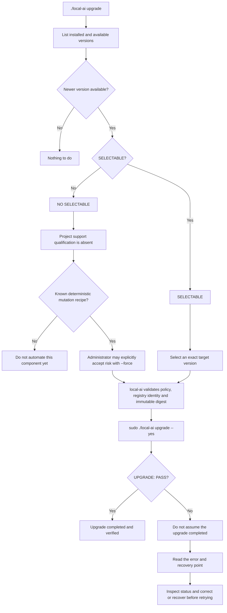

<!--
This Source Code Form is subject to the terms of the Mozilla Public
License, v. 2.0. If a copy of the MPL was not distributed with this
file, You can obtain one at https://mozilla.org/MPL/2.0/.
-->

# Upgrading Local Hybrid AI components

[← User documentation](README.md) · [CLI reference](cli.md) · [Upgrade policy](../upgrade-policy.md)

The normal upgrade workflow is deliberately small: **list what is installed, see what is available, select one target, apply it, and require a verified success**.



Start with:

```bash
./local-ai upgrade
```

This is the primary human version view. `./local-ai upgrade check` remains a compatibility alias. Stack selectors in the public CLI are always numeric: use `7`, never the internal manifest identity `stack7` and never a manifest directory name. The same numeric convention is used by selective lifecycle commands such as `./local-ai start 7` and `./local-ai stop 7`.

The useful concepts are:

| Field | Meaning |
|---|---|
| `INSTALLED` | The concrete version installed/running now. |
| `AVAILABLE` | The newest version discovered from the same registry/package. Discovery is information, not consent. |
| `POLICY` | The compatibility boundary local-ai will enforce for an explicit target. |
| `SELECTABLE` | Whether local-ai has a qualified automated upgrade procedure for that component. |
| `SELECTED` | The exact target explicitly chosen by the operator. |
| `VALID` | Whether an existing normal or explicitly forced selection still passes its applicable policy/baseline gates. |

Component topology and upgrade semantics are declared by each owning stack's `manifest.json` and compiled by the management CLI. Internal machine data may retain identities such as `stack7`; that representation is not an alternate operator selector. There is no separate central component catalog to keep synchronized when a stack changes.

## SELECTABLE

`SELECTABLE=yes` means more than "there is a newer image". It means Local Hybrid AI has a defined and tested procedure for changing that component through the supported `./local-ai` management boundary.

A typical flow is:

```bash
./local-ai upgrade
./local-ai upgrade 2 redis select 8.10.1-alpine3.23
./local-ai upgrade
sudo ./local-ai upgrade --yes
```

`select VERSION` validates and records an exact target as explicit operator intent. It does not modify the running service. The target must exist in the configured registry, satisfy the effective compatibility policy and resolve to an immutable digest; where versions are comparable, downgrade protection also applies. If the selected tag later moves to another digest, apply fails instead of following it silently.

`clear` removes the previously selected upgrade target from the local upgrade plan without changing the running service or its installed version:

```bash
./local-ai upgrade 2 redis clear
```

`sudo ./local-ai upgrade --yes` means **apply exactly the targets already selected**. It never means "upgrade everything" and discovery never creates a selection automatically.

Before mutation, local-ai revalidates the runtime baseline, policy, target existence, immutable digest and executor eligibility. The component-specific procedure may then create a recovery point when required, update installation-owned version authority, perform a targeted deployment, wait for READY, reconcile when required, verify the selected version, and re-verify affected prepared consumers.

### What `UPGRADE: PASS` means

`UPGRADE: PASS` is the success boundary for the supported operation. It does **not** merely mean that Docker started a container. It means that the guarded upgrade procedure finished without a failing condition and completed the post-change checks required by the executor, including target-version verification and any required READY/reconciliation/consumer verification for that component.

If `UPGRADE: PASS` is printed, the selected upgrade is recorded in upgrade history and the successful selection is cleared.

### If you do not receive `UPGRADE: PASS`

Do not assume the upgrade completed successfully, even if a container is running. Read the stable error code and any reported recovery point. Then inspect the installation with:

```bash
./local-ai status
./local-ai upgrade
```

A failed apply is journaled. Local Hybrid AI deliberately does not perform destructive automatic rollback. Depending on the failure, the correct action may be to correct the cause and retry, restore from the reported recovery point, or investigate a component-specific readiness/migration failure.

Compatibility policy can be inspected or overridden independently:

```bash
./local-ai upgrade policy
./local-ai upgrade policy 2 redis
./local-ai upgrade policy 2 redis set minor-series
./local-ai upgrade policy 2 redis clear
```

With no action after the component, `policy` shows the effective policy. `set` creates or replaces the installation-local override. `policy ... clear` removes only that override and returns the effective policy to the manifest default; it does **not** clear an upgrade selection. There is no public `show` action. Changing policy never makes an unqualified component selectable.

## NO SELECTABLE

`SELECTABLE=no` does **not** mean the software cannot be upgraded. It means Local Hybrid AI can see or describe the component, but the project has not yet qualified its automated upgrade procedure as supported.

The blocker explains why. Typical classes are:

| Blocker | Meaning |
|---|---|
| `migration-policy-required` | Updating may involve data/schema/application migrations whose compatibility and recovery rules are not yet fully qualified. |
| `executor-not-qualified` | Version discovery works, but the component-specific mutation/readiness/verification procedure has not yet passed the qualification gate. |
| `local-build` | The component is produced locally rather than upgraded from a normal registry version stream. |
| `non-versioned-component` | A versioned package upgrade does not meaningfully apply to this component. |

A `NO SELECTABLE` component may still show a newer `AVAILABLE` version. That is intentional: **knowing that an update exists and project support qualification are separate facts**.

When the owning stack manifest already defines a deterministic version-authority mutation and targeted deployment recipe, an administrator may explicitly accept the missing project qualification:

```bash
./local-ai upgrade 5 dockhand select v1.0.48 --force
./local-ai upgrade --yes
```

The forced selection remains `SELECTABLE=no`: the project has not silently promoted the path to supported. The stored selection records the qualification bypass and `VALID=yes` means that this explicit administrative choice still satisfies the remaining gates. `--force` does not bypass policy, target existence, immutable digest, stale-plan protection, recovery requirements, READY, VERIFY or dependency-impact checks. If no deterministic mutation recipe exists, local-ai refuses the forced selection with `UPGRADE_FORCE_UNAVAILABLE` rather than inventing an arbitrary Compose procedure. See [Administrator-forced upgrades](forced-upgrades.md).

### How a component becomes SELECTABLE

Promotion is an engineering qualification, not a manifest toggle and not a side effect of a successful forced run. A component may move from `NO SELECTABLE` to `SELECTABLE` only after the project can answer and prove the following:

1. The installed version can be identified reliably and the target can be resolved from the correct registry/package.
2. The compatibility policy for acceptable targets is explicit.
3. The exact mutation needed to change version authority is defined.
4. The deployment scope is known: which service is recreated, restarted or otherwise changed.
5. Required application or data migrations are defined, including ordering and compatibility constraints.
6. Failure modes and the safe recovery strategy are defined; a recovery point is required when loss/corruption risk justifies it.
7. A meaningful READY condition exists after the change.
8. A post-upgrade VERIFY condition proves the selected version is actually running and the component is usable.
9. Required providers/consumers and cross-stack effects are identified and reverified where necessary.
10. Selection, stale-plan detection, immutable target validation, failure behaviour and successful execution have automated tests.
11. The procedure has been qualified against a real runtime before the project marks it guarded/selectable.

Only after those gates are satisfied should the owning manifest declare `execution.mode=guarded` and expose `SELECTABLE=yes`.

For the engineering qualification contract, see [Upgrade executor qualification](../devel-docs/upgrade-qualification.md).

## Existing installations and `upgrade adopt`

`upgrade adopt` is a migration utility for installations created before explicit installation-owned version authority existed. It is **not part of the normal day-to-day upgrade workflow**.

```bash
./local-ai upgrade adopt
sudo ./local-ai upgrade adopt --yes
```

The read-only form shows what exact running identities would be recorded. Unprepared stacks are skipped; a PREPARED component whose runtime identity cannot be observed fails closed. The `--yes` form writes only missing non-secret authority keys and does not pull images, run Compose, select an upgrade or restart services. Fresh installations should already have exact source baselines and should not require routine adoption.
